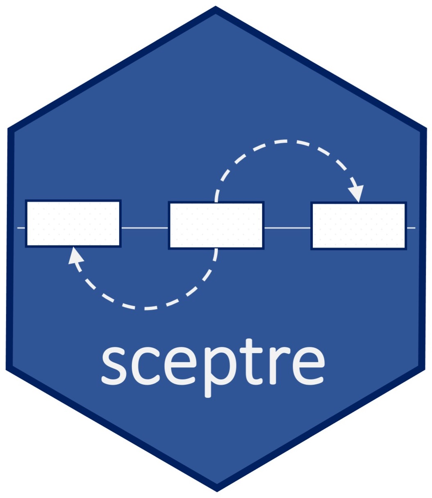

<!-- README.md is generated from README.Rmd. Please edit that file -->

```{r, include = FALSE}
knitr::opts_chunk$set(
  collapse = TRUE,
  comment = "#>",
  fig.path = "man/figures/README-",
  out.width = "90%"
)
```



# sceptre

<!-- badges: start -->
[](https://github.com/Katsevich-Lab/sceptre/actions?query=workflow%3AR-CMD-check+branch%3Amain)
<!-- badges: end -->

`sceptre` implements an analysis pipeline for single-cell CRISPR screen (i.e., Perturb-seq) data, including data import, gRNA-to-cell assignment, quality control, and testing association between CRISPR perturbations and changes in gene expression. It is built on three principles:

- **Statistical rigor.** Association testing is built on a principled resampling-based methodology. Built-in
  calibration and power checks let you verify that false positives are
  controlled and that real effects are detectable — on your own data.
- **Massive scalability.** Optimized C++ routines improve performance. Optional [disk-backed data structures](https://cran.r-project.org/package=ondisc) allow the analysis of datasets too large to fit in memory. The companion
  [`sceptre` Nextflow pipeline](https://github.com/timothy-barry/sceptre-pipeline)
  distributes analyses across hundreds of processors on a cluster or cloud.
- **Ease of use.** A small, pipe-friendly set of functions takes you from raw
  count matrices to results in a handful of steps.

## Installation

Install the development version of `sceptre` from GitHub:

```r
# install.packages("remotes")
remotes::install_github("Katsevich-Lab/sceptre")
```

## Documentation

New to `sceptre`? [Get started](https://katsevich-lab.github.io/sceptre/articles/sceptre.html) offers a brief tour of the pipeline, with plots and explanation at each step. Other resources are the [function reference](https://katsevich-lab.github.io/sceptre/reference/index.html) and the comprehensive [`sceptre` manual](https://timothy-barry.github.io/sceptre-book/).

## Featured publications

- [Barry et al., 2024](https://link.springer.com/article/10.1186/s13059-024-03254-2). "Robust differential expression testing...". *Genome Biology*.
- [Barry et al., 2024](https://timothy-barry.github.io/biostatistics_2024.pdf). "Exponential family measurement error models...". *Biostatistics.*
- [Morris et al., 2023](http://sanjanalab.org/reprints/Morris_Science_2023.pdf). "Discovery of target genes and pathways...". *Science*.
- [Barry et al., 2021](https://link.springer.com/article/10.1186/s13059-021-02545-2). "SCEPTRE improves calibration and sensitivity...". *Genome Biology*.

`sceptre` is also featured in a [10x Genomics analysis guide](https://www.10xgenomics.com/analysis-guides/single-cell-crispr-screen-analysis-with-sceptre).

## Bug reports, feature requests, and software questions

For bug reports, please open a [GitHub issue](https://github.com/Katsevich-Lab/sceptre/issues). For questions about `sceptre` functionality, documentation, or how to apply it to your data, please start a discussion under [Q&A](https://github.com/Katsevich-Lab/sceptre/discussions/categories/q-a).
