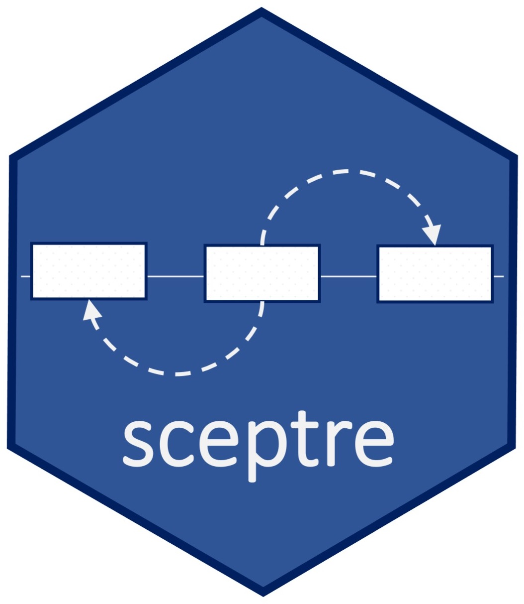
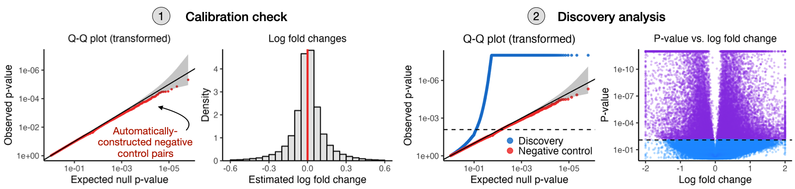

<!-- README.md is generated from README.Rmd. Please edit that file -->

# Rigorously analyze single-cell CRISPR screen data with `sceptre`

`sceptre` is a statistical method for differential expression analysis
of single-cell CRISPR screen data. We pronounce `sceptre` as “scepter,”
as in a large, decorated staff. But any pronunciation will do.

------------------------------------------------------------------------

<figure>

<figcaption aria-hidden="true"><em>Large-scale analysis of a real
single-cell CRISPR screen dataset</em></figcaption>
</figure>

## Installation and quick start

You can install `sceptre` from Github with the following command:

    # R version >= 4.1
    install.packages("devtools")
    devtools::install_github("katsevich-lab/sceptre")

`sceptre` includes separate modules for low multiplicity-of-infection
and high multiplicity-of-infection single-cell CRISPR screen analysis.
See the [low multiplicity-of-infection
tutorial](https://katsevich-lab.github.io/sceptre/articles/lowmoi_tutorial.html)
and [high multiplicity-of-infection
tutorial](https://katsevich-lab.github.io/sceptre/articles/highmoi_tutorial.html)
to get started.

## Funding

We are grateful to [Analytics at
Wharton](https://analytics.wharton.upenn.edu/) and the [National Science
Foundation](https://www.nsf.gov/) (DMS-2113072) for supporting the
development of this software.

    
