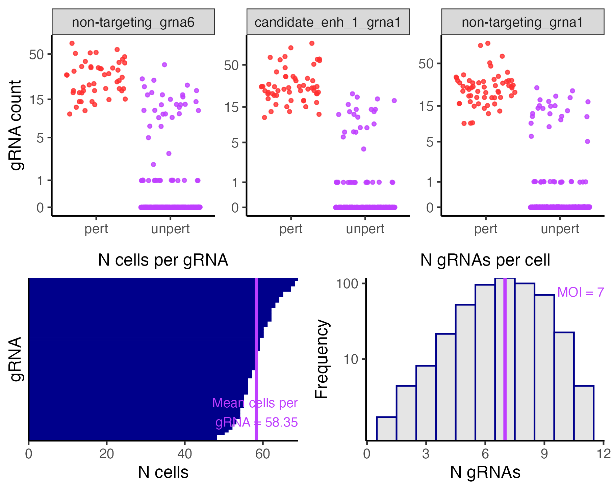
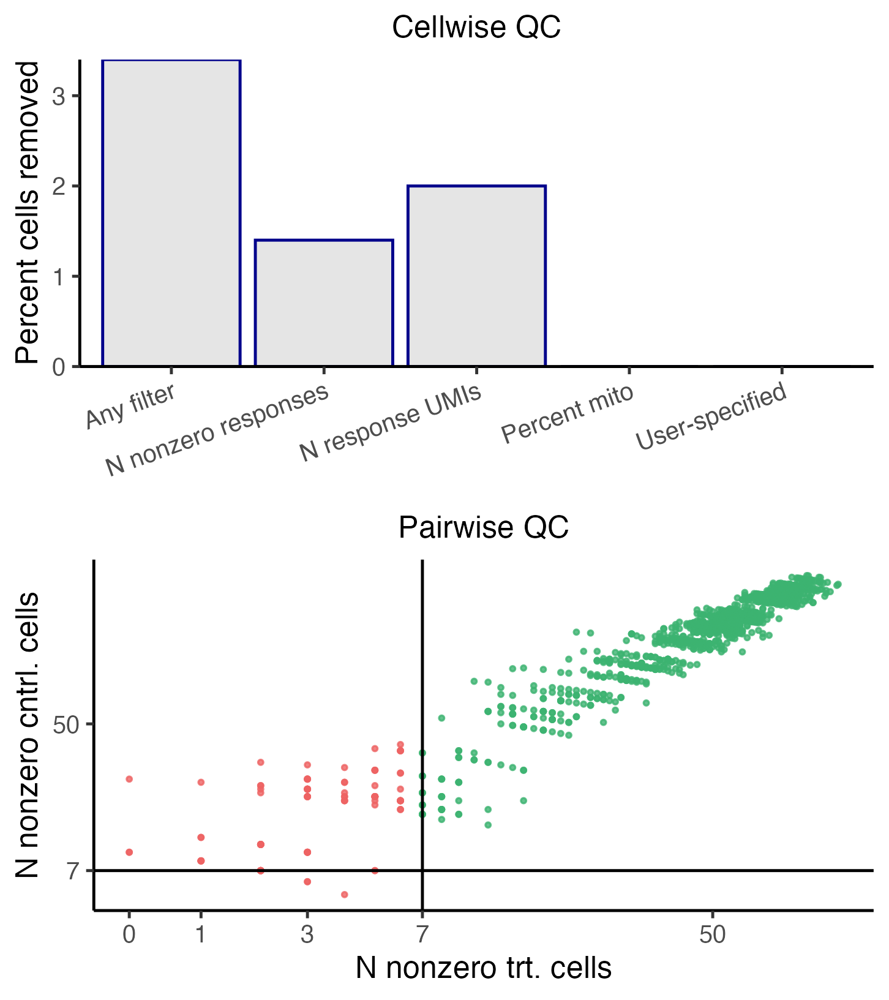
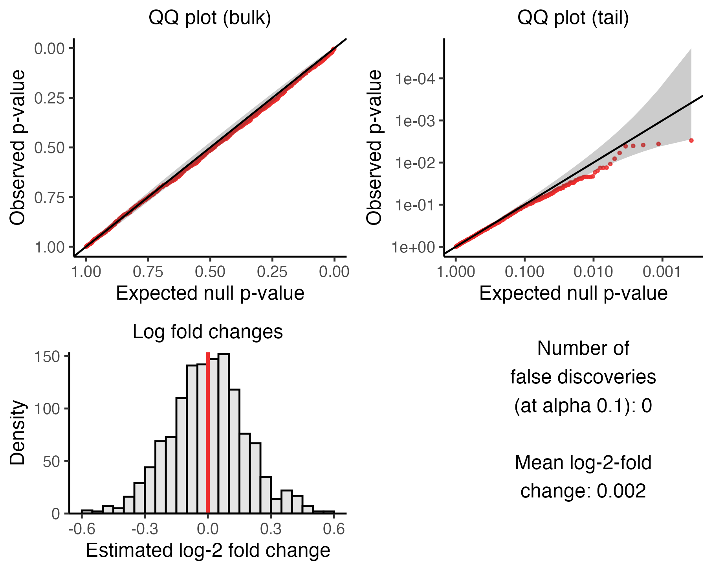
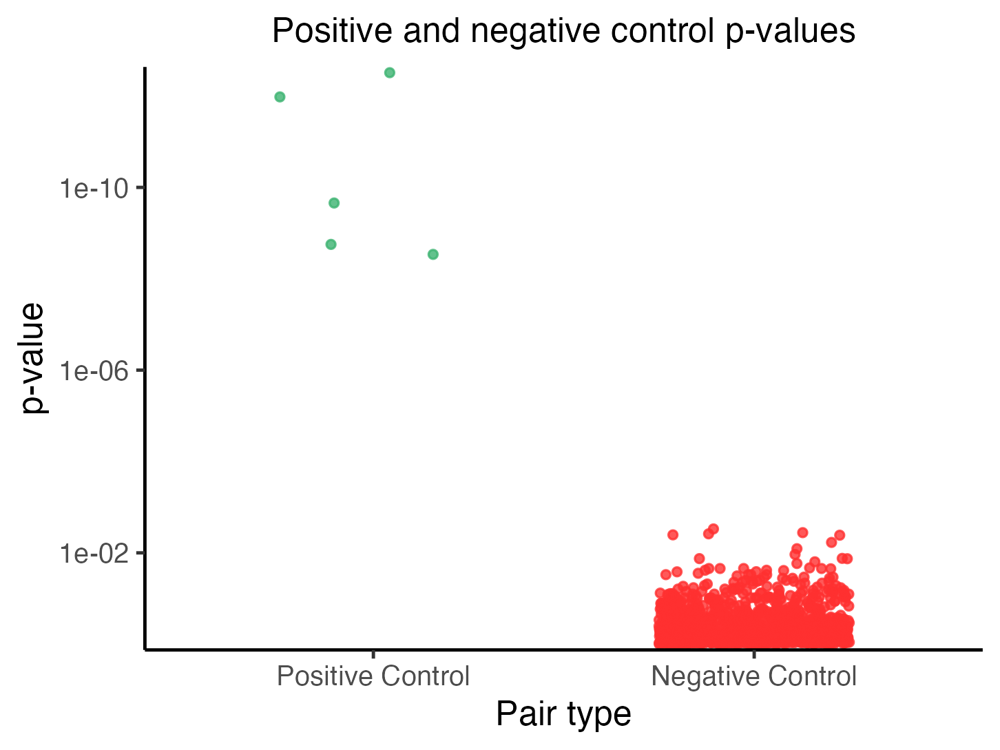
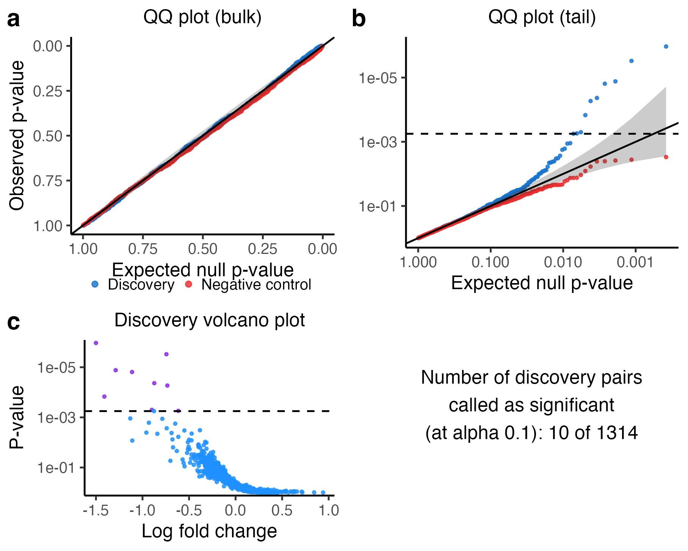

# Getting started with sceptre

`sceptre` is an R package that facilitates statistically rigorous,
massively scalable, and user-friendly single-cell CRISPR screen data
analysis. To get started, users should install `sceptre`.

``` r

install.packages("devtools")
devtools::install_github("katsevich-lab/sceptre")
```

See the [frequently asked questions
page](https://timothy-barry.github.io/sceptre-book/faq.html) for tips on
installing `sceptre` such that it runs as fast as possible. Users can
load `sceptre` via a call to
[`library()`](https://rdrr.io/r/base/library.html).

``` r

library(sceptre)
```

The standard pipeline involved in applying `sceptre` to analyze a
dataset consists of several steps, which we summarize in the following
schematic.


Standard `sceptre` pipeline

This chapter illustrates application of `sceptre` to a small simulated
CRISPRi screen of candidate enhancers, modeled on that of [Gasperini,
2019](https://pubmed.ncbi.nlm.nih.gov/30612741/). The goal of the
analysis is to confidently link enhancers to genes by testing for
changes in gene expression in response to the CRISPR perturbations of
the candidate enhancers.

Using `sceptre` is simple; carrying out an entire analysis requires only
a few lines of code. Below, we provide a minimal working example of
applying `sceptre` to analyze the example data. First, we load the
example data into R via the function
[`import_data_from_cellranger()`](https://katsevich-lab.github.io/sceptre/reference/import_data_from_cellranger.md),
which creates a `sceptre_object`, an object-based representation of the
single-cell CRISPR screen data. Next, we specify the gRNA-gene pairs
that we seek to test for association. Then, we call the pipeline
functions on the `sceptre_object` in order. Finally, we write the
outputs to a temporary directory.

``` r

# load the data, creating a sceptre_object
directories <- paste0(
    system.file("extdata", package = "sceptre"),
    "/highmoi_example/gem_group_",
    1:2
)
data(grna_target_data_frame_highmoi)
sceptre_object <- import_data_from_cellranger(
    directories = directories,
    moi = "high",
    grna_target_data_frame = grna_target_data_frame_highmoi
)

# construct the grna-gene pairs to analyze
positive_control_pairs <- construct_positive_control_pairs(sceptre_object)
discovery_pairs <- construct_cis_pairs(
    sceptre_object,
    positive_control_pairs = positive_control_pairs
)

# apply the pipeline functions to the sceptre_object in order
sceptre_object <- sceptre_object |> # |> is R's base pipe, similar to %>%
    set_analysis_parameters(discovery_pairs, positive_control_pairs) |>
    run_calibration_check() |>
    run_power_check() |>
    run_discovery_analysis()

# write the results to disk
output_directory <- file.path(tempdir(), "sceptre_outputs")
write_outputs_to_directory(sceptre_object, output_directory)

# open the output directory to inspect the results
browseURL(output_directory)
```

That’s it. The output directory now contains a variety of results and
plots from the analysis, including the set of significant gRNA-gene
pairs:

    ## # A tibble: 13 × 4
    ##   grna_target      response_id        p_value log_2_fold_change
    ##   <chr>            <chr>                <dbl>             <dbl>
    ## 1 candidate_enh_17 ENSG00000220891 0.00000215            -1.50 
    ## 2 candidate_enh_15 ENSG00000211641 0.00000604            -0.743
    ## 3 candidate_enh_18 ENSG00000220891 0.0000262             -1.29 
    ## 4 candidate_enh_5  ENSG00000211655 0.0000310             -1.11 
    ## 5 candidate_enh_19 ENSG00000253451 0.0000865             -0.874
    ## # ℹ 8 more rows

We describe each step of the pipeline in greater detail below.

## 1. Import data

The first step is to import the data. **Data can be imported into
`sceptre` from 10x Cell Ranger or Parse outputs, as well as from R
matrices.** The simplest way to import the data is to read the output of
one or more calls to `cellranger_count` into `sceptre` via the function
[`import_data_from_cellranger()`](https://katsevich-lab.github.io/sceptre/reference/import_data_from_cellranger.md).
[`import_data_from_cellranger()`](https://katsevich-lab.github.io/sceptre/reference/import_data_from_cellranger.md)
requires three arguments: `directories`, `grna_target_data_frame`, and
`moi`.

1.  `directories` is a character vector specifying the locations of the
    directories outputted by one or more calls to `cellranger_count`.
    Below, we set the variable `directories` to the (machine-dependent)
    location of the example CRISPRi data on disk.

    ``` r

    directories <- paste0(
        system.file("extdata", package = "sceptre"),
        "/highmoi_example/gem_group_",
        1:2
    )
    directories # file paths to the example data on your computer
    ```

        ## [1] "/private/var/folders/1w/h831hyps5qs5lzkh5xjj0_wh0000gq/T/RtmpgcetiN/temp_libpath124931c84cecb/sceptre/extdata/highmoi_example/gem_group_1"
        ## [2] "/private/var/folders/1w/h831hyps5qs5lzkh5xjj0_wh0000gq/T/RtmpgcetiN/temp_libpath124931c84cecb/sceptre/extdata/highmoi_example/gem_group_2"

    `directories` points to two directories, both of which store the
    expression data in matrix market format and contain the files
    `barcodes.tsv.gz`, `features.tsv.gz`, and `matrix.mtx.gz`.

    ``` r

    list.files(directories[1])
    ```

        ## [1] "barcodes.tsv.gz" "features.tsv.gz" "matrix.mtx.gz"

    ``` r

    list.files(directories[2])
    ```

        ## [1] "barcodes.tsv.gz" "features.tsv.gz" "matrix.mtx.gz"

2.  `grna_target_data_frame` is a data frame mapping each individual
    gRNA to the genomic element that the gRNA targets.
    `grna_target_data_frame` contains two required columns: `grna_id`
    and `grna_target`. `grna_id` is the ID of an individual gRNA, while
    `grna_target` is a label specifying the genomic element that the
    gRNA targets. (Typically, multiple gRNAs are designed to target a
    given genomic element in a single-cell CRISPR screen.) Non-targeting
    (NT) gRNAs are assigned a gRNA target label of “non-targeting”.
    `grna_target_data_frame` optionally contains the columns `chr`,
    `start`, and `end`, which give the chromosome, start coordinate, and
    end coordinate, respectively, of the genomic region that each gRNA
    targets. Finally, `grna_target_data_frame` optionally can contain
    the column `vector_id` specifying the vector to which a given gRNA
    belongs. `vector_id` should be supplied in experiments in which each
    viral vector contains two or more distinct gRNAs (as in, e.g.,
    [(Replogle, 2022)](https://pubmed.ncbi.nlm.nih.gov/35688146/)). We
    load and examine the `grna_target_data_frame` corresponding to the
    example data.

    ``` r

    data(grna_target_data_frame_highmoi)
    grna_target_data_frame_highmoi[c(1:4, 11:14, 51:54), ]
    ```

        ##                  grna_id     grna_target   chr    start      end
        ## 1  ENSG00000224277_grna1 ENSG00000224277 chr22 23567064 23567113
        ## 2  ENSG00000224277_grna2 ENSG00000224277 chr22 23567114 23567163
        ## 3  ENSG00000233521_grna1 ENSG00000233521 chr22 27225134 27225183
        ## 4  ENSG00000233521_grna2 ENSG00000233521 chr22 27225184 27225233
        ## 11 candidate_enh_1_grna1 candidate_enh_1 chr22 20772896 20772945
        ## 12 candidate_enh_1_grna2 candidate_enh_1 chr22 20772946 20772995
        ## 13 candidate_enh_2_grna1 candidate_enh_2 chr22 19998415 19998464
        ## 14 candidate_enh_2_grna2 candidate_enh_2 chr22 19998465 19998514
        ## 51   non-targeting_grna1   non-targeting  <NA>       NA       NA
        ## 52   non-targeting_grna2   non-targeting  <NA>       NA       NA
        ## 53   non-targeting_grna3   non-targeting  <NA>       NA       NA
        ## 54   non-targeting_grna4   non-targeting  <NA>       NA       NA

    Some gRNAs (e.g., `ENSG00000224277_grna1`) target gene transcription
    start sites and serve as positive controls; other gRNAs (e.g.,
    `candidate_enh_1_grna1`) target candidate enhancers, while others
    still (e.g., `non-targeting_grna1`) are non-targeting. Each gene and
    candidate enhancer in this dataset is targeted by exactly two gRNAs.

3.  `moi` is a string specifying the multiplicity-of-infection (MOI) of
    the data, taking values `"high"` or `"low"`. A high-MOI
    (respectively, low-MOI) dataset is one in which the experimenter has
    aimed to insert multiple gRNAs (respectively, a single gRNA) into
    each cell. (If a given cell is determined to contain multiple gRNAs
    in a low-MOI screen, that cell is removed as part of the quality
    control step, as discussed below.) The example dataset is a high MOI
    dataset, and so we set `moi` to `"high"`.

    ``` r

    moi <- "high"
    ```

Finally, we call the function
[`import_data_from_cellranger()`](https://katsevich-lab.github.io/sceptre/reference/import_data_from_cellranger.md),
passing `directories`, `grna_target_data_frame`, and `moi` as arguments.

``` r

sceptre_object <- import_data_from_cellranger(
    directories = directories,
    grna_target_data_frame = grna_target_data_frame_highmoi,
    moi = moi
)
```

[`import_data_from_cellranger()`](https://katsevich-lab.github.io/sceptre/reference/import_data_from_cellranger.md)
returns a `sceptre_object`, which is an object-based representation of
the single-cell CRISPR screen data. Evaluating `sceptre_object` in the
console prints a helpful summary of the data.

``` r

sceptre_object
```

    ## An object of class sceptre_object.
    ## 
    ## Attributes of the data:
    ##  • 500 cells
    ##  • 100 responses
    ##  • High multiplicity-of-infection 
    ##  • 50 targeting gRNAs (distributed across 25 targets) 
    ##  • 10 non-targeting gRNAs 
    ##  • 5 covariates (batch, grna_n_nonzero, grna_n_umis, response_n_nonzero, response_n_umis)

Several metrics are displayed, including the number of cells, the number
of genes (or “responses”), and the number of gRNAs present in the data.
`sceptre` also automatically computes the following cell-specific
covariates: `grna_n_nonzero` (i.e., the number of gRNAs expressed in the
cell), `grna_n_umis` (i.e., the number of gRNA UMIs sequenced in the
cell), `response_n_nonzero` (i.e., the number of responses expressed in
the cell), `response_n_umis` (i.e., the number of response UMIs
sequenced in the cell), `response_p_mito` (i.e., the fraction of
transcripts mapping to mitochondrial genes), and `batch`. (Cells loaded
from different directories are assumed to come from different batches.)

## 2. Set analysis parameters

The second step is to set the analysis parameters. The most important
analysis parameters are the discovery pairs, positive control pairs,
sidedness, and gRNA grouping strategy.

1.  **Discovery pairs and positive control pairs**. The primary goal of
    `sceptre` is to determine whether perturbation of a gRNA target
    (such as an enhancer) leads to a change in expression of a response
    (such as gene). We use the term *target-response pair* to refer to a
    given gRNA target and response that we seek to test for association
    (upon perturbation of the gRNA target). A *discovery target-response
    pair* is a target-response pair whose association status we do not
    know but would like to learn. For example, in an experiment in which
    we aim to link putative enhancers to genes, the discovery
    target-response pairs might consist of the set of putative enhancers
    and genes in close physical proximity to one another.

    A *positive control* (resp., *negative control*) *target-response
    pair* is a target-response pair for which we know that there *is*
    (resp., is *not*) a relationship between the target and the
    response. Positive control target-response pairs often are formed by
    coupling a transcription start site to the gene known to be
    regulated by that transcription start site. Negative control
    target-response pairs, meanwhile, typically are constructed by
    pairing negative control gRNAs to one or more responses. (We defer a
    detailed discussion of negative control pairs to a later section of
    this chapter.) Discovery pairs are of primary scientific interest,
    while positive control and negative control pairs serve a mainly
    technial purpose, helping us verify that the biological assay and
    statistical methodology are in working order.

    `sceptre` offers several helper functions to facilitate the
    construction of positive control and discovery pairs. The function
    [`construct_positive_control_pairs()`](https://katsevich-lab.github.io/sceptre/reference/construct_positive_control_pairs.md)
    takes as argument a `sceptre_object` and outputs the set of positive
    control pairs formed by matching gRNA targets (as contained in the
    `grna_target_data_frame`) to response IDs. Positive control pairs
    are optional and need not be computed.

    ``` r

    positive_control_pairs <- construct_positive_control_pairs(sceptre_object)
    head(positive_control_pairs)
    ```

        ##       grna_target     response_id
        ## 1 ENSG00000224277 ENSG00000224277
        ## 2 ENSG00000233521 ENSG00000233521
        ## 3 ENSG00000226772 ENSG00000226772
        ## 4 ENSG00000234503 ENSG00000234503
        ## 5 ENSG00000286326 ENSG00000286326

    Next, the functions
    [`construct_cis_pairs()`](https://katsevich-lab.github.io/sceptre/reference/construct_cis_pairs.md)
    and
    [`construct_trans_pairs()`](https://katsevich-lab.github.io/sceptre/reference/construct_trans_pairs.md)
    facilitate the construction of *cis* and *trans* discovery sets,
    respectively.
    [`construct_cis_pairs()`](https://katsevich-lab.github.io/sceptre/reference/construct_cis_pairs.md)
    takes as arguments a `sceptre_object` and an integer
    `distance_threshold` and returns the set of response-target pairs
    located on the same chromosome within `distance_threshold` bases of
    one another. `positive_control_pairs` optionally can be passed to
    this function, in which case positive control gRNA targets are
    excluded from the *cis* pairs. (Note that
    [`construct_cis_pairs()`](https://katsevich-lab.github.io/sceptre/reference/construct_cis_pairs.md)
    assumes that the responses are genes rather than, say, proteins or
    chromatin-derived features.)

    ``` r

    discovery_pairs <- construct_cis_pairs(
        sceptre_object = sceptre_object,
        positive_control_pairs = positive_control_pairs,
        distance_threshold = 5e6
    )
    discovery_pairs[c(1:4, 101:104), ]
    ```

        ##         grna_target     response_id
        ## 1   candidate_enh_1 ENSG00000099889
        ## 2   candidate_enh_1 ENSG00000040608
        ## 3   candidate_enh_1 ENSG00000273343
        ## 4   candidate_enh_1 ENSG00000161133
        ## 101 candidate_enh_2 ENSG00000211638
        ## 102 candidate_enh_2 ENSG00000211640
        ## 103 candidate_enh_2 ENSG00000253126
        ## 104 candidate_enh_2 ENSG00000211641

    [`construct_trans_pairs()`](https://katsevich-lab.github.io/sceptre/reference/construct_trans_pairs.md)
    constructs the entire set of possible target-response pairs.

2.  **Sidedness**. The parameter `side` controls whether to run a
    left-tailed (`"left"`), right-tailed (`"right"`), or two-tailed
    (`"both"`; default) test. A left-tailed (resp., right-tailed) test
    is appropriate when testing for a decrease (resp., increase) in
    expression; a two-tailed test, by contrast, is appropriate when
    testing for an increase *or* decrease in expression. A left-tailed
    test is the most appropriate choice for a CRISPRi screen of
    enhancers, and so we set `side` to `"left"`.

    ``` r

    side <- "left"
    ```

3.  **gRNA integration strategy**. Typically, multiple gRNAs are
    designed to target a given genomic element. The parameter
    `grna_integration_strategy` controls if and how gRNAs that target
    the same genomic element are integrated. The default option,
    `"union"`, combines gRNAs that target the same element into a single
    “grouped gRNA;” this “grouped gRNA” is tested for association
    against the responses to which the element is paired.
    `grna_integration_strategy` also can be set to “singleton,” in which
    case each gRNA targeting a given element is tested individually
    against the responses paired to that element. In our analysis we use
    the default “union” strategy.

Finally, we set the analysis parameters by calling the function
[`set_analysis_parameters()`](https://katsevich-lab.github.io/sceptre/reference/set_analysis_parameters.md),
passing `sceptre_object`, `discovery_pairs`, `positive_control_pairs`,
and `side` as arguments. Note that `sceptre_object` is the only required
arguments to this function.

``` r

sceptre_object <- set_analysis_parameters(
    sceptre_object = sceptre_object,
    discovery_pairs = discovery_pairs,
    positive_control_pairs = positive_control_pairs,
    side = side
)
print(sceptre_object) # output suppressed for brevity
```

## 3. Assign gRNAs to cells (optional)

The third step is to assign gRNAs to cells. This step can be skipped, in
which case gRNAs are assigned to cells automatically using default
options. The gRNA assignment step involves using the gRNA UMI counts to
determine which cells contain which gRNAs. We begin by plotting the UMI
count distribution of several randomly selected gRNAs via a call to the
function
[`plot_grna_count_distributions()`](https://katsevich-lab.github.io/sceptre/reference/plot_grna_count_distributions.md).

``` r

plot_grna_count_distributions(sceptre_object)
```


Histograms of the gRNA count distributions

The gRNAs display bimodal count distributions. Consider, for example,
`candidate_enh_6_grna1` (top left corner). This gRNA exhibits a UMI
count of $`\leq 2`$ or $`\geq 8`$ in most cells and a UMI count in
between in only a handful of cells. The vast majority of cells with a
UMI count of 1 or 2 likely do not actually contain
`candidate_enh_6_grna1`. This is an example of “background
contamination,” the phenomenon by which gRNA transcripts sometimes map
to cells that do not contain the corresponding gRNA.

**`sceptre` provides three methods for assigning gRNAs to cells (the
“mixture method,” the “maximum method,” and the “thresholding
method”)**, all of which account for background contamination. The
default method for high-MOI data is the “mixture method.” The gRNA
counts are regressed onto the (unobserved) gRNA presence/absence
indicator and the cell-specific covariates (e.g., `grna_n_umis`,
`batch`) via a latent variable Poisson GLM. The fitted model yields the
probability that each cell contains the gRNA, and these probabilities
are thresholded to assign the gRNA to cells. The default method in
low-MOI is the simpler “maximum” approach: the gRNA that accounts for
the greatest number of UMIs in a given cell is assigned to that cell. A
backup option in both low- and high-MOI is the “thresholding” approach:
a given gRNA is assigned to a given cell if the UMI count of that gRNA
in that cell exceeds some integer threshold.

We carry out the gRNA assignment step via a call to the function
[`assign_grnas()`](https://katsevich-lab.github.io/sceptre/reference/assign_grnas.md).
[`assign_grnas()`](https://katsevich-lab.github.io/sceptre/reference/assign_grnas.md)
takes arguments `sceptre_object` (required) and `method` (optional); the
latter argument can be set to `"mixture"`, `"maximum"`, or
`"thresholding"`.

``` r

sceptre_object <- assign_grnas(sceptre_object = sceptre_object)
print(sceptre_object) # output suppressed for brevity
```

We can call [`plot()`](https://rdrr.io/r/graphics/plot.default.html) on
the resulting `sceptre_object` to render a plot summarizing the output
of the gRNA-to-cell assignment step.

``` r

plot(sceptre_object)
```



gRNA-to-cell assignments

The top panel plots the gRNA-to-cell assignments of three randomly
selected gRNAs. In each plot the points represent cells; the vertical
axis indicates the UMI count of the gRNA in a given cell, and the
horizontal axis indicates whether the cell has been classified as
“perturbed” (i.e., it *contains* the gRNA) or unperturbed (i.e., it does
*not contain* the gRNA). Perturbed (resp., unperturbed) cells are shown
in the left (resp., right) column. The bottom left panel is a barplot of
the number of cells to which each gRNA has been mapped. Finally, the
bottom right panel is a histogram of the number of gRNAs contained in
each cell. The mean number of gRNAs per cell — i.e., the MOI — is
displayed in purple text.

## 4. Run quality control (optional)

The fourth step is to run quality control (QC). This step likewise can
be skipped, in which case QC is applied automatically using default
options. **`sceptre` implements two kinds of QC: cellwise QC and
pairwise QC. The former aims to remove low-quality cells, while the
latter aims to remove low-quality target-response pairs.**

The cellwise QC that `sceptre` implements is standard in single-cell
analysis. Cells for which `response_n_nonzero` (i.e., the number of
expressed responses) or `response_n_umis` (i.e., the number of response
UMIs) are extremely high or extremely low are removed. Likewise, cells
for which `response_p_mito` (i.e., the fraction of UMIs mapping to
mitochondrial genes) is excessively high are removed. Additionally, in
low-MOI, cells that contain zero or multiple gRNAs (as determined during
the RNA-to-cell assignment step) are removed. Finally, users optionally
can provide a list of additional cells to remove.

`sceptre` also implements QC at the level of the target-response pair.
For a given pair we define the “treatment cells” as those that contain a
gRNA targeting the given target. Next, we define the “control cells” as
the cells against which the treatment cells are compared to carry out
the differential expression test. We define the “number of nonzero
treatment cells” (`n_nonzero_trt`) as the number of *treatment* cells
with nonzero expression of the response; similarly, we define the
“number of nonzero control cells” (`n_nonzero_cntrl`) as the number of
*control* cells with nonzero expression of the response. `sceptre`
filters out pairs for which `n_nonzero_trt` or `n_nonzero_cntrl` falls
below some threshold (by default 7).

We call the function
[`run_qc()`](https://katsevich-lab.github.io/sceptre/reference/run_qc.md)
on the `sceptre_object` to carry out cellwise and pairwise QC.
[`run_qc()`](https://katsevich-lab.github.io/sceptre/reference/run_qc.md)
has several optional arguments that control the stringency of the
various QC thresholds. For example, we set `p_mito_threshold = 0.075`,
which filters out cells whose `response_p_mito` value exceeds 0.075.
(The optional arguments are set to reasonable defaults; the default for
`p_mito_threshold` is 0.2, for instance).

``` r

sceptre_object <- run_qc(sceptre_object, p_mito_threshold = 0.075)
print(sceptre_object) # output suppressed for brevity
```

We can visualize the output of the QC step by calling
[`plot()`](https://rdrr.io/r/graphics/plot.default.html) on the updated
`sceptre_object`.

``` r

plot(sceptre_object)
```



Cellwise and pairwise quality control

The top panel depicts the outcome of the cellwise QC. The various
cellwise QC filters (e.g., “N nonzero responses,” “N response UMIs,”
“Percent mito”, etc.) are shown on the horizontal axis, and the
percentage of cells removed due application of a given QC filter is
shown on the vertical axis. Note that a cell can be flagged by multiple
QC filters; for example, a cell might have an extremely high
`response_n_umi` value *and* an extremely high `response_n_nonzero`
value. Thus, the height of the “any filter” bar (which indicates the
percentage of cells removed due to application of *any* filter) need not
be equal to the sum of the heights of the other bars. The bottom panel
depicts the outcome of the pairwise QC. Each point corresponds to a
target-response pair; the vertical axis (resp., horizontal axis)
indicates the `n_nonzero_trt` (resp., `n_nonzero_cntrl`) value of that
pair. Pairs for which `n_nonzero_trt` or `n_nonzero_cntrl` fall below
the threshold are removed (red), while the remaining pairs are retained
(green).

## 5. Run calibration check

The fifth step is to run the calibration check. **The calibration check
is an analysis that verifies that `sceptre` controls the rate of false
discoveries on the dataset under analysis.** The calibration check
proceeds as follows. First, negative control target-response pairs are
constructed (automatically) by coupling subsets of NT gRNAs to randomly
selected responses. Importantly, the negative control pairs are
constructed in such a way that they are similar to the discovery pairs,
the difference being that the negative control pairs are devoid of
biological signal. Next, `sceptre` is applied to analyze the negative
control pairs. Given that the negative control pairs are absent of
signal, `sceptre` should produce approximately uniformly distributed
p-values on the negative control pairs. Moreover, after an appropriate
multiple testing correction, `sceptre` should make zero (or very few)
discoveries on the negative control pairs. Verifying calibration via the
calibration check increases our confidence that the discovery set that
`sceptre` ultimately produces is uncontaminated by excess false
positives.

We run the calibration check by calling the function
[`run_calibration_check()`](https://katsevich-lab.github.io/sceptre/reference/run_calibration_check.md)
on the `sceptre_object`.

``` r

sceptre_object <- run_calibration_check(sceptre_object)
print(sceptre_object) # output suppressed for brevity
```

We can assess the outcome of the calibration check by calling
[`plot()`](https://rdrr.io/r/graphics/plot.default.html) on the
resulting `sceptre_object`.

``` r

plot(sceptre_object)
```



Calibration check results

The visualization consists of four panels, which we describe below.

- The upper left panel is a QQ plot of the p-values plotted on an
  untransformed scale. The p-values should lie along the diagonal line,
  indicating uniformity of the p-values in the *bulk* of the
  distribution.

- The upper right panel is a QQ plot of the p-values plotted on a
  negative log-10 transformed scale. The p-values again should lie along
  the diagonal line (with the majority of the p-values falling within
  the gray confidence band), indicating uniformity of the p-values in
  the *tail* of the distribution.

- The lower left panel is a histogram of the estimated log-2 fold
  changes. The histogram should be roughly symmetric and centered around
  zero.

- Finally, the bottom right panel is a text box displaying (i) the
  number of false discoveries that `sceptre` has made on the negative
  control data and

  2.  the mean estimated log-fold change. The number of false
      discoveries should be a small integer like zero, one, two, or
      three, with zero being ideal. The mean estimated log-fold change,
      meanwhile, should be a numeric value close to zero; a number in
      the range \[-0.1, 0.1\] is adequate.

`sceptre` may not exhibit good calibration initially, which is OK. See
the [book](https://timothy-barry.github.io/sceptre-book/) for strategies
for improving calibration.

## 6. Run power check (optional)

The sixth step — which is optional — is to run the power check. The
power check involves applying `sceptre` to analyze the positive control
pairs. Given that the positive control pairs are known to contain
signal, `sceptre` should produce significant (i.e., small) p-values on
the positive control pairs. **The power check enables us to assess
`sceptre`’s power (i.e., its ability to detect true associations) on the
dataset under analysis.** We run the power check by calling the function
[`run_power_check()`](https://katsevich-lab.github.io/sceptre/reference/run_power_check.md)
on the `sceptre_object`.

``` r

sceptre_object <- run_power_check(sceptre_object)
print(sceptre_object) # output suppressed for brevity
```

We can visualize the outcome of the power check by calling
[`plot()`](https://rdrr.io/r/graphics/plot.default.html) on the
resulting `sceptre_object`.

``` r

plot(sceptre_object)
```



Power check results

Each point in the plot corresponds to a target-response pair, with
positive control pairs in the left column and negative control pairs in
the right column. The vertical axis indicates the p-value of a given
pair; smaller (i.e., more significant) p-values are positioned higher
along this axis (p-values truncated at $`10^{-20}`$ for visualization).
The positive control p-values should be small, and in particular,
smaller than the negative control p-values.

## 7. Run discovery analysis

The seventh and penultimate step is to run the discovery analysis. The
discovery analysis entails applying `sceptre` to analyze the discovery
pairs. We run the discovery analysis by calling the function
[`run_discovery_analysis()`](https://katsevich-lab.github.io/sceptre/reference/run_discovery_analysis.md).

``` r

sceptre_object <- run_discovery_analysis(sceptre_object)
print(sceptre_object) # output suppressed for brevity
```

We can visualize the outcome of the discovery analysis by calling
[`plot()`](https://rdrr.io/r/graphics/plot.default.html) on the
resulting `sceptre_object`.

``` r

plot(sceptre_object)
```



Discovery analysis results

The visualization consists of four panels.

- The upper left plot superimposes the discovery p-values (blue) on top
  of the negative control p-values (red) on an untransformed scale.

- The upper right plot is the same as the upper left plot, but the scale
  is negative log-10 transformed. The discovery p-values should trend
  above the diagonal line, indicating the presence of signal in the
  discovery set. The horizontal dashed line indicates the multiple
  testing threshold; discovery pairs whose p-value falls above this line
  are called as significant.

- The bottom left panel is a volcano plot of the p-values and log fold
  changes of the discovery pairs. Each point corresponds to a pair; the
  estimated log-2 fold change of the pair is plotted on the horizontal
  axis, and the (negative log-10 transformed) p-value is plotted on the
  vertical axis. The horizontal dashed line again indicates the multiple
  testing threshold. Points above the dashed line (colored in purple)
  are called as discoveries, while points below (colored in blue) are
  called as insignificant.

- The bottom right panel is a text box displaying the number of
  discovery pairs called as significant.

## 8. Write outputs to directory

The eighth and final step is to write the outputs of the analysis to a
directory on disk. We call the function
[`write_outputs_to_directory()`](https://katsevich-lab.github.io/sceptre/reference/write_outputs_to_directory.md),
which takes as arguments a `sceptre_object` and `directory`; `directory`
is a string indicating the location of the directory in which to write
the results contained within the `sceptre_object`.

``` r

write_outputs_to_directory(
    sceptre_object = sceptre_object,
    directory = output_directory
)
```

[`write_outputs_to_directory()`](https://katsevich-lab.github.io/sceptre/reference/write_outputs_to_directory.md)
writes several files to the specified directory: a text-based summary of
the analysis (`analysis_summary.txt`), the various plots (`*.png`), the
calibration check, power check, discovery analysis results
(`results_run_calibration_check.rds`, `results_run_power_check.rds`, and
`results_run_discovery_analysis.rds`, respectively), and the binary
gRNA-to-cell assignment matrix (`grna_assignment_matrix.rds`).

``` r

list.files(output_directory)
```

    ##  [1] "analysis_summary.txt"               "grna_assignment_matrix.rds"        
    ##  [3] "plot_assign_grnas.png"              "plot_grna_count_distributions.png" 
    ##  [5] "plot_run_calibration_check.png"     "plot_run_discovery_analysis.png"   
    ##  [7] "plot_run_power_check.png"           "plot_run_qc.png"                   
    ##  [9] "results_run_calibration_check.rds"  "results_run_discovery_analysis.rds"
    ## [11] "results_run_power_check.rds"

We also can obtain the calibration check, power check, and discovery
analysis results in R via a call to the function
[`get_result()`](https://katsevich-lab.github.io/sceptre/reference/get_result.md),
passing as arguments `sceptre_object` and `analysis`, where the latter
is a string indicating the function whose results we are querying.

``` r

result <- get_result(
    sceptre_object = sceptre_object,
    analysis = "run_discovery_analysis"
)
```

The variable `result` is a data frame, the rows of which correspond to
target-response pairs, and the columns of which are as follows:
`response_id`, `grna_target`, `n_nonzero_trt`, `n_nonzero_cntrl`,
`pass_qc` (a `TRUE`/`FALSE` value indicating whether the pair passes
pairwise QC), `p_value`, `fold_change`, `se_fold_change` (standard error
for fold change estimate), `log_2_fold_change`, and `significant` (a
`TRUE`/`FALSE` value indicating whether the pair is called as
significant). The p-value contained within the `p_value` column is a raw
(i.e., non-multiplicity-adjusted) p-value.

``` r

head(result)
```

    ##        response_id      grna_target n_nonzero_trt n_nonzero_cntrl pass_qc
    ##             <char>           <char>         <int>           <int>  <lgcl>
    ## 1: ENSG00000220891 candidate_enh_17            20             169    TRUE
    ## 2: ENSG00000211641 candidate_enh_15            77             301    TRUE
    ## 3: ENSG00000220891 candidate_enh_18            22             167    TRUE
    ## 4: ENSG00000211655  candidate_enh_5            29             165    TRUE
    ## 5: ENSG00000253451 candidate_enh_19            45             227    TRUE
    ## 6: ENSG00000211641 candidate_enh_16            75             303    TRUE
    ##         p_value fold_change se_fold_change log_2_fold_change significant
    ##           <num>       <num>          <num>             <num>      <lgcl>
    ## 1: 1.076683e-06   0.3524393     0.07719320        -1.5045534        TRUE
    ## 2: 3.021114e-06   0.5974147     0.06777816        -0.7431952        TRUE
    ## 3: 1.311570e-05   0.4094443     0.08408239        -1.2882609        TRUE
    ## 4: 1.550816e-05   0.4626207     0.08963478        -1.1120984        TRUE
    ## 5: 4.323042e-05   0.5457610     0.07300526        -0.8736588        TRUE
    ## 6: 5.376764e-05   0.6016546     0.06982219        -0.7329927        TRUE

## Further reading

We encourage readers interested in learning more to consult the [sceptre
manual](https://timothy-barry.github.io/sceptre-book/).

``` r

library(sessioninfo)
session_info()
```

    ## ─ Session info ───────────────────────────────────────────────────────────────
    ##  setting  value
    ##  version  R version 4.6.0 (2026-04-24)
    ##  os       macOS Tahoe 26.4.1
    ##  system   aarch64, darwin23
    ##  ui       X11
    ##  language en
    ##  collate  en_US
    ##  ctype    en_US
    ##  tz       America/New_York
    ##  date     2026-06-24
    ##  pandoc   3.9.0.2 @ /opt/homebrew/bin/ (via rmarkdown)
    ##  quarto   1.9.38 @ /usr/local/bin/quarto
    ## 
    ## ─ Packages ───────────────────────────────────────────────────────────────────
    ##  package      * version   date (UTC) lib source
    ##  bslib          0.10.0    2026-01-26 [3] CRAN (R 4.6.0)
    ##  cachem         1.1.0     2024-05-16 [3] CRAN (R 4.6.0)
    ##  cli            3.6.6     2026-04-09 [3] CRAN (R 4.6.0)
    ##  cowplot        1.2.0     2025-07-07 [3] CRAN (R 4.6.0)
    ##  crayon         1.5.3     2024-06-20 [3] CRAN (R 4.6.0)
    ##  data.table     1.18.4    2026-05-06 [3] CRAN (R 4.6.0)
    ##  desc           1.4.3     2023-12-10 [3] CRAN (R 4.6.0)
    ##  digest         0.6.39    2025-11-19 [3] CRAN (R 4.6.0)
    ##  dplyr          1.2.1     2026-04-03 [3] CRAN (R 4.6.0)
    ##  evaluate       1.0.5     2025-08-27 [3] CRAN (R 4.6.0)
    ##  farver         2.1.2     2024-05-13 [3] CRAN (R 4.6.0)
    ##  fastmap        1.2.0     2024-05-15 [3] CRAN (R 4.6.0)
    ##  fs             2.1.0     2026-04-18 [3] CRAN (R 4.6.0)
    ##  generics       0.1.4     2025-05-09 [3] CRAN (R 4.6.0)
    ##  ggplot2        4.0.3     2026-04-22 [3] CRAN (R 4.6.0)
    ##  glue           1.8.1     2026-04-17 [3] CRAN (R 4.6.0)
    ##  gtable         0.3.6     2024-10-25 [3] CRAN (R 4.6.0)
    ##  htmltools      0.5.9     2025-12-04 [3] CRAN (R 4.6.0)
    ##  htmlwidgets    1.6.4     2023-12-06 [3] CRAN (R 4.6.0)
    ##  jquerylib      0.1.4     2021-04-26 [3] CRAN (R 4.6.0)
    ##  jsonlite       2.0.0     2025-03-27 [3] CRAN (R 4.6.0)
    ##  knitr          1.51      2025-12-20 [3] CRAN (R 4.6.0)
    ##  labeling       0.4.3     2023-08-29 [3] CRAN (R 4.6.0)
    ##  lattice        0.22-9    2026-02-09 [3] CRAN (R 4.6.0)
    ##  lifecycle      1.0.5     2026-01-08 [3] CRAN (R 4.6.0)
    ##  magrittr       2.0.5     2026-04-04 [3] CRAN (R 4.6.0)
    ##  Matrix       * 1.7-5     2026-03-21 [3] CRAN (R 4.6.0)
    ##  otel           0.2.0     2025-08-29 [3] CRAN (R 4.6.0)
    ##  pillar         1.11.1    2025-09-17 [3] CRAN (R 4.6.0)
    ##  pkgconfig      2.0.3     2019-09-22 [3] CRAN (R 4.6.0)
    ##  pkgdown        2.2.0     2025-11-06 [3] CRAN (R 4.6.0)
    ##  purrr          1.2.2     2026-04-10 [3] CRAN (R 4.6.0)
    ##  R.methodsS3    1.8.2     2022-06-13 [3] CRAN (R 4.6.0)
    ##  R.oo           1.27.1    2025-05-02 [3] CRAN (R 4.6.0)
    ##  R.utils        2.13.0    2025-02-24 [3] CRAN (R 4.6.0)
    ##  R6             2.6.1     2025-02-15 [3] CRAN (R 4.6.0)
    ##  ragg           1.5.2     2026-03-23 [3] CRAN (R 4.6.0)
    ##  RColorBrewer   1.1-3     2022-04-03 [3] CRAN (R 4.6.0)
    ##  Rcpp           1.1.1-1.1 2026-04-24 [3] CRAN (R 4.6.0)
    ##  rlang          1.2.0     2026-04-06 [3] CRAN (R 4.6.0)
    ##  rmarkdown      2.31      2026-03-26 [3] CRAN (R 4.6.0)
    ##  S7             0.2.2     2026-04-22 [3] CRAN (R 4.6.0)
    ##  sass           0.4.10    2025-04-11 [3] CRAN (R 4.6.0)
    ##  scales         1.4.0     2025-04-24 [3] CRAN (R 4.6.0)
    ##  sceptre      * 0.99.0    2026-06-24 [1] Bioconductor
    ##  sessioninfo  * 1.2.3     2025-02-05 [3] CRAN (R 4.6.0)
    ##  systemfonts    1.3.2     2026-03-05 [3] CRAN (R 4.6.0)
    ##  textshaping    1.0.5     2026-03-06 [3] CRAN (R 4.6.0)
    ##  tibble         3.3.1     2026-01-11 [3] CRAN (R 4.6.0)
    ##  tidyselect     1.2.1     2024-03-11 [3] CRAN (R 4.6.0)
    ##  utf8           1.2.6     2025-06-08 [3] CRAN (R 4.6.0)
    ##  vctrs          0.7.3     2026-04-11 [3] CRAN (R 4.6.0)
    ##  withr          3.0.2     2024-10-28 [3] CRAN (R 4.6.0)
    ##  xfun           0.57      2026-03-20 [3] CRAN (R 4.6.0)
    ##  yaml           2.3.12    2025-12-10 [3] CRAN (R 4.6.0)
    ## 
    ##  [1] /private/var/folders/1w/h831hyps5qs5lzkh5xjj0_wh0000gq/T/RtmpgcetiN/temp_libpath124931c84cecb
    ##  [2] /Users/ekatsevi/Library/R/arm64/4.6/library
    ##  [3] /Library/Frameworks/R.framework/Versions/4.6/Resources/library
    ##  * ── Packages attached to the search path.
    ## 
    ## ──────────────────────────────────────────────────────────────────────────────
