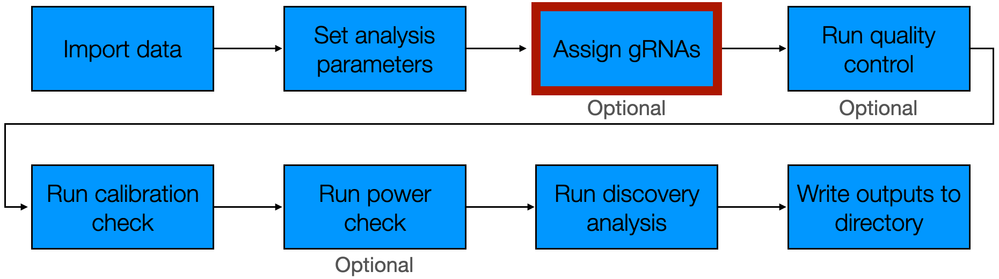
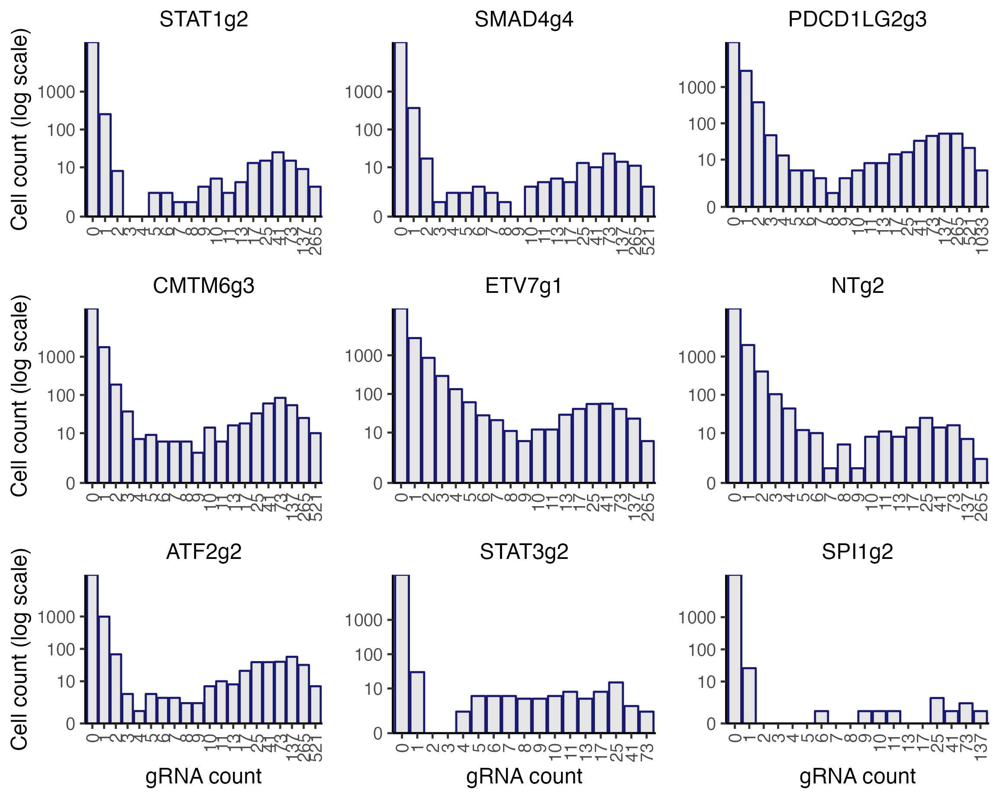
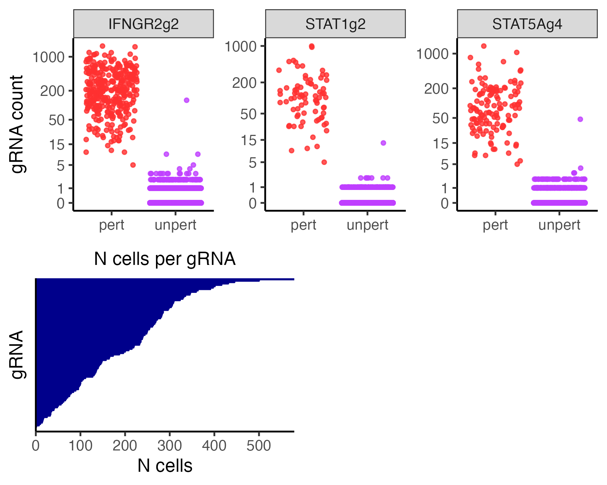
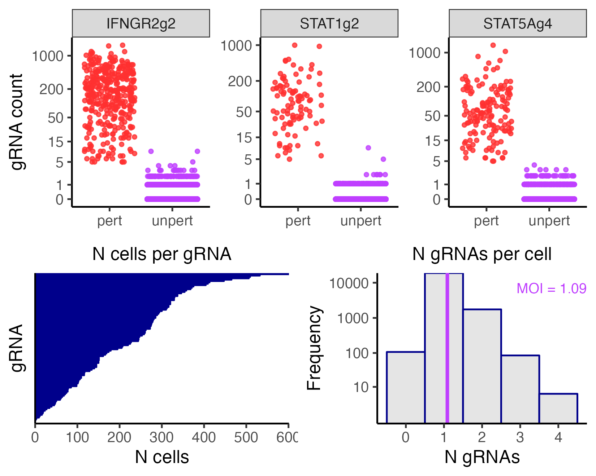

```{r, include = FALSE}
knitr::opts_chunk$set(
  collapse = TRUE,
  comment = "#>"
)
```

The third step of the pipeline is to assign gRNAs to cells. This step entails using the gRNA UMI counts to determine which cells contain which gRNAs. `sceptre` provides three gRNA-to-cell assignment methods: the "mixture model method," the "maximum method," and "the thresholding method."

```{r, out.width = "650px", fig.align="center", echo = FALSE}

```

We begin by loading `sceptre`.

```{r,results='hide'}
library(sceptre)
```

## Initialize the CRISPRi and CRISPRko `sceptre_object`s

We use the high-MOI CRISPRi and low-MOI CRISPRko data as running examples. We call `import_data()` and `set_analysis_parameters()` on the low-MOI CRISPRko data to initialize a `sceptre_object` called `sceptre_object_lowmoi`.

```{r}
# low-MOI CRISPRko data setup
# 1. import data
sceptre_object_lowmoi <- import_data(response_matrix = lowmoi_example_data$response_matrix,
                                     grna_matrix = lowmoi_example_data$grna_matrix,
                                     extra_covariates = lowmoi_example_data$extra_covariates,
                                     grna_target_data_frame = lowmoi_example_data$grna_target_data_frame,
                                     moi = "low")

# 2. set analysis parameters
positive_control_pairs <- construct_positive_control_pairs(sceptre_object_lowmoi)
discovery_pairs <- construct_trans_pairs(sceptre_object = sceptre_object_lowmoi,
                                         positive_control_pairs = positive_control_pairs)
sceptre_object_lowmoi <- set_analysis_parameters(sceptre_object = sceptre_object_lowmoi,
                                                 discovery_pairs = discovery_pairs,
                                                 positive_control_pairs = positive_control_pairs)
```

We do the same for the high-MOI CRISPRi data, creating `sceptre_object_highmoi`.

```{r}
# high-MOI CRISPRi setup
# 1. import data
sceptre_object_highmoi <- import_data(response_matrix = highmoi_example_data$response_matrix,
                                      grna_matrix = highmoi_example_data$grna_matrix,
                                      grna_target_data_frame = grna_target_data_frame_highmoi,
                                      moi = "high",
                                      extra_covariates = highmoi_example_data$extra_covariates,
                                      response_names = highmoi_example_data$gene_names)
# 2. set analysis parameters
positive_control_pairs <- construct_positive_control_pairs(sceptre_object_highmoi)
discovery_pairs <- construct_cis_pairs(sceptre_object_highmoi,
                                       positive_control_pairs = positive_control_pairs,
                                       distance_threshold = 5e6)
sceptre_object_highmoi <- set_analysis_parameters(sceptre_object = sceptre_object_highmoi,
                                                  discovery_pairs = discovery_pairs,
                                                  positive_control_pairs = positive_control_pairs,
                                                  side = "left")
```

We are now ready to carry out the gRNA assignment step on both datasets.

## Visualize the gRNA count distributions

A helpful first step in assigning gRNAs to cells is to visualize the gRNA UMI count distributions. As discussed in the Get Started vignette (`vignette("sceptre")`), we can use the function `plot_grna_count_distributions()` to plot the empirical UMI count distribution of one or more gRNAs. `plot_grna_count_distributions()` takes several arguments: `sceptre_object` (required), `n_grnas_to_plot` (optional), `grnas_to_plot` (optional), and `threshold` (optional). `n_grnas_to_plot` is an integer specifying the number of randomly-selected gRNAs to plot. `grnas_to_plot` is a character vector specifying (by name) one or more specific gRNAs to plot. Finally, `threshold` is an integer specifying the location at which to draw a dotted vertical line. We call  `plot_grna_count_distributions()` on the low-MOI CRISPRko data, plotting nine random gRNAs.

```{r, eval=FALSE}
plot_grna_count_distributions(sceptre_object = sceptre_object_lowmoi,
                              n_grnas_to_plot = 9)
```

```{r, out.width = "750px", fig.align="center", echo = FALSE, fig.cap=c("Histograms of the gRNA count distributions for the low-MOI CRISPRko data.")}
set.seed(2)
p <- plot_grna_count_distributions(sceptre_object = sceptre_object_lowmoi, n_grnas_to_plot = 9)
ggplot2::ggsave(filename = "grna_count_distribution_step3.png", plot = p, device = "png", scale = 1.4, width = 5, height = 4, dpi = 330)

```

We see that the gRNA count distributions exhibit generally bimodal behavior. As discussed in Get Started, this bimodality is due to the phenomenon of background contamination: gRNA reads sometimes map to cells that do not contain the corresponding gRNA. `sceptre` provides three methods for assigning gRNAs to cells, all of which account for background contamination.

## Assign gRNAs to cells

We assign gRNAs to cells to cells by calling the function `assign_grnas()`. `assign_grnas()` takes the arguments `sceptre_object` (required), `method` (optional), `print_progress` (optional), and `parallel` (optional). `method` is the gRNA assignment method and should be set to `"mixture"`, `"maximum"`, or `"thresholding"`. `print_progress` (default `TRUE`) and `parallel` (default `FALSE`) are logical values specifying whether to print progress updates and run the function in parallel, respectively. Note that parallel computation is not yet configured for Windows; thus, Windows users either should omit the `parallel` argument or set `parallel` to `FALSE`. Below, we describe the three gRNA assignment strategies in detail.

### Mixture method

The first gRNA assignment strategy is the `"mixture"` method, which involves assigning gRNAs to cells using a mixture model. The mixture method is the default method for high-MOI screens and is an optional method for low-MOI screens. The method works as follows. First, we fit a latent variable Poisson GLM to the data, regressing the gRNA UMI count vector onto the (latent) gRNA indicator vector and cell-specific covariate matrix. (A given entry of the gRNA indicator vector is defined to be "1" if the gRNA is present in the corresponding cell and "0" otherwise.) We fit the latent variable Poisson GLM using a novel variant of the EM algorithm. The fitted model yields the probability that each cell contains the gRNA; we threshold these probabilities to assign the gRNA to cells. An advantage of the GLM-based mixture modeling approach is that it accounts for cell-specific covariates, such as sequencing depth and batch. For example, cells that are sequenced deeply (and have a large value for `grna_n_umis` or `response_n_umis`) generally exhibit higher levels of ambient background contamination; `sceptre` controls for heterogeneity across cells due to sequencing depth and other factors.

We use the mixture assignment method to assign gRNAs to cells on both the high-MOI CRISPRi data and low-MOI CRISPRko data, saving the resulting outputs as `sceptre_object_lowmoi_mixture` and `sceptre_object_highmoi_mixture`, respectively.

```{r,results='hide'}
# high-MOI CRISPRi data
sceptre_object_highmoi_mixture <- assign_grnas(sceptre_object = sceptre_object_highmoi,
                                               method = "mixture", parallel = TRUE)
```

```{r,results='hide'}
# low-MOI CRISPRko data
sceptre_object_lowmoi_mixture <- assign_grnas(sceptre_object = sceptre_object_lowmoi,
                                              method = "mixture", parallel = TRUE)
```

We can pass optional, method-specific parameters to `assign_grnas()` to control precisely how the assignment method is deployed. The relevant parameters for the mixture method include `formula_object`, `n_em_rep`, `n_nonzero_cells_cutoff`, `backup_threshold`, and `probability_threshold`. `formula_object` is a formula object that specifies how `sceptre` is to adjust for the cell-specific covariates in the latent-variable gRNA count model. The default formula object is constructed by summing over all covariates and then log-transforming the count-based covariates. It is sometimes helpful to exclude covariates from the formula object so as to improve the speed of the gRNA assignment step. For example, we define a reduced formula object `formula_object_reduced` that includes only `grna_n_nonzero` and `grna_n_umis`, the two most important covariates for assigning gRNAs to cells.

```{r,results='hide'}
formula_object_reduced <- formula(~log(grna_n_nonzero) + log(grna_n_umis))
```

`n_em_rep` is the number of times to run the EM algorithm using random starting estimates (default: `n_em_rep = 5`). Setting `n_em_rep` to a larger integer can improve the accuracy of the gRNA assignments at the cost of increasing compute. `n_nonzero_cells_cutoff` is the minimum number of cells that must exhibit nonzero expression of the gRNA to attempt fitting a mixture model to the gRNA count distribution (default: `n_nonzero_cells_cutoff = 10`). If the gRNA is expressed in fewer than `n_nonzero_cells_cutoff` cells, the gRNA instead is assigned to cells via the thresholding method, where the threshold used is `backup_threshold` (default: `backup_threshold = 5`). (See below for a detailed discussion of the thresholding method.) Finally, cells whose estimated probability of having received a gRNA exceeds `probability_threshold` are called as containing the gRNA (default: `probability_threshold = 0.8`). In practice `probability_threshold` typically does not impact the results considerably.

To illustrate use of these method-specific parameters, we again call `assign_grnas()` to assign gRNAs to cells on the high-MOI CRISPRi data, this time setting `formula_object` to `formula_object_reduced`.

```{r,results='hide'}
sceptre_object_highmoi_mixture <- assign_grnas(sceptre_object = sceptre_object_highmoi,
                                               formula_object = formula_object_reduced,
                                               parallel = TRUE)
```

### Maximum method

The second gRNA assignment strategy is the `"maximum"` method. The maximum method is the default assignment method for low-MOI screens and is not available as an option for high-MOI screens. The maximum method assigns the gRNA that accounts for the greatest number of UMIs in a given cell to that cell. We apply the maximum method to the low-MOI CRISPRko data below.

```{r}
sceptre_object_lowmoi_maximum <- assign_grnas(sceptre_object_lowmoi, method = "maximum")
```

The maximum method allows for one optional argument: `umi_fraction_threshold` (default: `umi_fraction_threshold = 0.8`). Cells for which the maximally expressed gRNA constitutes fewer than `umi_fraction_threshold` of the UMIs in that cell are flagged as containing multiple gRNAs. (Cells containing multiple gRNAs are removed as part of low-MOI quality control step, as discussed later). For example, if the maximally expressed gRNA in a given cell makes up 0.64 (or 64$\%$) of the UMIs in that cell, then that cell is flagged as containing multiple gRNAs and is removed during quality control (assuming that `umi_fraction_threshold = 0.8`).

### Thresholding method

The third method for assigning gRNAs to cells is the `"thresholding"` method; this method is available in both low- and high-MOI settings. The thresholding method assigns a gRNA to a cell if the UMI count of the gRNA in the cell is greater than or equal to some integer threshold (by default 5). We apply the `"thresholding"` method to both CRISPRi and CRISPRko datasets as follows.

```{r,results='hide'}
# high-MOI CRISPRi data
sceptre_object_highmoi_thresholding <- assign_grnas(sceptre_object = sceptre_object_highmoi,
                                                    method = "thresholding")
# low-MOI CRISPRko data
sceptre_object_lowmoi_thresholding <- assign_grnas(sceptre_object = sceptre_object_lowmoi,
                                                   method = "thresholding")
```

The thresholding method allows for one optional argument, namely the integer threshold `threshold`. An important special case is to set `threshold` to `1`, which causes any gRNA expressed in a given cell to be assigned to that cell. We assign gRNAs to cells on the CRISPRi data using a threshold of 1 below.

```{r}
sceptre_object_highmoi_thresholding <- assign_grnas(sceptre_object = sceptre_object_highmoi,
                                                    method = "thresholding",
                                                    threshold = 1)
```

Note that setting `threshold` to `1` causes background contamination to be ignored.

## Plotting and printing the outcome of the gRNA-to-cell assignment step

We can call `plot()` on the `sceptre_object` to render a plot summarizing the outcome of the gRNA-to-cell assignment step. `plot()` takes the arguments `sceptre_object` (required) `n_grnas_to_plot` (optional), `grnas_to_plot` (optional), and `return_indiv_plots` (optional). `n_grnas_to_plot` is the number of (randomly-selected) gRNAs to plot; `grnas_to_plot` is a vector of names of one or more gRNAs to plot; and `return_indiv_plots` is a logical value indicating whether to return the constituent panels of the plot individually (`TRUE`) or combined into a single figure (`FALSE`; default).

We visualize the outcome of the gRNA-to-cell assignment step on the low-MOI CRISPRko data based on the maximum assignment strategy. We specifically plot the gRNAs "IFNGR2g2", "STAT1g2", and "STAT5Ag4". (These gRNAs were selected arbitrarily for the purpose of illustrating the `grnas_to_plot` argument.)


```{r,eval=FALSE}
grnas_to_plot <- c("IFNGR2g2", "STAT1g2", "STAT5Ag4")
plot(sceptre_object_lowmoi_maximum, grnas_to_plot = grnas_to_plot)
```

```{r, out.width = "650px", fig.align="center",echo=FALSE,fig.cap="Maximum assignment method on the low-MOI CRISPRko data."}
grnas_to_plot <- c("IFNGR2g2", "STAT1g2", "STAT5Ag4")
p <- plot(sceptre_object_lowmoi_maximum, grnas_to_plot = grnas_to_plot)
ggplot2::ggsave(filename = "lowmoi_maximum_assignment_step3.png", plot = p, device = "png", scale = 1.0, width = 5, height = 4, dpi = 330)

```

The Get Started vignette (`vignette("sceptre")`) describes how to interpret this plot. Briefly, the top panel displays the gRNA-to-cell assignments of several individual gRNAS, and the bottom left panel shows the number of cells per gRNA. Typically, the bottom right panel plots the number of gRNAs per cell, but the bottom right panel is not meaningful under the maximum assignment strategy and is thus omitted.

It is informative to compare the output of multiple gRNA assignment methods and check for consistency across methods. To this end we render a visualization of the gRNA-to-cell assignments on the same dataset, this time based on the mixture method.

```{r, eval=FALSE}
plot(sceptre_object_lowmoi_mixture, grnas_to_plot = grnas_to_plot)
```

```{r, out.width = "650px", fig.align="center",echo=FALSE,fig.cap="Mixture assignment method on the low-MOI CRISPRko data."}
grnas_to_plot <- c("IFNGR2g2", "STAT1g2", "STAT5Ag4")
p <- plot(sceptre_object_lowmoi_mixture, grnas_to_plot = grnas_to_plot)
ggplot2::ggsave(filename = "lowmoi_mixture_assignment_step3.png", plot = p, device = "png", scale = 1.0, width = 5, height = 4, dpi = 330)

```

Encouragingly, the gRNA assignments appear to be highly concordant across the maximum and mixture methods. Suppose that we ultimately choose to use the mixture strategy to assign gRNAs to cells on the low-MOI CRISPRko dataset. We update `sceptre_object_lowmoi` as follows.

```{r}
sceptre_object_lowmoi <- sceptre_object_lowmoi_mixture
```

We can call `print()` on `sceptre_object_lowmoi` to print a summary tracking the progress of the analysis. The field "gRNA-to-cell assignment information" presents information about the gRNA assignment step, including the selected assignment method, the mean number of cells per gRNA, and the mean number of gRNAs per cell.

```{r}
print(sceptre_object_lowmoi_mixture)
```
