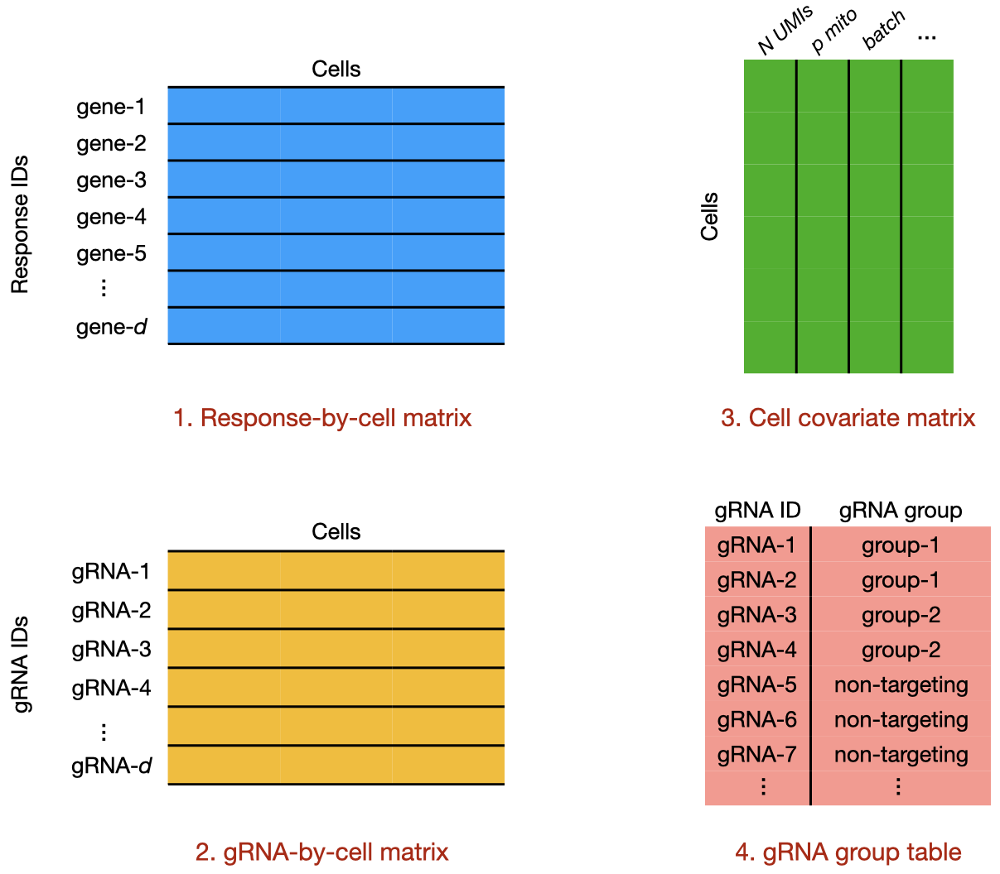
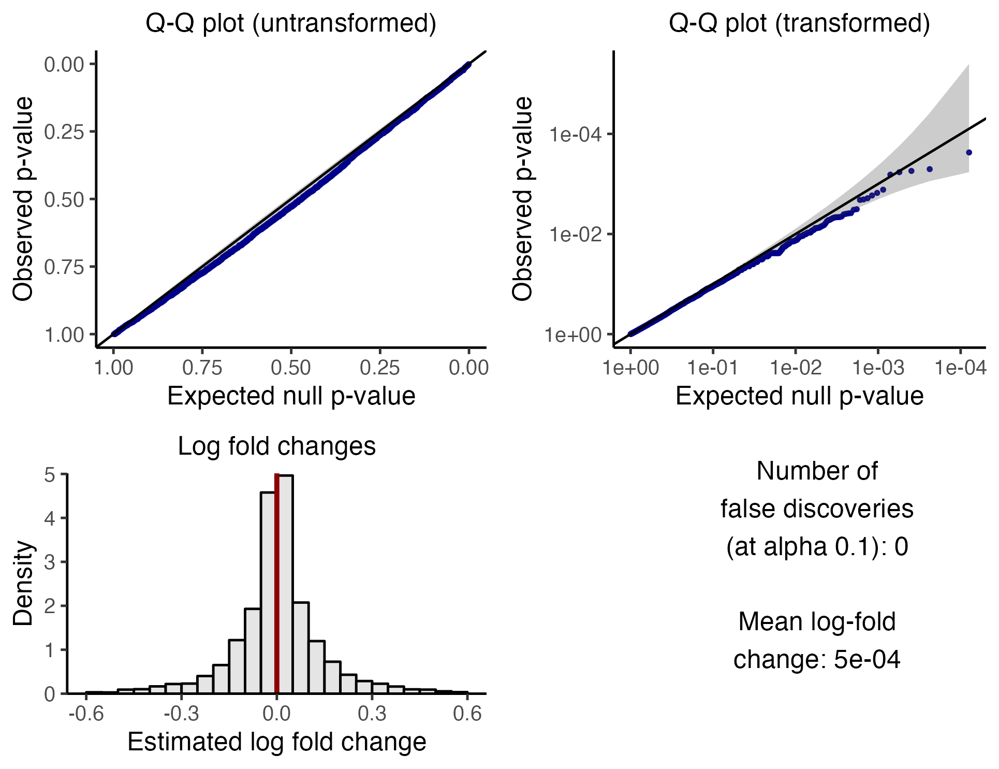
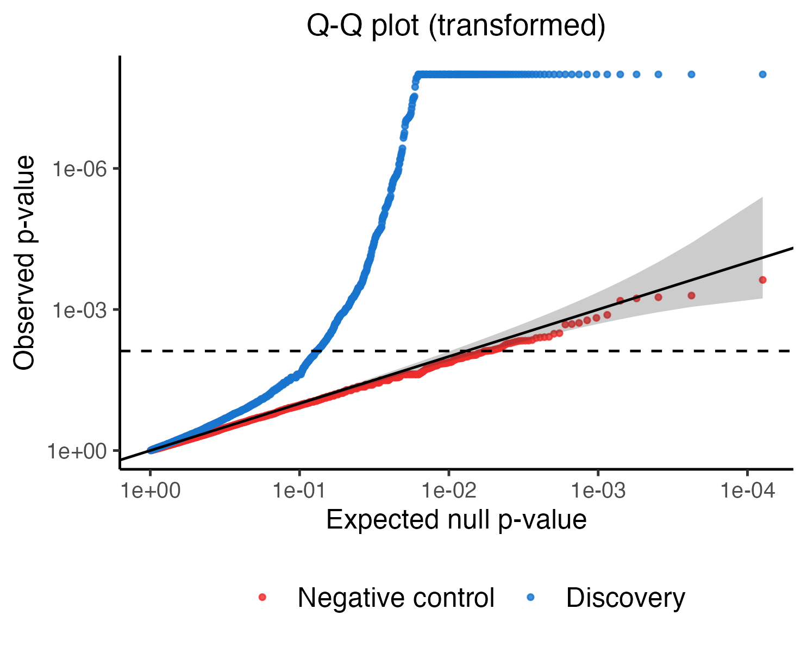
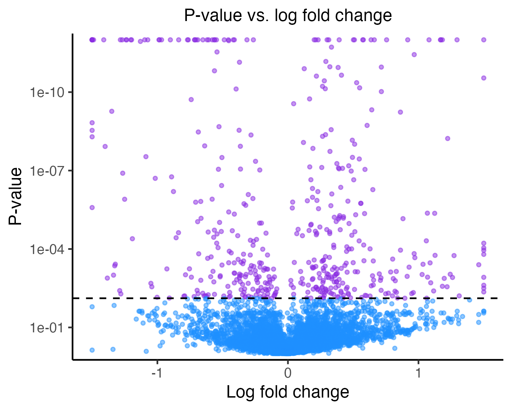

```{r, include = FALSE}
knitr::opts_chunk$set(
  collapse = TRUE,
  comment = "#>",
  dpi=300,
  fig.width=7
)
```

This tutorial illustrates application of `sceptre` to an example low multiplicity-of-infection (MOI) single-cell CRISPR screen dataset. The example dataset that we examine is taken from the paper "Characterizing the molecular regulation of inhibitory immune checkpoints with multimodal single-cell screens" by Papalexi et al., 2021. The authors of this study perturbed 26 genes hypothesized to play a role in the expression of immune checkpoint molecules and measured the effects of these perturbations via single-cell RNA sequencing.

## Initial code demonstration

The code below is a self-contained and complete application of `sceptre` to the example data. Users can copy, paste, and execute this code in Rstudio to get a sense for how `sceptre` works. The entire script takes three minutes to run on a standard laptop.

```{r, echo = FALSE}
library(sceptre)
library(Matrix)
```

```{r, eval=FALSE}
# load package
library(sceptre)

# load the data associated with the experiment
data(response_matrix_lowmoi)       # gene-by-cell expression matrix
data(grna_matrix_lowmoi)           # gRNA-by-cell expression matrix
data(covariate_data_frame_lowmoi)  # cell-by-covariate data frame
data(grna_group_data_frame_lowmoi) # gRNA group information

# obtain the set of pairs to analyze
response_grna_group_pairs <- generate_all_pairs(response_matrix_lowmoi,
                                                grna_group_data_frame_lowmoi)

# set the formula object
formula_object <- formula(~log(response_n_umis) + 
                           log(response_n_nonzero) +
                           bio_rep + 
                           p_mito)

# run the calibration check analysis (NOTE: `calibration_check` set to `TRUE`)
calibration_result <- run_sceptre_lowmoi(
  response_matrix = response_matrix_lowmoi,
  grna_matrix = grna_matrix_lowmoi,
  covariate_data_frame = covariate_data_frame_lowmoi,
  grna_group_data_frame = grna_group_data_frame_lowmoi,
  formula_object = formula_object,
  response_grna_group_pairs = response_grna_group_pairs,
  calibration_check = TRUE
)

# plot the calibration result to ensure adequate calibration of the p-values
plot_calibration_result(calibration_result)

# run the discovery analysis (NOTE: `calibration_check` set to `FALSE`)
discovery_result <- run_sceptre_lowmoi(
  response_matrix = response_matrix_lowmoi,
  grna_matrix = grna_matrix_lowmoi,
  covariate_data_frame = covariate_data_frame_lowmoi,
  grna_group_data_frame = grna_group_data_frame_lowmoi,
  formula_object = formula_object,
  response_grna_group_pairs = response_grna_group_pairs,
  calibration_check = FALSE
)

# compare discovery p-values to the negative control p-values; make a volcano plot
compare_calibration_and_discovery_results(calibration_result, discovery_result)
make_volcano_plot(discovery_result)

# obtain the discovery set for downstream analysis
discovery_set <- obtain_discovery_set(discovery_result)
```

All `sceptre` analyses follow this general template.

-   **Setup**: We begin by setting up the analysis. This entails (1) loading the data; (2) constructing the set of CRISPR perturbation-gene pairs that we seek to test for association; and (3) defining a formula object that specifies how `sceptre` is to adjust for the cell-specific covariates (e.g., sequencing depth, batch, etc.).

-   **Calibration check**: We then carry out the "calibration check," which involves applying `sceptre` to a set of automatically-generated negative control CRISPR perturbation-gene pairs (i.e., perturbation-gene pairs for which we know there is no regulatory relationship). The calibration check enables us to verify that `sceptre` controls the number of false discoveries on the dataset under analysis, which ultimately ensures that the discovery set that `sceptre` returns is high-quality. The calibration check step entails (4) carrying out the calibration check itself and (5) visualizing the calibration check results.

-   **Discovery analysis**: We finally conduct the "discovery analysis," which consists of applying `sceptre` to analyze the set of perturbation-gene pairs whose regulatory relationships we seek to learn. The discovery analysis step entails (6) carrying out the discovery analysis itself, (7) visualizing the discovery analysis results, and (8) obtaining the final discovery set.

Below, we describe each step of the analysis procedure in greater detail.

# Part I: Setup

We begin by setting up the analysis. Setup consists of three steps: preparing the data to pass to `sceptre`, determining the set of CRISPR perturbation-gene pairs to test for association, and defining a formula object that specifies how to adjust for the covariates.

### Step 1: Prepare the data objects

A single-cell CRISPR screen analysis involves four fundamental data objects: (i) the response-by-cell expression matrix, (ii) the gRNA-by-cell expression matrix, (iii) the cell covariate matrix, and (iv) the gRNA group information table. (We use the term "response" to refer to the outcome variable in the single-cell CRISPR screen experiment; typically, the responses are genes or cell surface proteins.) We describe each of these objects, using the Papalexi data as a running example.

```{r, out.width = "500px",  fig.align="center", echo = FALSE, fig.cap=c("The four fundamental data objects in a single-cell CRISPR screen analysis.")}

```

i\. The **response-by-cell matrix** is a matrix that records the expression of each response in each cell. The example response-by-cell matrix included in the `sceptre` package is stored in the variable `response_matrix_lowmoi`.

```{r}
data(response_matrix_lowmoi)
```

`response_matrix_lowmoi` is an expression matrix consisting of 290 genes and 20,729 cells. This matrix was constructed by sampling 290 genes from the original expression matrix. The responses (i.e., the genes) are in the rows, and the cells are in the columns. We print a few entries of `response_matrix_lowmoi` to get a sense for what these data look like.

```{r}
response_matrix_lowmoi[1:5, 1:5]
```

The gene IDs, which uniquely identify each gene, are stored as row names.

```{r}
response_matrix_lowmoi |> rownames() |> head()
```

`response_matrix_lowmoi` is a sparse R matrix. In general the response-by-cell matrix should be a standard (i.e., dense) R matrix or a sparse R matrix (of type `dgCMatrix`, `dgTMatrix`, or `dgRMatrix`). Note that the response-by-cell matrix is an *un-normalized* (i.e., raw) matrix of counts.

ii\. The **gRNA-by-cell matrix** records the expression of each gRNA in each cell. The example gRNA-by-cell matrix is stored in the variable `grna_matrix_lowmoi`.

```{r}
data(grna_matrix_lowmoi)
```

`grna_matrix_lowmoi` consists of 110 gRNAs and 20,729 cells. The gRNAs are stored in the rows and the cells in the columns. We print a few entries of this matrix to get a sense for what it looks like.

```{r}
grna_matrix_lowmoi[25:30, 1:5]
```

The gRNA IDs, which uniquely identify each individual gRNA, are stored as row names.

```{r}
grna_matrix_lowmoi |> rownames() |> head()
```

Like the gene expression matrix, the gRNA-by-cell matrix either should be a standard R matrix or a sparse R matrix. Users optionally can pass a logical (i.e., `TRUE`/`FALSE`) matrix of cell-to-gRNA assignments; see the documentation of `run_sceptre_lowmoi` via (`?run_sceptre_lowmoi`) for more details.

iii\. The **cell covariate matrix** records the value of each cell-specific covariate (e.g., sequencing batch, sequencing depth) in each cell. The example cell covariate matrix is stored in the variable `covariate_data_frame_lowmoi`.

```{r}
data(covariate_data_frame_lowmoi)
```

The cells are in the rows and the covariates in the columns. We print the first few rows of this data frame below.

```{r}
head(covariate_data_frame_lowmoi)
```

There are four covariates: `response_n_umis` (i.e., the total number of gene UMIs sequenced in the cell), `response_n_nonzero` (i.e., the total number of genes expressed in the cell), `bio_rep` (i.e., the biological replicate in which the cell was sequenced, one of `rep_1`, `rep_2`, and `rep_3`) and `p_mito` (i.e., the proportion of sequenced gene transcripts that map to mitochondrial genes). We strongly recommend that users include the variables `response_n_umis`, `response_n_nonzero`, and `p_mito` in their cell covariate matrix. When applicable, sequencing batch and/or biological replicate also should be included. Categorical variables (e.g., `bio_rep`) should be stored as factors or strings rather than integers.

<details>

<summary>**Click here for details on computing the cell covariate matrix within `sceptre`**</summary>

Users can compute the variables `response_n_umis`, `response_n_nonzero`, and `p_mito` for an input matrix using the `sceptre` function `compute_cell_covariates`. An demonstration of this function is below:

```{r}
covariate_data_frame_reduced <- compute_cell_covariates(response_matrix_lowmoi)
head(covariate_data_frame_reduced)
```

Users manually can append batch and/or biological replicate information via the dollar sign (`$`) operator.

```{r}
covariate_data_frame_reduced$bio_rep <- c(rep("rep_1", 9428),
                                          rep("rep_2", 6001),
                                          rep("rep_3", 5300)) |> factor()
```

We will use `covariate_data_frame_lowmoi` instead of the above-computed `covariate_data_frame_reduced` throughout the rest of this tutorial, as the former was computed using the entire set of genes, while the latter was computed using the reduced set of 290 genes.

</details>

iv\. The **gRNA group table** records the "gRNA group" to which each individual gRNA belongs. Typically, gRNAs that target the same genomic location are assigned to the same gRNA group. The example gRNA group table included in the `sceptre` package is stored in the variable `grna_group_data_frame_lowmoi`.

```{r}
data(grna_group_data_frame_lowmoi)
```

`grna_group_data_frame_lowmoi` is a data frame containing two columns: `grna_id` and `grna_group`. In the example data, gRNAs are grouped according the gene that they target. For example, gRNAs `ATF2g1`, `ATF2g2`, `ATF2g3`, and `ATF2g4` target gene `ATF2`.

```{r}
head(grna_group_data_frame_lowmoi, 8)
```

Importantly, all non-targeting (NT) gRNAs (in this case, `NTg1`-`NTg10`) are assigned a `grna_group` label of "non-targeting."

```{r}
 grna_group_data_frame_lowmoi |> dplyr::filter(grna_group == "non-targeting")
```

`sceptre` tests for association between responses and targeting *gRNA groups* (as opposed to *individual gRNAs*). `sceptre` tests a given response-gRNA group pair for association by comparing the expression level of the response across cells that have been infected by (any gRNA within) the given gRNA group against cells that have been infected by a non-targeting gRNA.

### Step 2: Determine the set of response-gRNA group pairs to analyze.

After preparing the data objects, we determine the set of response-gRNA group pairs to test for association. This determination typically is made on the basis of the biological question under investigation. For example, in an experiment that seeks to map enhancers of unknown function to target genes, we might pair a given enhancer-targeting gRNA group to the set of genes in close physical proximity to the targeted enhancer. In the absence of a specific biological question, a reasonable strategy is to conduct an unbiased screen of all response-gRNA group pairs. The function `generate_all_pairs` couples each response to each gRNA group, taking as input the response matrix and the gRNA group table.

```{r}
response_grna_group_pairs <- generate_all_pairs(response_matrix_lowmoi,
                                                grna_group_data_frame_lowmoi)
```

The outputted data frame, `response_grna_group_pairs`, has two columns: `response_id` and `grna_group`.

```{r}
head(response_grna_group_pairs) # each gRNA group is mapped to each gene
```

In general the `response_grna_group_pairs` data frame should specify the set of response-gRNA group pairs to test for association.

### Step 3: Set the formula object.

The third step is to construct a formula object that specifies how to adjust for the cell-specific covariates. We recommend including the following covariates in the formula object: `response_n_umis`, `response_n_nonzero`, `p_mito`, and (if applicable) sequencing batch and/or biological replicate. It is best practice to log-transform integer count variables (e.g., `response_n_umis`, `response_n_nonzero`).

```{r}
formula_object <- formula(~log(response_n_umis) + 
                            log(response_n_nonzero) +
                            bio_rep + 
                            p_mito)
```

## Part II: Calibration check

Now that we have completed setup, we are ready to begin the data analysis.

### Step 4. Run the calibration check.

We begin by running the "calibration check." The calibration check is an analysis that verifies that `sceptre` is able to control the rate of false discoveries on the dataset under analysis. The calibration check consists of randomly grouping together NT gRNAs to form "negative control" gRNA groups. These negative control gRNA groups are then paired to a large set of randomly-selected responses, forming "negative control" response-gRNA group pairs. `sceptre` is applied to analyze these negative control response-gRNA group pairs. As the negative control pairs are devoid of biological signal, the p-values that `sceptre` produces on the negative control pairs should be uniformly distributed. Moreover, after an appropriate multiple testing correction, `sceptre` should make zero (or very few) discoveries on the negative control pairs. Verifying that `sceptre` satisfies these properties ensures that the discovery set that `sceptre` ultimately produces is uncontaminated by excess false positives.

We run the calibration check by calling `run_sceptre_lowmoi`, passing as arguments (i) the response matrix, (ii) the gRNA matrix, (iii) the covariate data frame, (iv) the gRNA group data frame, (v) the formula object, and (vi) the (discovery) response-gRNA group pairs. We also set the `calibration_check` argument to `TRUE`. The example invocation takes about 30 seconds to run.

```{r, eval=FALSE}
calibration_result <- run_sceptre_lowmoi(
  response_matrix = response_matrix_lowmoi,
  grna_matrix = grna_matrix_lowmoi,
  covariate_data_frame = covariate_data_frame_lowmoi,
  grna_group_data_frame = grna_group_data_frame_lowmoi,
  formula_object = formula_object,
  response_grna_group_pairs = response_grna_group_pairs,
  calibration_check = TRUE # calibration_check TRUE
) 
```

The output, `calibration_result`, is a data frame containing p-values for negative control response-gRNA group pairs.

<details>

<summary>**Click here for a more detailed explanation of the calibration check analysis, which may be skipped on a first pass.**</summary>

`calibration_result` is a data frame containing 6,327 rows and six columns. Each row corresponds to a negative control response-gRNA group pair. The columns are as follows:

-   `response_id`: the response in the given negative control response-gRNA group pair.
-   `grna_group`: the gRNA group in the given negative control response-gRNA group pair. The individual NT gRNAs that constitute the gRNA group are listed, concatenated into a string via an ampersand ("&") separator.
-   `n_nonzero_trt`: the number of "treatment cells" (i.e., cells perturbed by the negative control gRNA group) with nonzero response expression (see [quality control](pairwise-qc.html)).
-   `n_nonzero_cntrl`: the number of "control cells" (i.e., NT-receiving cells that were *not* perturbed by the negative control gRNA group) with nonzero response expression (see [quality control](pairwise-qc.html)).
-   `p_value`: the `sceptre` p-value for the test of association between the gRNA group and the response.
-   `log_2_fold_change`: the `sceptre`-estimated log-2 fold change in expression of the response.

```{r, echo=FALSE}
if (file.exists("calibration_result.rds")) {
  calibration_result <- readRDS("calibration_result.rds")
} else {
 calibration_result <- run_sceptre_lowmoi(response_matrix = response_matrix_lowmoi,
grna_matrix = grna_matrix_lowmoi,
covariate_data_frame = covariate_data_frame_lowmoi,
grna_group_data_frame = grna_group_data_frame_lowmoi,
formula_object = formula_object,
response_grna_group_pairs = response_grna_group_pairs,
calibration_check = TRUE,
print_progress = FALSE)
 saveRDS(object = calibration_result, file = "calibration_result.rds")
}
```

```{r}
head(calibration_result)
```

We describe how the negative control pairs are constructed. Recall that our ultimate aim is to conduct a "discovery analysis," which entails applying `sceptre` to the discovery response-gRNA group pairs specified in `response_grna_group_pairs`. The calibration check is "matched" to the discovery analysis in three important ways. First, the number of gRNAs assigned to each negative control gRNA group is equal to the median number of gRNAs per targeting gRNA group (four, in the case of the example data). Second, the negative control pairs are subjected to the same pairwise QC to which the discovery pairs are subjected. In particular, the minimum number of treatment cells with nonzero expression (`n_nonzero_trt`) and the minimum number of control cells with nonzero expression (`n_nonzero_cntrl`) are both greater than or equal to seven, the default QC threshold.

```{r}
min(calibration_result$n_nonzero_trt)
min(calibration_result$n_nonzero_cntrl)
```

Finally, the number of negative control pairs analyzed (i.e., 6,327) is equal to the number of discovery pairs that passes pairwise QC. In summary, the calibration check closely mirrors the discovery analysis, the difference being that the calibration check is carried out on "matched" pairs devoid of biological signal.

</details>

### Step 5: Assess calibration.

We next assess whether the negative control results are well-calibrated. To do so, we call the function `plot_calibration_result()`, which creates a visualization that facilitates calibration assessment. The visualization consists of four panels, which we describe below.

```{r, eval=FALSE}
plot_calibration_result(calibration_result)
```

```{r, out.width = "500px", fig.align="center", echo = FALSE}
if (!file.exists("calibration_result.png")) {
  p <- plot_calibration_result(calibration_result)
  ggplot2::ggsave(filename = "calibration_result.png", plot = p, device = "png", scale = 0.9, width = 6.5, height = 5, dpi = 330)
}

```

-   The upper left panel is a Q-Q plot of the p-values on an untransformed scale. The p-values should lie along the diagonal line, indicating uniformity of the p-values in the *bulk* of the distribution.

-   The upper right panel is a Q-Q plot of the p-values on a negative log-10 transformed scale. The p-values again should lie along the diagonal line (with the majority of the p-values falling within the gray confidence band), indicating uniformity of the p-values in the *tail* of the distribution.

-   The lower left panel is a histogram of the estimated log-2 fold changes. The histogram should be roughly symmetric and centered around zero.

-   Finally, the bottom right panel is a text box displaying (i) the number of false discoveries that `sceptre` makes on the negative control data (after a BH correction at level 0.1) and (ii) the mean estimated log-fold change. The number of false discoveries should be a small integer like zero, one, two, or three. (Zero is ideal.) The mean estimated log-fold change, meanwhile, should be a numeric value close to zero; a number in the range [-0.1, 0.1] is adequate.

`sceptre` may not exhibit good calibration initially. This is OK. There are several strategies that a user can employ to improve the calibration of `sceptre`. First, one can increase the QC thresholds (see [quality control](pairwise-qc.html)), which if not specified are set to sensible default values. Second, one can deactivate the asymptotic inference module of `sceptre` by setting `fit_skew_normal` to `FALSE`. Third, one can add additional, potentially relevant covariates to the `formula_object`. A complete article discussing strategies for improving the calibration of `sceptre` is forthcoming.

## Part III: Discovery analysis

### Step 6. Run the discovery analysis.

Once we have verified that `sceptre` is adequately calibrated, we are ready to carry out the discovery analysis. We run the discovery analysis by calling `run_sceptre_lowmoi`, passing the same arguments that we passed for the calibration check but setting `calibration_check` to `FALSE`.

```{r, eval=FALSE}
discovery_result <- run_sceptre_lowmoi(
  response_matrix = response_matrix_lowmoi,
  grna_matrix = grna_matrix_lowmoi,
  covariate_data_frame = covariate_data_frame_lowmoi,
  grna_group_data_frame = grna_group_data_frame_lowmoi,
  formula_object = formula_object,
  response_grna_group_pairs = response_grna_group_pairs,
  calibration_check = FALSE # calibration check FALSE
) 
```

```{r, echo=FALSE}
if (file.exists("discovery_result.rds")) {
  discovery_result <- readRDS("discovery_result.rds")
} else {
 discovery_result <- run_sceptre_lowmoi(response_matrix = response_matrix_lowmoi,
grna_matrix = grna_matrix_lowmoi,
covariate_data_frame = covariate_data_frame_lowmoi,
grna_group_data_frame = grna_group_data_frame_lowmoi,
formula_object = formula_object,
response_grna_group_pairs = response_grna_group_pairs,
calibration_check = FALSE,
print_progress = FALSE)
 saveRDS(object = discovery_result, file = "discovery_result.rds")
}
```

`run_sceptre_lowmoi` (with `calibration_check` set to `FALSE`) computes a p-value and estimates the log-fold change for each response-gRNA group pair specified in `response_grna_group_pairs` (that passes QC). In the output data frame `discovery_result`, `response_id` and `grna_group` are the response and gRNA group in the given pair; `n_nonzero_trt` and `n_nonzero_cntrl` are [quality control](pairwise-qc.html) metrics; and `p_value` and `log_2_fold_change` are the p-value and estimated log-2 fold change of the pair. Rows are sorted by `p_value`.

```{r}
head(discovery_result)
```

Pairs that fail to pass QC (by default, pairs with either `n_nonzero_trt` or `n_nonzero_cntrl` falling below 7) are assigned a `p_value` and `log_2_fold_change` of `NA` and appear in the bottom rows of the `discovery_result` data frame.

```{r}
tail(discovery_result)
```

### Step 7. Visualize the discovery analysis results.

Next, we create a couple plots to help us visualize the discovery results. We plot the negative control p-values and the discovery p-values on the same Q-Q plot via a call to `compare_calibration_and_discovery_results`. The negative control p-values are plotted in red and the discovery p-values in blue. The horizontal dashed line indicates the multiple testing threshold (which, by default, is the BH threshold at level 0.1). Blue points above the horizontal dashed line are called as discoveries. The negative control p-values should lie along the diagonal line and fall mostly within the gray confidence band. The discovery p-values, by contrast, should trend above the diagonal line, indicating the presence of signal in the discovery set.

```{r, eval = FALSE}
compare_calibration_and_discovery_results(
  calibration_result = calibration_result,
  discovery_result = discovery_result
)
```

```{r, out.width = "400px", fig.align="center", echo = FALSE}
if (!file.exists("comparison_plot.png")) {
p <- compare_calibration_and_discovery_results(
  calibration_result = calibration_result,
  discovery_result = discovery_result)
ggplot2::ggsave(filename = "comparison_plot.png", plot = p, device = "png", scale = 0.9, width = 5, height = 4, dpi = 330)  
}

```

Next, we create a volcano plot of the discovery results via a call to `make_volcano_plot`. Each point in the plot corresponds to a response-gRNA group pair; the estimated log-2 fold change of the pair is plotted on the x-axis, and the (negative log-10 transformed) p-value is plotted on the y-axis. The horizontal dashed line again indicates the multiple testing threshold. Points above the dashed line (colored in purple) are called as discoveries, while points below (colored in blue) are called as insignificant.

```{r, eval = FALSE}
make_volcano_plot(discovery_result = discovery_result)
```

```{r, out.width = "400px", fig.align="center", echo = FALSE}
if (!file.exists("volcano_plot.png")) {
p <- make_volcano_plot(discovery_result)
ggplot2::ggsave(filename = "volcano_plot.png", plot = p, device = "png", scale = 0.9, width = 5, height = 4, dpi = 330)  
}

```

### Step 9: Obtain the discovery set for downstream analysis.

Finally, we obtain the discovery set. We pass `discovery_result` to `obtain_discovery_set`, which returns the subset of response-gRNA group pairs that are called as discoveries.

```{r}
discovery_set <- obtain_discovery_set(discovery_result)
```

We can use `discovery_set` for various downstream analyses.

<details>

<summary>**Click here for more options for multiplicity correction.**</summary>

We have used the BH correction at level 0.1 throughout this analysis. One can change the multiple testing correction procedure and level by setting the arguments `multiple_testing_correction` and `alpha` to different values in the functions `plot_calibration_result`, `compare_calibration_and_discovery_results`, `make_volcano_plot`, and `obtain_discovery_set`. See the documentation of these functions for more information.

</details>
