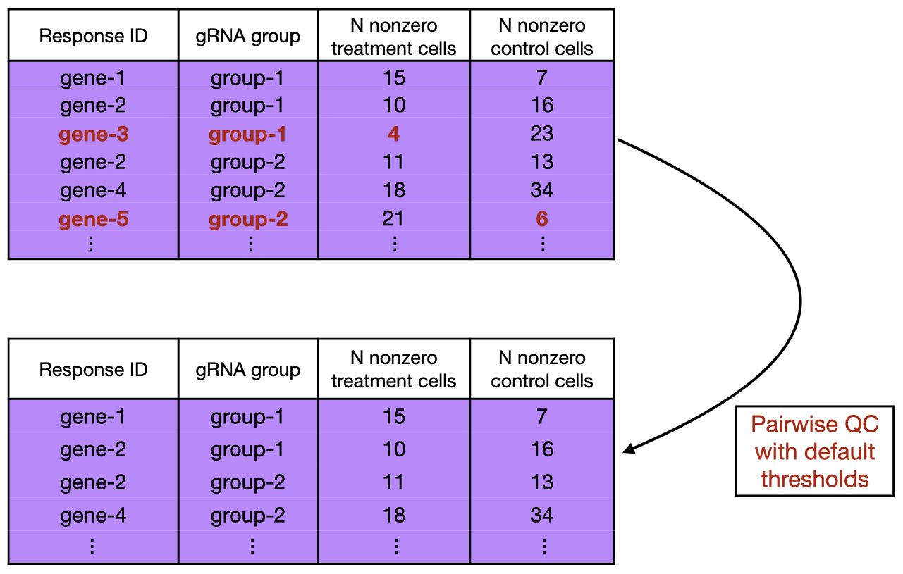

This article discusses quality control (QC) in the context of low MOI single-cell CRISPR screens. QC, though somewhat tedious and technical, is important to get right to ensure high quality results.

Three types of QC that are common in single-cell CRISPR screen analysis are response-wise QC, gRNA-wise QC, and cell-wise QC, which aim to filter out low-quality responses, low-quality gRNAs, and low-quality cells, respectively. A fourth type of QC, *pairwise QC*, aims to filter out low-quality response-gRNA group pairs. Pairwise QC, though not currently widespread in the single-cell CRISPR screen space, arguably is the most important type of QC in single-cell CRISPR screen analysis. `sceptre` provides extensive support for pairwise QC. (`sceptre` does not currently implement response-wise, gRNA-wise, or cell-wise QC; users can implement these forms of QC on their own before passing their data to `sceptre`.)

For a given response-gRNA group pair, we define the "number of nonzero treatment cells" as the number of "treatment cells" (i.e., cells that have been perturbed by the gRNA group) in which the response exhibits nonzero expression. Similarly, we define the "number of nonzero control cells" as the number of "control cells" (i.e., cells that have received a non-targeting gRNA) in which the response exhibits nonzero expression. The number of nonzero treatment cells and the number of nonzero control cells are good metrics of pair quality. `sceptre` filters out pairs for which the number of nonzero treatment cells or the number of nonzero control cells falls below some threshold. By default, this threshold is set to 7 for both metrics. (See the section "Pairwise QC" in Barry 2023 for a justification of this threshold.) While a threshold of 7 is a good starting point, users can try out different choices for this threshold by setting the parameters `n_nonzero_trt_thresh` and `n_nonzero_cntrl_thresh` to different values in the `run_sceptre_lowmoi` function. The choice of pairwise QC threshold can impact the results, and so some experimentation can be helpful. A simple illustration of pairwise QC is below.

```{r, out.width = "550px", fig.align="center", echo = FALSE, fig.cap=c("Pairwise QC using a default threshold of 7 nonzero treatment cells and 7 nonzero control cells.")}

```
