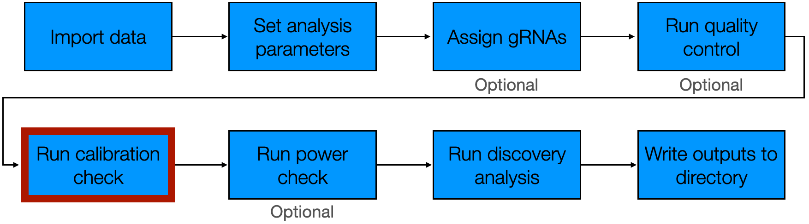
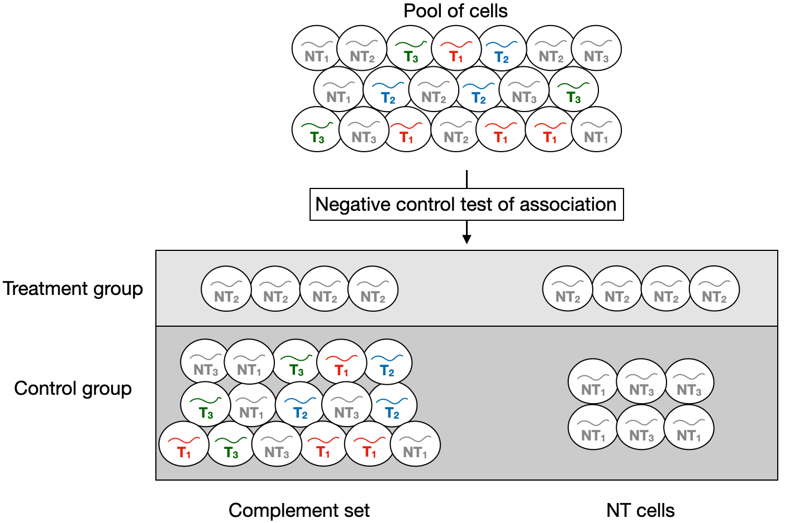
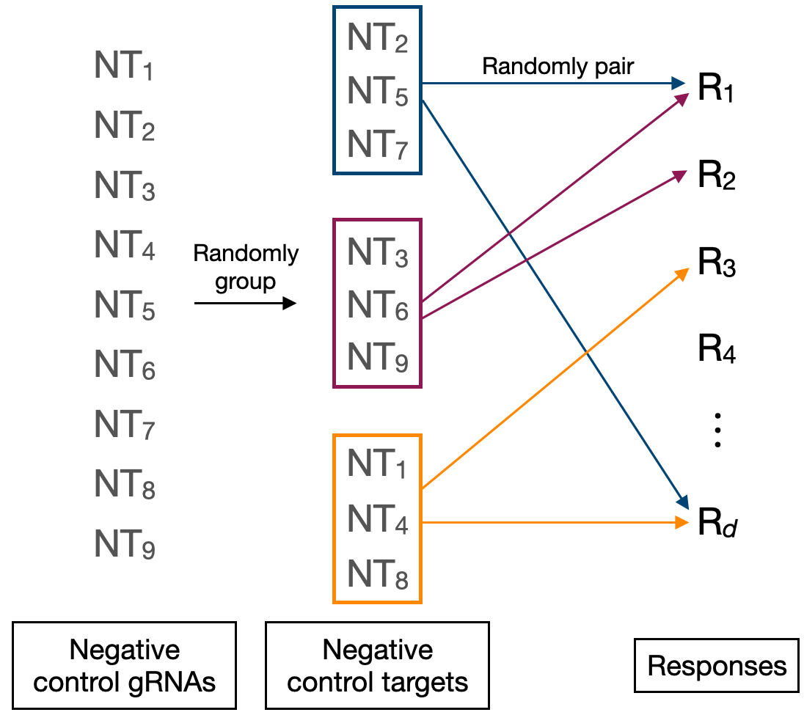
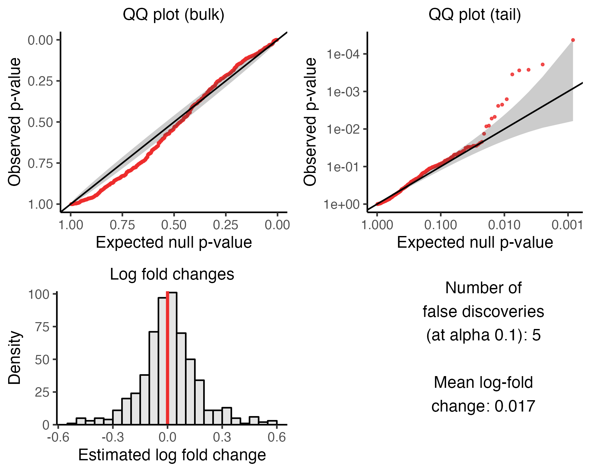

The fifth step of the pipeline is to run the calibration check. The calibration check involves applying `sceptre` to analyze negative control target-response pairs --- pairs for which we know there is no association between the target and response --- to ensure control of the false discovery rate. The calibration check enables us to verify that the discovery set that `sceptre` ultimately produces is uncontaminated by excess false positives.

```{r, out.width = "650px", fig.align="center", echo = FALSE}

```

We begin by loading `sceptre`.

```{r,results='hide'}
library(sceptre)
```

We initialize `sceptre_object`s corresponding to the low-MOI CRISPRko data and high-MOI CRISPRi data. We call the pipeline functions that precede `run_calibration_check()` (namely, `import_data()`, `set_analysis_parameters()`, `assign_grnas()`, and `run_qc()`) on both datasets.

```{r}
# low-MOI CRISPRko data
# 1. import data
sceptre_object_lowmoi <- import_data(response_matrix = lowmoi_example_data$response_matrix,
                                     grna_matrix = lowmoi_example_data$grna_matrix,
                                     extra_covariates = lowmoi_example_data$extra_covariates,
                                     grna_target_data_frame = lowmoi_example_data$grna_target_data_frame,
                                     moi = "low")
positive_control_pairs <- construct_positive_control_pairs(sceptre_object_lowmoi)
discovery_pairs <- construct_trans_pairs(sceptre_object = sceptre_object_lowmoi,
                                         positive_control_pairs = positive_control_pairs)

# 2-4. set analysis parameters, assign gRNAs, run qc
sceptre_object_lowmoi <- sceptre_object_lowmoi |>
  set_analysis_parameters(discovery_pairs = discovery_pairs,
                          positive_control_pairs = positive_control_pairs) |>
  assign_grnas() |> run_qc(p_mito_threshold = 0.075)
```

```{r, results='hide'}
# high-MOI CRISPRi data
# 1. import data
sceptre_object_highmoi <- import_data(response_matrix = highmoi_example_data$response_matrix,
                                      grna_matrix = highmoi_example_data$grna_matrix,
                                      grna_target_data_frame = grna_target_data_frame_highmoi,
                                      moi = "high",
                                      extra_covariates = highmoi_example_data$extra_covariates,
                                      response_names = highmoi_example_data$gene_names)
positive_control_pairs <- construct_positive_control_pairs(sceptre_object_highmoi)
discovery_pairs <- construct_cis_pairs(sceptre_object_highmoi,
                                       positive_control_pairs = positive_control_pairs,
                                       distance_threshold = 5e6)

# 2-4. set analysis parameters, assign gRNAs, run qc
sceptre_object_highmoi <- sceptre_object_highmoi |>
  set_analysis_parameters(discovery_pairs = discovery_pairs,
                          positive_control_pairs = positive_control_pairs,
                          side = "left") |>
  assign_grnas(parallel = TRUE) |> run_qc(p_mito_threshold = 0.075)
```

We are now ready to run the calibration check.

## Calibration check methodology

We begin by describing the methodology underlying the calibration check.

#### Differential expression paradigm

The goal of the calibration check is to test for association between subsets of negative control gRNAs and responses. Suppose for simplicity that we are conducting a singleton analysis, i.e. suppose that we seek to test for association between an individual negative control gRNA and a response. The "treatment group" is the set of cells containing the given non-targeting gRNA, and the "control group" is the set of cells against which the treatment group is compared to carry out the test of association. The control group can be either the complement set or the NT cells. Within the context of the calibration check analysis, the complement set consists of the cells that do not contain the given non-targeting gRNA; the NT cells, on the other hand, consist of the cells that contain any non-targeting gRNA *excluding* the given non-targeting gRNA that we are testing for association against the response (see schematic below.) `sceptre` carries out the test of association by testing for differential expression of the response across the treatment and control groups, yielding a p-value.

```{r, out.width = "750px", fig.align="center", echo=FALSE, fig.cap="**Figure 1**: A schematic illustrating the differential expression paradigm of the calibration check analysis. The single-cell CRISPR screen experiment produces a pool of cells; in this example the cells contain targeting gRNAs and three non-targeting gRNAs (labeled NT$_1$, NT$_2$, and NT$_3$). Suppose that we seek to test for association between a given non-targeting gRNA (e.g., NT$_2$) and a response. First, we divide the cells into treatment and control groups, where the treatment group consists of the cells that contain NT$_2$, and the control group can be either the complement set or the NT cells. Within the context of the calibration check analysis, the complement set consists of all cells that do not contain NT$_2$; the NT cells, on the other hand, consist of cells that contain a non-targeting gRNA excluding NT$_2$. (Thus, in this example, the NT cells consist of cells that contain NT$_1$ or NT$_3$.) `sceptre` tests for differential expression of the given response across the treatment and control groups, yielding a p-value for the test of association bewteen the given non-targeting gRNA and the response."}

```

#### Constructing the negative control pairs

The calibration check involves forming a set of negative control target-response pairs and then testing these pairs for association to ensure control of the false discovery rate. `sceptre` automatically constructs the negative control pairs, and it does so in such a way that the negative control pairs are highly similar to the discovery pairs, the difference being that the negative control pairs are devoid of biological signal. `sceptre` builds the negative control pairs as follows. First, `sceptre` forms "negative control groups" by randomly grouping together distinct sets of negative control gRNAs. For example, in a screen containing nine negative control gRNAs (labeled NT~1~ *-* NT~9~), gRNAs NT~2~, NT~5~, and NT~7~ might be assigned randomly to one group, gRNAs NT~3~, NT~6~, and NT~9~ might be assigned randomly to another group, and so on. (See schematic below). The number of negative control gRNAs per group (by default) is set equal to the average number of gRNAs per discovery target. For example, in a screen in which each discovery target is targeted by three gRNAs, each negative control group is formed by randomly putting together three negative control gRNAs. The negative control gRNA groups can (and often do) overlap; for example, a given NT gRNA (e.g., NT~2~) could be a part of multiple negative control groups.

```{r, out.width = "550px", fig.align="center", echo=FALSE, fig.cap="A schematic illustrating how the negative control target response pairs are constructed. First, negative control gRNA groups are formed by randomly assembling negative control gRNAs into groups of size one or more. Next, the negative control gRNA groups are randomly paired to responses. "}

```

In a singleton analysis (i.e., an analysis in which we seek to test for association between individual gRNAs and responses), each negative control gRNA is placed into its own negative control group of size one. (Recall that we can prompt `sceptre` to run a singleton analysis by setting `grna_grouping_strategy` to `"singleton"` in `set_analysis_parameters()`). We often use the term "negative control target" interchangeably with "negative control gRNA group."

After forming the negative control targets, `sceptre` constructs the set of negative control pairs by randomly pairing the negative control targets to the responses. The number of negative control pairs that `sceptre` constructs is set equal to the number of pairs in the discovery set (after QC is applied to the discovery pairs). Moreover, the negative control pairs are subjected to the same pairwise QC as the discovery pairs. In this sense the negative control pairs are "matched" to the discovery pairs in three respects: (1) the number of gRNAs contained within each target is the same across the negative control and discovery pairs; (2) the negative control pairs are subjected to the same pairwise QC as the discovery pairs; (3) the number of negative control pairs is equal to the number of discovery pairs.

#### Analyzing the negative control pairs

The calibration check entails testing for association between the negative control targets and the responses to which the negative control targets have been paired. If `grna_grouping_strategy` is set to `"singleton"`, the analysis proceeds as described in the section "Differential expression paradigm." If `grna_grouping_strategy` is set to `"union"` (the default), negative control gRNAs contained within a given negative control target are combined via the union operation; this combined gRNA is then tested for association against the responses as if it were a singleton gRNA. Consider again Figure 1 (section "Differential expression paradigm"). Suppose that NT~1~ and NT~2~ constitute a given negative control target, and suppose we seek to test for association between this negative control target and a given response. The "treatment group" would be the cells containing either NT~1~ or NT~2~. Meanwhile, the "complement set" would consist of cells that do *not* contain NT~1~ or NT~2~. Finally, the "NT cells" would consist of cells containing NT~3~.

## Running the calibration check

We carry out the calibration check by calling the function `run_calibration_check()` on the `sceptre_object`. `run_calibration_check()` takes the arguments `sceptre_object` (required), `n_calibration_pairs` (optional), `calibration_group_size` (optional), `print_progress` (optional), and `parallel` (optional), and `output_amount` (optional). `n_calibration_pairs` is the number of negative control target-response pairs to test for association. By default `n_calibration_pairs` is set to the number of discovery target-response pairs that passes pairwise QC. Next, `calibration_group_size` is the number of negative control gRNAs to put together to construct each negative control target. By default `calibration_group_size` is set to the median number of gRNAs per discovery target. Finally, `print_progress` and `parallel` control whether to print updates to the console and run the computation in parallel, respectively. We describe the `output_amount` argument in a subsequent section. Below, we run the calibration check on the high-MOI CRISPRi and low-MOI CRISPRko data, setting `parallel` to `TRUE`.

```{r, results='hide'}
sceptre_object_highmoi <- run_calibration_check(sceptre_object_highmoi,
                                                parallel = TRUE)
sceptre_object_lowmoi <- run_calibration_check(sceptre_object_lowmoi,
                                               parallel = TRUE)
```

We can plot the outcome of the calibration check by calling `plot()` on the resulting `sceptre_object`. We plot the outcome of the calibration check on the low-MOI CRISPRko data.

```{r, eval=FALSE}
plot(sceptre_object_lowmoi)
```

```{r, out.width = "650px", fig.align="center", echo = FALSE, fig.cap="Outcome of the calibration check on the low-MOI CRISPRko data."}
p <- plot(sceptre_object_lowmoi)
ggplot2::ggsave(filename = "plot_calibration_lowmoi.png", plot = p, device = "png", scale = 1.1, width = 5, height = 4, dpi = 330)
knitr::include_graphics("plot_calibration_lowmoi.png")
```

We described in the Get Started vignette (`vignette("sceptre")`) how to interpret this figure. Briefly, the upper left (resp., right) plot is a QQ plot of the negative control p-values on an untransformed (resp., transformed) scale; the p-values should lie predominantly along the diagonal line. The lower left plot is a histogram of the estimated (log-2) fold changes; the histogram should be symmetric and centered about zero. Finally, the lower right panel is a text box displaying the number of false discoveries made on the negative control pairs (after applying the multiple testing adjustment) and the mean estimated (log-2) fold change. Both of these numbers ideally should be close to zero. (It is OK if the number of false discoveries is nonzero; see next section.)

We can obtain a data frame containing the results by calling `get_result` on the `sceptre_object`, setting `analysis` to `"run_calibration_check"`. We obtain the result data frame and print the first few rows of this data frame below.

```{r}
calibration_result <- get_result(sceptre_object = sceptre_object_lowmoi,
                                 analysis = "run_calibration_check")
head(calibration_result)
```

Each row of this data frame corresponds to a negative control target-response pair. The columns `response_id` and `grna_target` indicate the response and target that make up a given target-response pair. The individual non-targeting gRNAs that form a negative control target are listed, concatenated into a string via the ampersand ("&") separator. (For example, the negative control gRNA target "NTg4&NTg7&NTg8&NTg9" is formed by combining the negative control gRNAs NTg4, NTg7, NTg8, and NTg9.) The remaining columns of the data frame as follows: `n_nonzero_trt` (the number of nonzero treatment cells in the pair), `n_nonzero_cntrl` (the number of nonzero control cells in the pair), `pass_qc` (whether the pair passes pairwise QC), `p_value` (the p-value of the pair), `log_2_fold_change` (the estimated log-2 fold change of the pair), and `significant` (whether the pair is called as significant after applying the multiple testing correction adjustment).

## Diagnosing miscalibration

The negative control p-values may demonstrate *miscalibration*, which is a deviation of the p-values from the expected uniform distribution under the null hypothesis. Indicators of miscalibration include (i) the presence of points that lie considerably above or below the diagonal line on the negative control QQ plots and (ii) the presence of many false discoveries. Miscalibration is problematic because miscalibration suggests that `sceptre` might not be controlling the rate of false discoveries on the dataset under analysis. Miscalibration varies along a spectrum from less severe to more severe; the table below presents miscalibration severity as a function of the number of false discoveries made on the negative control data. This table is only approximate and should not be taken as a

| Number of false discoveries | Calibration quality     |
|-----------------------------|-------------------------|
| 0-1                         | Excellent calibration   |
| 2-6                         | Mild miscalibration     |
| 7-14                        | Moderate miscalibration |
| 15+                         | Severe miscalibration   |

: Calibration quality as a (rough) function of the number of false discoveries made on the negative control data.

```{r}
sceptre_object_highmoi <- sceptre_object_highmoi |>
  set_analysis_parameters(discovery_pairs = discovery_pairs,
                          positive_control_pairs = positive_control_pairs,
                          side = "left",
                          formula_object = formula(~log(grna_n_umis))) |>
  run_qc()

sceptre_object_highmoi <- run_calibration_check(sceptre_object_highmoi,
                                                parallel = TRUE)
```

```{r, eval=FALSE}
plot(sceptre_object_highmoi)
```

```{r, out.width = "650px", fig.align="center", echo = FALSE, fig.cap="An example of mild miscalibration on the high-MOI CRISPRi data. The results are miscalibrated because several important covariates have been excluded from the response UMI count model."}
p <- plot(sceptre_object_highmoi)
ggplot2::ggsave(filename = "plot_calibration_highmoi_bad.png", plot = p, device = "png", scale = 1.1, width = 5, height = 4, dpi = 330)

```

## Improving calibration

There are several concrete steps that users can take to improve the calibration of `sceptre`. We list the five most important strategies here, ordered roughly from most to least promising. These strategies need not be applied in isolation and instead can be mixed and matched as the user wishes.

1.  **Deactivate the parametric curve fit**. `sceptre` by default computes the p-value for a given target-response pair by fitting a parametric curve (specifically, a skew-normal density) to the distribution of null test statistics and then evaluating the tail probability of the fitted curve at the observed test statistic. If the parametric curve provides a poor fit to the distribution of the null test statistics, the resulting p-value can be miscalibrated. Users can deactivate the parametric curve fitting functionality of `sceptre` and instead return an exact p-value by setting `fit_parametric_curve` to `FALSE` in `set_analysis_parameters()`, as follows.

    ```{r, eval=FALSE}
    sceptre_object_highmoi <- sceptre_object_highmoi |>
      set_analysis_parameters(discovery_pairs = discovery_pairs,
                              positive_control_pairs = positive_control_pairs,
                              side = "left",
                              fit_parametric_curve = FALSE) # fit_parametric_curve set to FALSE
    ```

    The calibration check, power check, and discovery analyses all run more slowly when `fit_parametric_curve` is set to `FALSE`, as `sceptre` must compute a greater number of null test statistics to preserve adequate precision of the p-values. Thus, setting `fit_parametric_curve` to `FALSE` may not be a feasible strategy for users testing a large number (e.g., 10,000+) of pairs. Users should consider using the permutation test (`resampling_mechaism = "permutations"`) rather than the conditional randomization test (`resampling_mechanism = "crt"`) if setting `fit_parametric_curve` to `FALSE` to improve speed.

    ```{r, eval=FALSE}
    sceptre_object_highmoi <- sceptre_object_highmoi |>
      set_analysis_parameters(discovery_pairs = discovery_pairs,
                              positive_control_pairs = positive_control_pairs,
                              side = "left",
                              fit_parametric_curve = FALSE, # slows down the code
                              resampling_mechanism = "permutations") # speeds up the code
    ```

2.  **Add additional covariates**. `sceptre` might be miscalibrated because there are missing covariates. Users should consider whether any additional covariates are relevant and, if so, add these covariates to the `sceptre_object` via `import_data()` or `import_data_from_cellranger()`. For example, if the data contain multiple cell types, then cell type should be included as a covariate. Batch, biological replicate, and cell cycle also may be relevant covariates. (`sceptre` does not currently provide functionality for imputing cell type or cycle.)

3.  **Tighten the QC thresholds**. Users can tighten the cellwise and pairwise QC thresholds to remove outlier cells and target-response pairs with a low effective sample size, respectively, thereby ameliorating challenges to calibration due to sparsity and model misspecification. Below, we increase `n_nonzero_trt_thresh` and `n_nonzero_cntrl_thresh` to 15; the default value for these parameters is 10. We additionally set `response_n_umis_range` to `c(0.05, 0.95)`, which clips the `response_n_umis` distribution at the fifth and ninety-fifth percentiles (as opposed the the first and ninety-ninth percentiles, which is the default).

    ```{r, eval=FALSE}
    sceptre_object_highmoi <- sceptre_object_highmoi |>
      run_qc(n_nonzero_trt_thresh = 10L,
             n_nonzero_cntrl_thresh = 10L,
             response_n_umis_range = c(0.05, 0.95))
    ```

4.  **Change the resampling mechanism or the complement set**.

5.  **Test fewer pairs**.
