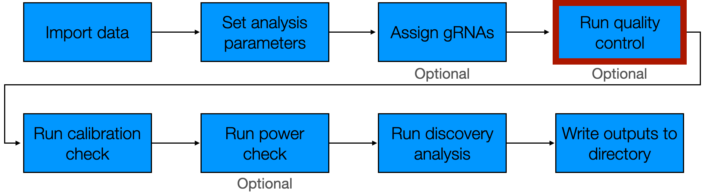
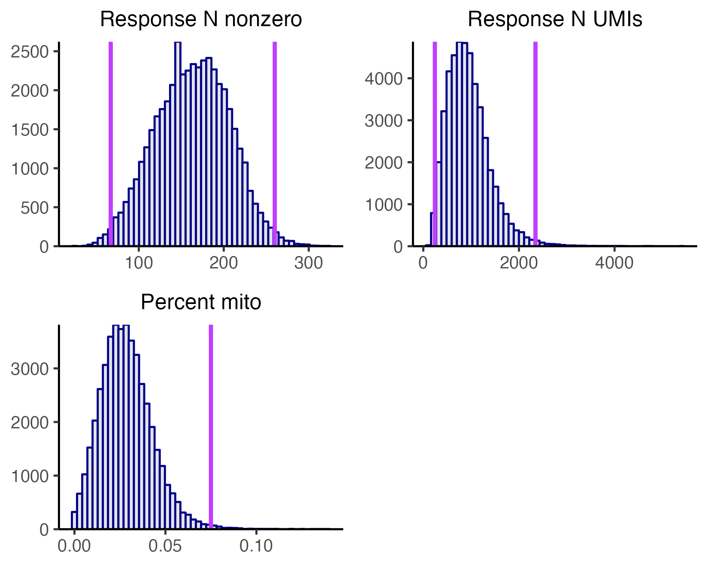
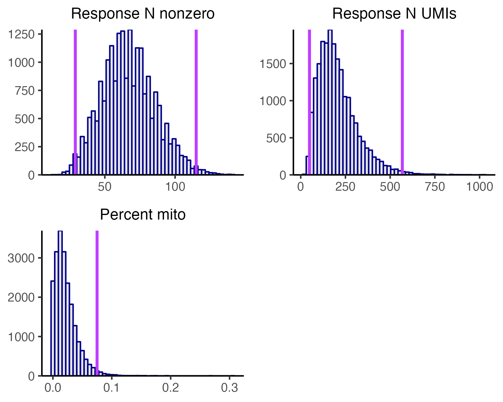
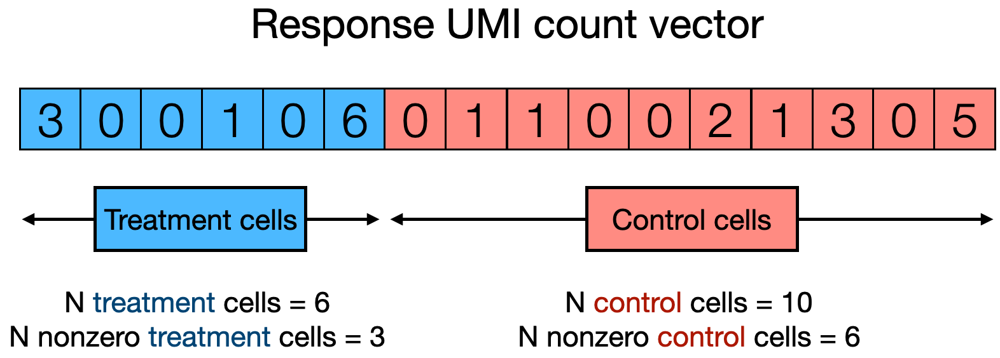
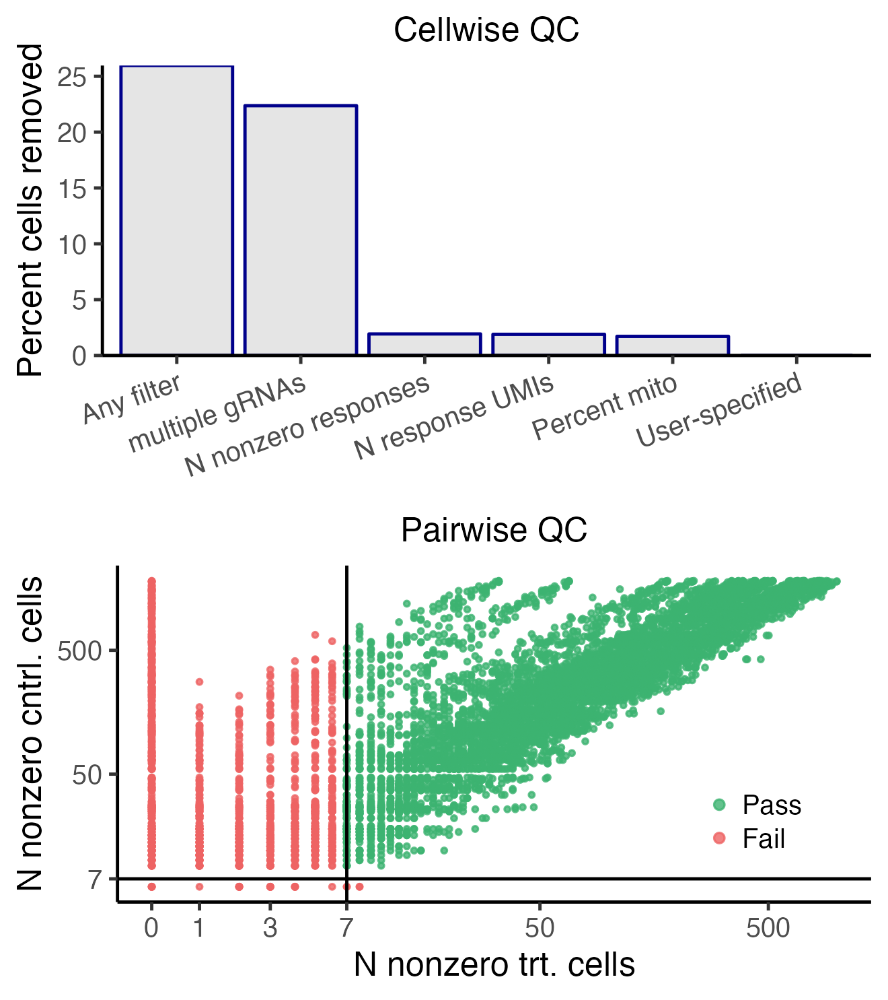

The fourth step of the pipeline is to run quality control (QC).

```{r, out.width = "650px", fig.align="center", echo = FALSE}

```

We begin by loading the `sceptre` package.

```{r,results='hide'}
library(sceptre)
```

We initialize `sceptre_object`s corresponding to the high-MOI CRISPRi and low-MOI CRISPRko data. We call the first three pipeline functions on both datasets: `import_data()`, `set_analysis_parameters()`, and `assign_grnas()`.

```{r}
# low-MOI CRISPRko data
# 1. import data
sceptre_object_lowmoi <- import_data(response_matrix = lowmoi_example_data$response_matrix,
                                     grna_matrix = lowmoi_example_data$grna_matrix,
                                     extra_covariates = lowmoi_example_data$extra_covariates,
                                     grna_target_data_frame = lowmoi_example_data$grna_target_data_frame,
                                     moi = "low")
positive_control_pairs <- construct_positive_control_pairs(sceptre_object_lowmoi)
discovery_pairs <- construct_trans_pairs(sceptre_object = sceptre_object_lowmoi,
                                         positive_control_pairs = positive_control_pairs)

# 2-3. set analysis parameters, assign gRNAs
sceptre_object_lowmoi <- sceptre_object_lowmoi |>
  set_analysis_parameters(discovery_pairs = discovery_pairs,
                          positive_control_pairs = positive_control_pairs) |>
  assign_grnas()
```

```{r, results='hide'}
# high-MOI CRISPRi data
# 1. import data
sceptre_object_highmoi <- import_data(response_matrix = highmoi_example_data$response_matrix,
                                      grna_matrix = highmoi_example_data$grna_matrix,
                                      grna_target_data_frame = grna_target_data_frame_highmoi,
                                      moi = "high",
                                      extra_covariates = highmoi_example_data$extra_covariates,
                                      response_names = highmoi_example_data$gene_names)
positive_control_pairs <- construct_positive_control_pairs(sceptre_object_highmoi)
discovery_pairs <- construct_cis_pairs(sceptre_object_highmoi,
                                       positive_control_pairs = positive_control_pairs,
                                       distance_threshold = 5e6)

# 2-3. set analysis parameters, assign gRNAs
sceptre_object_highmoi <- sceptre_object_highmoi |>
  set_analysis_parameters(discovery_pairs = discovery_pairs,
                          positive_control_pairs = positive_control_pairs,
                          side = "left") |>
  assign_grnas(parallel = TRUE)
```

We are now ready to run QC. We apply QC both at the level of the cell and at the level of the target-response pair. Cellwise QC involves filtering cells on the covariates `response_n_nonzero`, `response_n_umis`, and `response_p_mito`. In low-MOI we additionally remove cells that contain multiple gRNAs. Pairwise QC involves removing pairs for which there are insufficiently many cells or there is insufficiently high expression of the response.

## Plot the cell-specific covariates

A helpful initial step in applying QC is to visualize the distribution of the cell-specific covariates. To this end we call the function `plot_covariates()`, which creates a histogram of the covariates `response_n_nonzero`, `response_n_umis`, and (if applicable) `response_p_mito`. Cellwise QC removes cells that lie in the extreme right tail of the `response_p_mito` distribution or that lie in the extreme left *or* right tail of the `response_n_nonzero` or `response_n_umis` distribution. To help guide the selection of QC thresholds, `plot_covariates()` plots candidate QC thresholds as vertical lines on the histograms. The optional arguments `response_n_nonzero_range`, `response_n_umis_range`, and `p_mito_threshold` control the location of these candidate QC thresholds. `response_n_nonzero_range` (resp., `response_n_umis_range`) is a length-two vector of quantiles (default: `c(0.01, 0.99)`) indicating the location at which to draw candidate QC thresholds on the `response_n_nonzero` (resp., `response_n_umis`) histogram. Next, `p_mito_threshold` is a single numeric value in the interval [0,1] specifying the location at which to draw a candidate QC threshold on the `response_p_mito` plot. We call `plot_covariates()` on the high-MOI CRISPRi `sceptre_object` (i.e., `sceptre_object_highmoi`), setting `p_mito_threshold` to `0.075`.

```{r, eval=FALSE}
plot_covariates(sceptre_object_highmoi, p_mito_threshold = 0.075)
```

```{r, out.width = "650px", fig.align="center", echo = FALSE, fig.cap=c("Plot of covariates for high-MOI CRISPRi data.")}
p <- plot_covariates(sceptre_object_highmoi, p_mito_threshold = 0.075)
ggplot2::ggsave(filename = "plot_covariates_highmoi.png", plot = p, device = "png", scale = 1.1, width = 5, height = 4, dpi = 330)

```

Inspecting these plots (and tinkering with `response_n_nonzero_range`, `response_n_umis_range`, and `p_mito_threshold` as necessary) helps guide the selection of reasonable QC thresholds. In general it is good to clip long, asymmetric tails so as to remove outlier cells. The QC thresholds appear to be drawn at sensible locations on these data.

We also call `plot_covariates()` low-MOI CRISPRko data, again setting `p_mito_threshold` to 0.075.

```{r,eval=FALSE}
plot_covariates(sceptre_object_lowmoi, p_mito_threshold = 0.075)
```

```{r, out.width = "650px", fig.align="center", echo = FALSE, fig.cap=c("Outcome of QC on low-MOI CRISPRko data.")}
p <- plot_covariates(sceptre_object_lowmoi, p_mito_threshold = 0.075)
ggplot2::ggsave(filename = "plot_covariates_lowmoi.png", plot = p, device = "png", scale = 1.1, width = 5, height = 4, dpi = 330)

```

The low-MOI plot is broadly similar to its high-MOI counterpart. In particular, the QC thresholds appear to be drawn at sensible locations.

## QC parameters

We apply QC to a `sceptre_object` by calling the function `run_qc()`. `run_qc()` takes the arguments `sceptre_object`, `response_n_umis_range`, `response_n_nonzero_range`, `p_mito_threshold`, `additional_cells_to_remove`, `n_nonzero_trt_thresh`, and `n_nonzero_cntrl_thresh`. The only required argument among these is `sceptre_object`; the rest are set to reasonable defaults.

### Cellwise QC parameters

The parameters `response_n_umis_range`, `response_n_nonzero_range`, `p_mito_threshold`, and `additional_cells_to_remove` control cellwise QC. `response_n_umis_range` (resp., `response_n_nonzero_range`) is a length-two vector of quantiles (default `c(0.01, 0.99)`); cells whose `response_n_umis` (resp., `response_n_nonzero`) quantile falls outside this range are excluded. Next, `p_mito_threshold` is a number in the interval [0,1]; cells whose value for `response_p_mito` falls above this threshold likewise are excluded. (Note that `p_mito_threshold` is not a quantile but rather an absolute number). Finally, `additional_cells_to_remove` is an integer vector specifying the (1-based) indices of additional cells to remove. Cells flagged by `additional_cells_to_remove` are removed before applying any other cellwise QC filer.

### Pairwise QC parameters

The parameters `n_nonzero_trt_thresh` and `n_nonzero_cntrl_thresh` control pairwise QC (i.e., QC at the level of the target-response pair). Recall that for a given target-response pair, we divide the cells into treatment and control groups. The treatment group consists of the cells that contain a gRNA targeting the given target, and the control group consists of the cells against which the treatment cells are compared. (The control group can be either the complement set or NT cells; this choice is governed by the `control_group` parameter.) We define the "number of nonzero treatment cells" (resp., the "number of nonzero control cells") as the number of cells in the treatment group (resp., control group) that contain nonzero expression of the response. (We sometimes use the shorthand `n_nonzero_trt` and `n_nonzero_cntrl` to refer to the number of nonzero treatment cells and control cells, respectively.) `n_nonzero_trt` and `n_nonzero_cntrl` are reasonable metrics of pair quality, with higher quality pairs exhibiting larger values for `n_nonzero_trt` and `n_nonzero_cntrl`. The schematic below illustrates the definition of `n_nonzero_trt` and `n_nonzero_cntrl`.

```{r, out.width = "550px", fig.align="center", echo = FALSE, fig.cap=c("Definition of `n_nonzero_trt` and `n_nonzero_cntrl`. Each square represents a cell, and the integer within a square represents the UMI count of the response in the corresponding cell. Some cells belong to the treatment group (blue), and others belong to the control group (red). `n_nonzero_trt` (resp., `n_nonzero_cntrl`) is the number of cells in the treatment group (resp., control group) with nonzero expression of the response.")}

```

`sceptre` tabulates `n_nonzero_trt` and `n_nonzero_cntrl` for each target-response pair. Pairs for which `n_nonzero_trt` is less than `n_nonzero_trt_thresh` or `n_nonzero_cntrl` is less than `n_nonzero_cntrl_thresh` are excluded. Both `n_nonzero_trt_thresh` and `n_nonzero_cntrl_thresh` are set to `7` by default.

## Run QC

We call `run_qc()` on `sceptre_object_highmoi` and `sceptre_object_lowmoi` to run QC on the high-MOI CRISPRi and low-MOI CRISPRko data. In both cases we set `p_mito_threshold` to `0.075` but otherwise fall back on the default parameter values.

```{r}
sceptre_object_highmoi <- run_qc(sceptre_object = sceptre_object_highmoi,
                                 p_mito_threshold = 0.075)
sceptre_object_lowmoi <- run_qc(sceptre_object = sceptre_object_lowmoi,
                                 p_mito_threshold = 0.075)
```

We can call the function `plot()` on the resulting `sceptre_object` to render a visualization of the outcome of the QC step. We call `plot()` on `sceptre_object_lowmoi` as an example.

```{r,eval=FALSE}
plot(sceptre_object_lowmoi)
```

```{r, out.width = "500px", fig.align="center", echo = FALSE, fig.cap="Outcome of applying cellwise (top) and pairwise (bottom) QC to the low-MOI CRISPRko data."}
p <- plot(sceptre_object_lowmoi)
ggplot2::ggsave(filename = "plot_qc_lowmoi.png", plot = p, device = "png", scale = 1.0, width = 4, height = 4.5, dpi = 330)

```

We described in Get Started (`vignette("sceptre")`) how to interpret this figure. The top panel displays the percentage of cells removed (vertical axis) as a result of applying the different cellwise QC filters (horizontal axis). For example, over 20$\%$ of cells were removed because they contain multiple gRNAs, and about 2$\%$ of cells were removed because they exhibit extremely high or extremely values for `response_n_nonzero`. Note that the "multiple gRNAs" filter in general is applied only to low-MOI data. Next, the bottom panel plots the set of discovery target-response pairs, where the vertical (resp., horizontal) position of a given pair indicates its `n_nonzero_cntrl` (resp., `n_nonzero_trt`) value. Pairs with a sufficiently large value for `n_nonzero_cntrl` *and* `n_nonzero_trt` (colored in green) pass pairwise QC; all other pairs are removed.

Finally, we call `print()` on `sceptre_object_lowmoi` to print a summary of the status of the analysis. The summary contains information about cellwise and pairwise QC; see the first entry under the "Attributes of the data" field and the second two entries under the "Analysis parameters" field.

```{r}
print(sceptre_object_lowmoi)
```

Users may wonder why `sceptre` does not implement response-wise QC (e.g., filtering out lowly expressed responses). The reason is that pairwise QC is in some sense stronger than response-wise QC. Suppose for example that a given response exhibits zero expression across cells. Target-response pairs containing this response will have an `n_nonzero_trt` and `n_nonzero_cntrl` value of zero and thus be filtered out, in effect filtering out the response as well.
