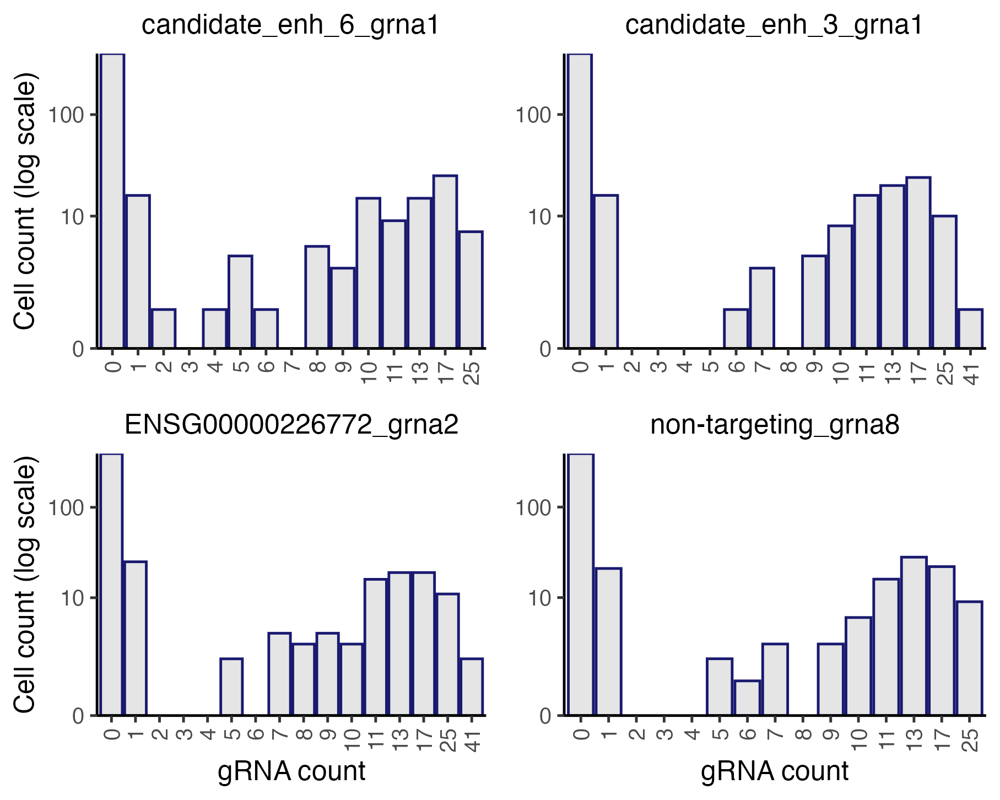
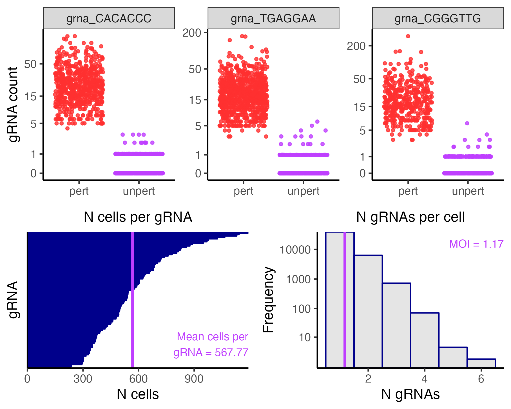
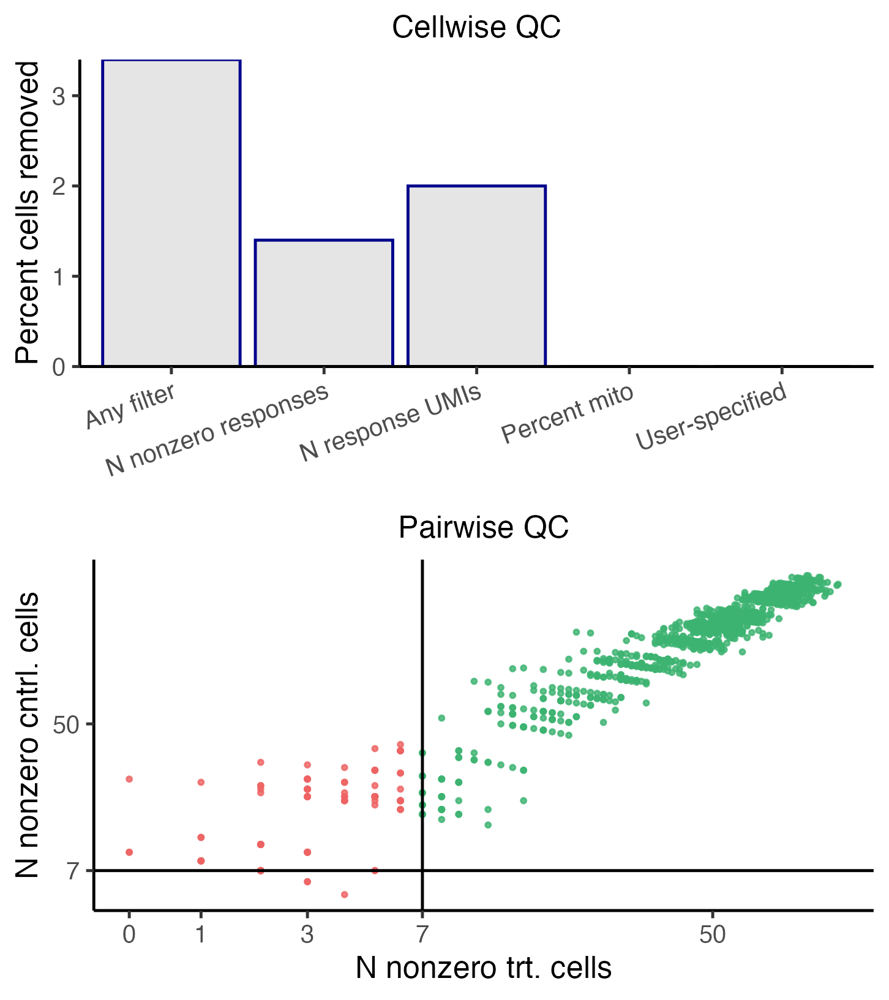
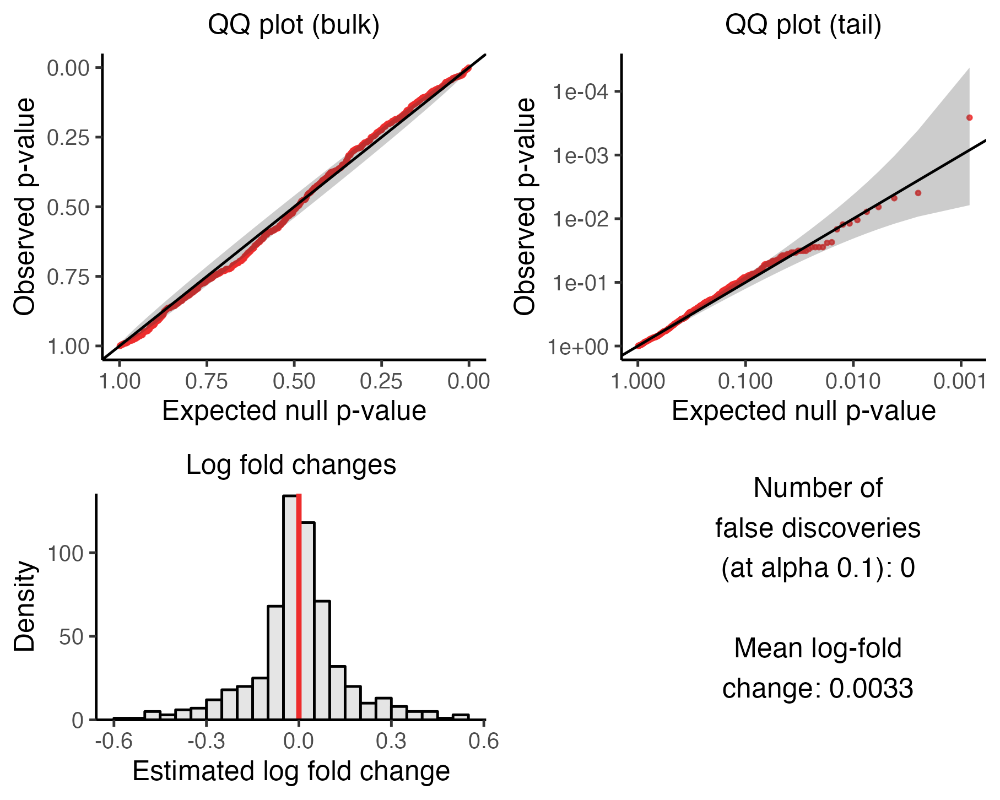
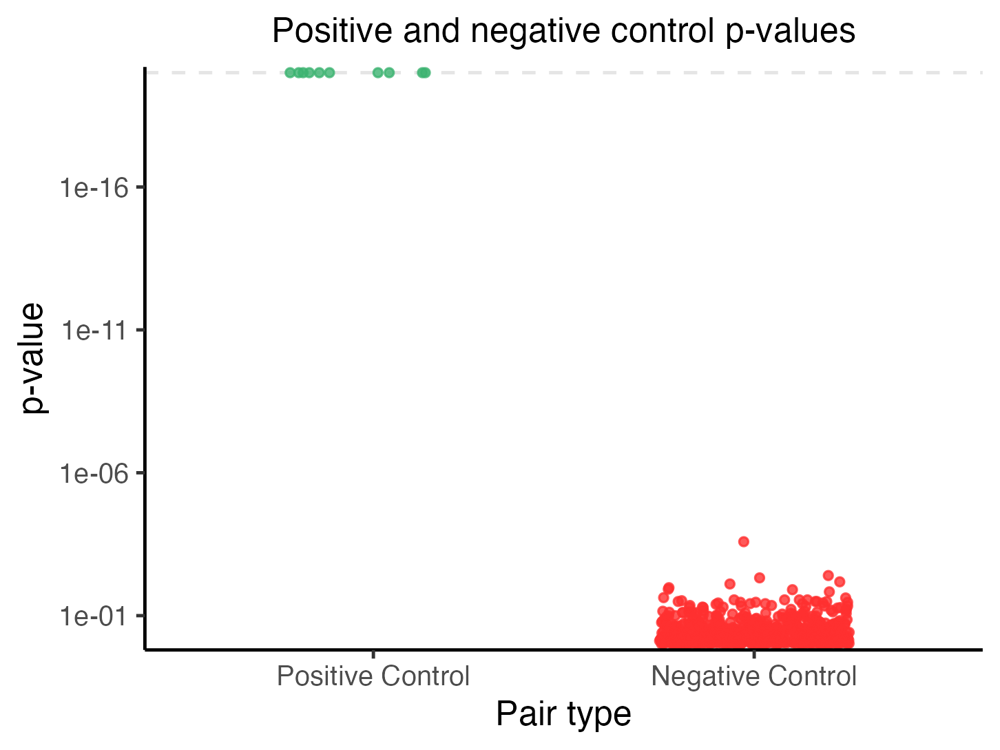
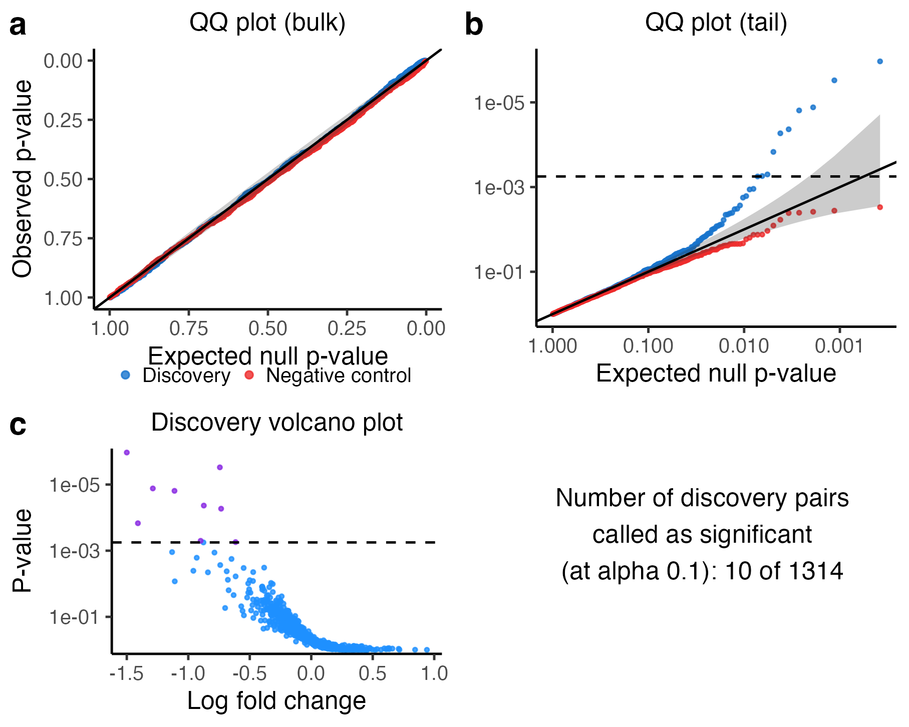

```{r, include = FALSE}
knitr::opts_chunk$set(
  collapse = TRUE,
  comment = "#>"
)
```

**`sceptre` facilitates statistically rigorous, computationally efficient, and user-friendly single-cell CRISPR screen data analysis.** The standard pipeline involved in applying `sceptre` to analyze a dataset consists of several steps, which we summarize in the following schematic.

```{r, out.width = "650px", fig.align="center", echo = FALSE, fig.cap=c("Standard `sceptre` pipeline")}
knitr::include_graphics("pipeline_schematic.png")
```

This vignette illustrates application of `sceptre` to a CRISPRi screen of candidate enhancers in K562 cells (Gasperini et al, 2019). The goal of the analysis is to confidently link enhancers to genes by testing for changes in gene expression in response to the CRISPR perturbations of the candidate enhancers. We begin by loading the `sceptre` package.

```{r,results='hide'}
library(sceptre)
```

```{r, echo = FALSE}
library(Matrix)
```

## The whole game

Using `sceptre` is simple; carrying out an entire analysis requires only a few lines of code. Below, we provide a minimal working example of applying `sceptre` to analyze the example data. First, we load the example data into R via the function `import_data_from_cellranger()`, which creates a `sceptre_object`, an object-based representation of the single-cell CRISPR screen data. Next, we specify the gRNA-gene pairs that we seek to test for association. Then, we call the pipeline functions on the `sceptre_object` in order. Finally, we write the outputs to the directory `~/sceptre_outputs`.

```{r, eval=FALSE}
# load the data, creating a sceptre_object
directories <- paste0(
  system.file("extdata", package = "sceptre"),
  "/highmoi_example/gem_group_", 1:2
)
data(grna_target_data_frame_highmoi)
sceptre_object <- import_data_from_cellranger(
  directories = directories,
  moi = "high",
  grna_target_data_frame = grna_target_data_frame_highmoi
)

# construct the grna-gene pairs to analyze
positive_control_pairs <- construct_positive_control_pairs(sceptre_object)
discovery_pairs <- construct_cis_pairs(sceptre_object, positive_control_pairs)

# apply the pipeline functions to the sceptre_object in order
sceptre_object <- sceptre_object |>
  set_analysis_parameters(discovery_pairs, positive_control_pairs) |>
  run_calibration_check() |>
  run_power_check() |>
  run_discovery_analysis()

# write the results to disk
write_outputs_to_directory(sceptre_object, "~/sceptre_outputs")
```

That's it. Note that `|>` is the base R pipe operator, equivalent in this context to the more familiar `%>%`. We describe each step of the pipeline in greater detail below.

## I. Import data

The first step is to import the data. **Data can be imported into `sceptre` from 10X Cell Ranger or Parse outputs, as well as from R matrices.** The simplest way to import the data is to read the output of one or more calls to `cellranger_count()` into `sceptre` via the function `import_data_from_cellranger()`, although users can instead input data from the Parse Biosciences count matrix generation software or from standard R matrices. `import_data_from_cellranger()` requires three arguments: `directories`, `grna_target_data_frame`, and `moi`.

1.  `directories` is a character vector specifying the locations of the directories outputted by one or more calls to `cellranger_count()`. Below, we set the variable `directories` to the (machine-dependent) location of the example CRISPRi data on disk.

    ```{r}
    directories <- paste0(
      system.file("extdata", package = "sceptre"), 
      "/highmoi_example/gem_group_", 1:2
    )
    directories # file paths to the example data on your computer
    ```

    `directories` points to two directories, both of which store the expression data in matrix market format and contain the files `barcodes.tsv.gz`, `features.tsv.gz`, and `matrix.mtx.gz`.

    ```{r}
    list.files(directories[1])
    list.files(directories[2])
    ```

2.  `grna_target_data_frame` is a data frame mapping each individual gRNA to the genomic element that the gRNA targets. `grna_target_data_frame` contains two required columns: `grna_id` and `grna_target`. `grna_id` is the ID of an individual gRNA, while `grna_target` is a label specifying the genomic element that the gRNA targets. (Typically, multiple gRNAs are designed to target a given genomic element in a single-cell CRISPR screen.) Non-targeting (NT) gRNAs are assigned a gRNA target label of "non-targeting". `grna_target_data_frame` optionally contains the columns `chr`, `start`, and `end`, which give the chromosome, start coordinate, and end coordinate, respectively, of the genomic region that each gRNA targets. We load and examine the `grna_target_data_frame` corresponding to the example data.

    ```{r}
    data(grna_target_data_frame_highmoi)
    grna_target_data_frame_highmoi[c(1:4, 21:24, 80:83),]
    ```

    Some gRNAs (e.g., `grna_CCGGGCG` and `grna_TGGCGGC`) target gene transcription start sites and serve as positive controls; other gRNAs (e.g., `grna_TCTTGAC` and `grna_TGATCGC`) target candidate enhancers, while others still (e.g., `grna_TATTCGT` and `grna_GACCTCC`) are non-targeting. Each gene and candidate enhancer in this dataset is targeted by exactly two gRNAs.

3.  `moi` is a string specifying the multiplicity-of-infection (MOI) of the data, taking values "high" or "low". A high-MOI (respectively, low-MOI) dataset is one in which the experimenter has aimed to insert multiple gRNAs (respectively, a single gRNA) into each cell. (If a given cell is determined to contain multiple gRNAs in a low-MOI screen, that cell is removed as part of the quality control step, as discussed below.) The example dataset is a high MOI dataset, and so we set `moi` to "high".

    ```{r}
    moi <- "high"
    ```

Finally, we call the function `import_data_from_cellranger()`, passing `directories`, `grna_target_data_frame`, and `moi` as arguments.

```{r,results='hide'}
sceptre_object <- import_data_from_cellranger(
  directories = directories,
  grna_target_data_frame = grna_target_data_frame_highmoi,
  moi = moi
)
```

`import_data_from_cellranger()` returns a `sceptre_object`, which is an object-based representation of the single-cell CRISPR screen data. Evaluating `sceptre_object` in the console prints a helpful summary of the data.

```{r}
sceptre_object
```

Several metrics are displayed, including the number of cells, the number of genes (or "responses"), and the number of gRNAs present in the data. `sceptre` also automatically computes the following cell-specific covariates: `grna_n_nonzero` (i.e., the number of gRNAs expressed in the cell), `grna_n_umis` (i.e., the number of gRNA UMIs sequenced in the cell), `response_n_nonzero` (i.e., the number of responses expressed in the cell), `response_n_umis` (i.e., the number of response UMIs sequenced in the cell), `response_p_mito` (i.e., the fraction of transcripts mapping to mitochondrial genes), and `batch`. (Cells loaded from different directories are assumed to come from different batches.)

See `vignette("import-data")` for more details about data import.

## II. Set analysis parameters

The second step is to set the analysis parameters. The most important analysis parameters are the discovery pairs, positive control pairs, sidedness, and gRNA grouping strategy.

1.  **Discovery pairs and positive control pairs**. The primary goal of `sceptre` is to determine whether perturbation of a gRNA target (such as an enhancer) leads to a change in expression of a response (such as gene). We use the term *target-response pair* to refer to a given gRNA target and response that we seek to test for association (upon perturbation of the gRNA target). A *discovery target-response pair* is a target-response pair whose association status we do not know but would like to learn. For example, in an experiment in which we aim to link putative enhancers to genes, the discovery target-response pairs might consist of the set of putative enhancers and genes in close physical proximity to one another.

    A *positive control* (resp., *negative control*) *target-response pair* is a target-response pair for which we know that there *is* (resp., is *not*) a relationship between the target and the response. Positive control target-response pairs often are formed by coupling a transcription start site to the gene known to be regulated by that transcription start site. Negative control target-response pairs, meanwhile, typically are constructed by pairing negative control gRNAs to one or more responses. (We defer a detailed discussion of negative control pairs to a later section of this vignette.) Discovery pairs are of primary scientific interest, while positive control and negative control pairs serve a mainly technial purpose, helping us verify that the biological assay and statistical methodology are in working order.

    `sceptre` offers several helper functions to facilitate the construction of positive control and discovery pairs. The function `construct_positive_control_pairs()` takes as argument a `sceptre_object` and outputs the set of positive control pairs formed by matching gRNA targets (as contained in the `grna_target_data_frame`) to response IDs. Positive control pairs are optional and need not be computed.

    ```{r}
    positive_control_pairs <- construct_positive_control_pairs(sceptre_object)
    head(positive_control_pairs)
    ```

    Next, the functions `construct_cis_pairs()` and `construct_trans_pairs()` facilitate the construction of *cis* and *trans* discovery sets, respectively. `construct_cis_pairs()` takes as arguments a `sceptre_object` and an integer `distance_threshold` and returns the set of response-target pairs located on the same chromosome within `distance_threshold` bases of one another. `positive_control_pairs` optionally can be passed to this function, in which case positive control gRNA targets are excluded from the *cis* pairs. (Note that `construct_cis_pairs()` assumes that the responses are genes rather than, say, proteins or chromatin-derived features.)

    ```{r}
    discovery_pairs <- construct_cis_pairs(
      sceptre_object = sceptre_object,
      positive_control_pairs = positive_control_pairs,
      distance_threshold = 5e6
    )
    discovery_pairs[c(1:4, 101:104),]
    ```

    `construct_trans_pairs()` constructs the entire set of possible target-response pairs. See the Set Analysis Parameters vignette (`vignette("set-analysis-parameters")`) for more information about these functions.

2.  **Sidedness**. The parameter `side` controls whether to run a left-tailed (`"left"`), right-tailed (`"right"`), or two-tailed (`"both"`; default) test. A left-tailed (resp., right-tailed) test is appropriate when testing for a decrease (resp., increase) in expression; a two-tailed test, by contrast, is appropriate when testing for an increase *or* decrease in expression. A left-tailed test is the most appropriate choice for a CRISPRi screen of enhancers, and so we set `side` to `"left"`.

    ```{r}
    side <- "left"
    ```

3.  **gRNA grouping strategy**. Typically, multiple gRNAs are designed to target a given genomic element. The parameter `grna_grouping_strategy` controls if and how gRNAs that target the same genomic element are grouped. The default option, `"union"`, combines gRNAs that target the same element into a single "grouped gRNA;" this "grouped gRNA" is tested for association against the responses to which the element is paired. `grna_grouping_strategy` also can be set to "singleton," in which case each gRNA targeting a given element is tested individually against the responses paired to that element. In our analysis we use the default "union" strategy.

Finally, we set the analysis parameters by calling the function `set_analysis_parameters()`, passing `sceptre_object`, `discovery_pairs`, `positive_control_pairs`, and `side` as arguments. Note that `sceptre_object` and `discovery_pairs` are the only required arguments to this function.

```{r, message=FALSE,results='hide'}
sceptre_object <- set_analysis_parameters(
  sceptre_object = sceptre_object,
  discovery_pairs = discovery_pairs,
  positive_control_pairs = positive_control_pairs,
  side = side
)
print(sceptre_object) # output suppressed for brevity
```

## III. Assign gRNAs to cells (optional)

The third step is to assign gRNAs to cells. This step can be skipped, in which case gRNAs are assigned to cells automatically using default options. The gRNA assignment step involves using the gRNA UMI counts to determine which cells contain which gRNAs. We begin by plotting the UMI count distribution of several randomly selected gRNAs via a call to the function `plot_grna_count_distributions()`.

```{r, eval=FALSE}
plot_grna_count_distributions(sceptre_object)
```

```{r, out.width = "650px", fig.align="center", echo = FALSE, fig.cap=c("Histograms of the gRNA count distributions")}
set.seed(2)
p <- plot_grna_count_distributions(sceptre_object = sceptre_object)
ggplot2::ggsave(filename = "grna_count_distribution.png", plot = p, device = "png", scale = 1.1, width = 5, height = 4, dpi = 330)

```

The gRNAs display fairly bimodal count distributions. Consider, for example, `gRNA_CCTGACA` (top left corner). This gRNA exhibits a UMI count of $\leq 1$ or $\geq 5$ in most cells and a UMI count of 2, 3, or 4 in only a handful of cells. The vast majority of cells with a UMI count of 1 likely do not actually contain `gRNA_CCTGACA`. This is an example of "background contamination," the phenomenon by which gRNA transcripts sometimes map to cells that do not contain the corresponding gRNA.

**`sceptre` provides three methods for assigning gRNAs to cells (the "mixture method," the "maximum method," and the "thresholding method")**, all of which account for background contamination. The default method for high-MOI data is the "mixture method." The gRNA counts are regressed onto the (unobserved) gRNA presence/absence indicator and the cell-specific covariates (e.g., `grna_n_umis`, `batch`) via a latent variable Poisson GLM. The fitted model yields the probability that each cell contains the gRNA, and these probabilities are thresholded to assign the gRNA to cells. The default method in low-MOI is the simpler "maximum" approach: the gRNA that accounts for the greatest number of UMIs in a given cell is assigned to that cell. A backup option in both low- and high-MOI is the "thresholding" approach: a given gRNA is assigned to a given cell if the UMI count of that gRNA in that cell exceeds some integer threshold.

We carry out the gRNA assignment step via a call to the function `assign_grnas()`. `assign_grnas()` takes arguments `sceptre_object` (required) and `method` (optional); the latter argument can be set to `"mixture"`, `"maximum"`, or `"thresholding"`. We parallelize execution of `assign_grnas()` by setting `parallel` to `TRUE`. (Windows users should remove the `parallel = TRUE` argument, as parallel execution is not yet configured for Windows.)

```{r,results='hide'}
sceptre_object <- assign_grnas(sceptre_object = sceptre_object, parallel = TRUE)
print(sceptre_object) # output suppressed for brevity
```

We can call `plot()` on the resulting `sceptre_object` to render a plot summarizing the output of the gRNA-to-cell assignment step.

```{r,eval=FALSE}
plot(sceptre_object)
```

```{r, out.width = "650px", fig.align="center", echo = FALSE, fig.cap=c("gRNA-to-cell assignments")}
set.seed(3)
p <- plot(sceptre_object)
ggplot2::ggsave(filename = "grna_count_assignments.png", plot = p, device = "png", scale = 1.1, width = 5, height = 4, dpi = 330)

```

The top panel plots the gRNA-to-cell assignments of three randomly selected gRNAs. In each plot the points represent cells; the vertical axis indicates the UMI count of the gRNA in a given cell, and the horizontal axis indicates whether the cell has been classified as "perturbed" (i.e., it *contains* the gRNA) or unperturbed (i.e., it does *not contain* the gRNA). Perturbed (resp., unperturbed) cells are shown in the left (resp., right) column. The bottom left panel is a barplot of the number of cells to which each gRNA has been mapped. Finally, the bottom right panel is a histogram of the number of gRNAs contained in each cell. The mean number of gRNAs per cell --- i.e., the MOI --- is displayed in purple text.

## IV. Run quality control (optional)

The fourth step is to run quality control (QC). This step likewise can be skipped, in which case QC is applied automatically using default options. **`sceptre` implements two kinds of QC: cellwise QC and pairwise QC. The former aims to remove low-quality cells, while the latter aims to remove low-quality target-response pairs.**

The cellwise QC that `sceptre` implements is standard in single-cell analysis. Cells for which `response_n_nonzero` (i.e., the number of expressed responses) or `response_n_umis` (i.e., the number of response UMIs) is extremely high or extremely low are removed. Likewise, cells for which `response_p_mito` (i.e., the fraction of UMIs mapping to mitochondrial genes) is excessively high are removed. Additionally, in low-MOI, cells that contain multiple gRNAs (as determined during the RNA-to-cell assignment step) are removed. Finally, users optionally can provide a list of additional cells to remove.

`sceptre` also implements QC at the level of the target-response pair. For a given pair we define the "treatment cells" as those that contain a gRNA targeting the given target. Next, we define the "control cells" as the cells against which the treatment cells are compared to carry out the differential expression test. We define the "number of nonzero treatment cells" (`n_nonzero_trt`) as the number of *treatment* cells with nonzero expression of the response; similarly, we define the "number of nonzero control cells" (`n_nonzero_cntrl`) as the number of *control* cells with nonzero expression of the response. `sceptre` filters out pairs for which `n_nonzero_trt` or `n_nonzero_cntrl` falls below some threshold (by default 7).

We call the function `run_qc()` on the `sceptre_object` to carry out cellwise and pairwise QC. `run_qc()` has several optional arguments that control the stringency of the various QC thresholds. For example, we set `p_mito_threshold = 0.075`, which filters out cells whose `response_p_mito` value exceeds 0.075. (The optional arguments are set to reasonable defaults; the default for `p_mito_threshold` is 0.2, for instance).

```{r,results='hide'}
sceptre_object <- run_qc(sceptre_object, p_mito_threshold = 0.075)
print(sceptre_object) # output suppressed for brevity
```

We can visualize the output of the QC step by calling `plot()` on the updated `sceptre_object`.

```{r,eval=FALSE}
plot(sceptre_object)
```

```{r, out.width = "450px", fig.align="center", echo = FALSE, fig.cap=c("Cellwise and pairwise quality control")}
p <- plot(sceptre_object)
ggplot2::ggsave(filename = "qc.png", plot = p, device = "png", scale = 1.1, width = 4, height = 4.5, dpi = 330)

```

The top panel depicts the outcome of the cellwise QC. The various cellwise QC filters (e.g., "N nonzero responses," "N response UMIs," "Percent mito", etc.) are shown on the horizontal axis, and the percentage of cells removed due application of a given QC filter is shown on the vertical axis. Note that a cell can be flagged by multiple QC filters; for example, a cell might have an extremely high `response_n_umi` value *and* an extremely high `response_n_nonzero` value. Thus, the height of the "any filter" bar (which indicates the percentage of cells removed due to application of *any* filter) need not be equal to the sum of the heights of the other bars. The bottom panel depicts the outcome of the pairwise QC. Each point corresponds to a target-response pair; the vertical axis (resp., horizontal axis) indicates the `n_nonzero_trt` (resp., `n_nonzero_cntrl`) value of that pair. Pairs for which `n_nonzero_trt` or `n_nonzero_cntrl` fall below the threshold are removed (red), while the remaining pairs are retained (green).

## V. Run calibration check

The fifth step is to run the calibration check. **The calibration check is an analysis that verifies that `sceptre` controls the rate of false discoveries on the dataset under analysis.** The calibration check proceeds as follows. First, negative control target-response pairs are constructed (automatically) by coupling subsets of NT gRNAs to randomly selected responses. Importantly, the negative control pairs are constructed in such a way that they are similar to the discovery pairs, the difference being that the negative control pairs are devoid of biological signal. Next, `sceptre` is applied to analyze the negative control pairs. Given that the negative control pairs are absent of signal, `sceptre` should produce approximately uniformly distributed p-values on the negative control pairs. Moreover, after an appropriate multiple testing correction, `sceptre` should make zero (or very few) discoveries on the negative control pairs. Verifying calibration via the calibration check increases our confidence that the discovery set that `sceptre` ultimately produces is uncontaminated by excess false positives.

We run the calibration check by calling the function `run_calibration_check()` on the `sceptre_object`.

```{r,results='hide'}
sceptre_object <- run_calibration_check(sceptre_object, parallel = TRUE)
print(sceptre_object) # output suppressed for brevity
```

We can assess the outcome of the calibration check by calling `plot()` on the resulting `sceptre_object`.

```{r,eval=FALSE}
plot(sceptre_object)
```

```{r, out.width = "650px", fig.align="center", echo = FALSE, fig.cap=c("Calibration check results")}
set.seed(3)
p <- plot(sceptre_object)
ggplot2::ggsave(filename = "calibration_check.png", plot = p, device = "png", scale = 1.1, width = 5, height = 4, dpi = 330)

```

The visualization consists of four panels, which we describe below.

-   The upper left panel is a QQ plot of the p-values plotted on an untransformed scale. The p-values should lie along the diagonal line, indicating uniformity of the p-values in the *bulk* of the distribution.

-   The upper right panel is a QQ plot of the p-values plotted on a negative log-10 transformed scale. The p-values again should lie along the diagonal line (with the majority of the p-values falling within the gray confidence band), indicating uniformity of the p-values in the *tail* of the distribution.

-   The lower left panel is a histogram of the estimated log-2 fold changes. The histogram should be roughly symmetric and centered around zero.

-   Finally, the bottom right panel is a text box displaying (i) the number of false discoveries that `sceptre` has made on the negative control data and (ii) the mean estimated log-fold change. The number of false discoveries should be a small integer like zero, one, two, or three, with zero being ideal. The mean estimated log-fold change, meanwhile, should be a numeric value close to zero; a number in the range [-0.1, 0.1] is adequate.

`sceptre` may not exhibit good calibration initially, which is OK. See the Calibration Check vignette (`vignette("calibration-check)"`) for strategies for improving calibration.

## VI. Run power check (optional)

The sixth step --- which is optional --- is to run the power check. The power check involves applying `sceptre` to analyze the positive control pairs. Given that the positive control pairs are known to contain signal, `sceptre` should produce significant (i.e., small) p-values on the positive control pairs. **The power check enables us to assess `sceptre`'s power (i.e., its ability to detect true associations) on the dataset under analysis.** We run the power check by calling the function `run_power_check()` on the `sceptre_object`.

```{r,results='hide'}
sceptre_object <- run_power_check(sceptre_object, parallel = TRUE)
print(sceptre_object) # output suppressed for brevity
```

We can visualize the outcome of the power check by calling `plot()` on the resulting `sceptre_object`.

```{r,eval=FALSE}
plot(sceptre_object)
```

```{r, out.width = "550px", fig.align="center", echo = FALSE, fig.cap=c("Power check results")}
set.seed(3)
p <- plot(sceptre_object)
ggplot2::ggsave(filename = "power_check.png", plot = p, device = "png", scale = 1.1, width = 4, height = 3, dpi = 330)

```

Each point in the plot corresponds to a target-response pair, with positive control pairs in the left column and negative control pairs in the right column. The vertical axis indicates the p-value of a given pair; smaller (i.e., more significant) p-values are positioned higher along this axis (p-values truncated at $10^{-20}$ for visualization). The positive control p-values should be small, and in particular, smaller than the negative control p-values.

## VII. Run discovery analysis

The seventh and penultimate step is to run the discovery analysis. The discovery analysis entails applying `sceptre` to analyze the discovery pairs. We run the discovery analysis by calling the function `run_discovery_analysis()`.

```{r,results='hide'}
sceptre_object <- run_discovery_analysis(sceptre_object, parallel = TRUE)
print(sceptre_object) # output suppressed for brevity
```

We can visualize the outcome of the discovery analysis by calling `plot()` on the resulting `sceptre_object`.

```{r,eval=FALSE}
plot(sceptre_object)
```

```{r, out.width = "650px", fig.align="center", echo = FALSE, fig.cap=c("Discovery analysis results")}
set.seed(3)
p <- plot(sceptre_object)
ggplot2::ggsave(filename = "discovery_analysis.png", plot = p, device = "png", scale = 1.1, width = 5, height = 4, dpi = 330)

```

The visualization consists of four panels.

-   The upper left plot superimposes the discovery p-values (blue) on top of the negative control p-values (red) on an untransformed scale.

-   The upper right plot is the same as the upper left plot, but the scale is negative log-10 transformed. The discovery p-values should trend above the diagonal line, indicating the presence of signal in the discovery set. The horizontal dashed line indicates the multiple testing threshold; discovery pairs whose p-value falls above this line are called as significant.

-   The bottom left panel is a volcano plot of the p-values and log fold changes of the discovery pairs. Each point corresponds to a pair; the estimated log-2 fold change of the pair is plotted on the horizontal axis, and the (negative log-10 transformed) p-value is plotted on the vertical axis. The horizontal dashed line again indicates the multiple testing threshold. Points above the dashed line (colored in purple) are called as discoveries, while points below (colored in blue) are called as insignificant.

-   The bottom right panel is a text box displaying the number of discovery pairs called as significant.

## VIII. Write outputs to directory

The eighth and final step is to write the outputs of the analysis to a directory on disk. We call the function `write_outputs_to_directory()`, which takes as arguments a `sceptre_object` and `directory`; `directory` is a string indicating the location of the directory in which to write the results contained within the `sceptre_object`.

```{r,results='hide'}
write_outputs_to_directory(
  sceptre_object = sceptre_object, 
  directory = "~/sceptre_outputs"
)
```

`write_outputs_to_directory()` writes several files to the specified directory: a text-based summary of the analysis ("analysis_summary.txt"), the various plots ("\*.png"), and the calibration check, power check, and discovery analysis results ("results_run_calibration_check.rds," "results_run_power_check.rds," and "results_run_discovery_analysis.rds," respectively).

```{r}
list.files("~/sceptre_outputs")
```

We also can obtain the calibration check, power check, and discovery analysis results in R via a call to the function `get_result()`, passing as arguments `sceptre_object` and `analysis`, where the latter is a string indicating the function whose results we are querying.

```{r}
result <- get_result(sceptre_object, analysis = "run_discovery_analysis")
```

`result` is a data frame, the rows of which correspond to target-response pairs, and the columns of which are as follows: `response_id`, `grna_target`, `n_nonzero_trt`, `n_nonzero_cntrl`, `pass_qc` (a `TRUE`/`FALSE` value indicating whether the pair passes pairwise QC), `p_value`, `log_2_fold_change`, and `significant` (a `TRUE`/`FALSE` value indicating whether the pair is called as significant).

```{r}
head(result)
```

## Further reading

Each step of the pipeline has its own dedicated vignette. We encourage advanced users to read these additional vignettes to learn more about the various options available at each step of the pipeline. We recommend that users begin with the Import Data vignette (`vignette("import-data")`) and then move through the remaining vignettes in order.
