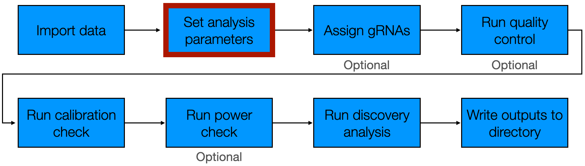
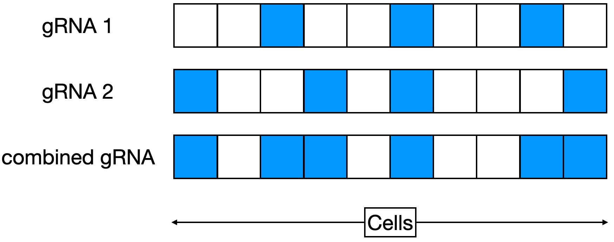
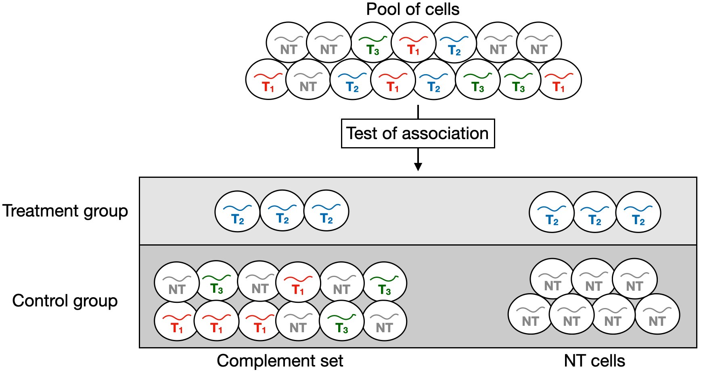
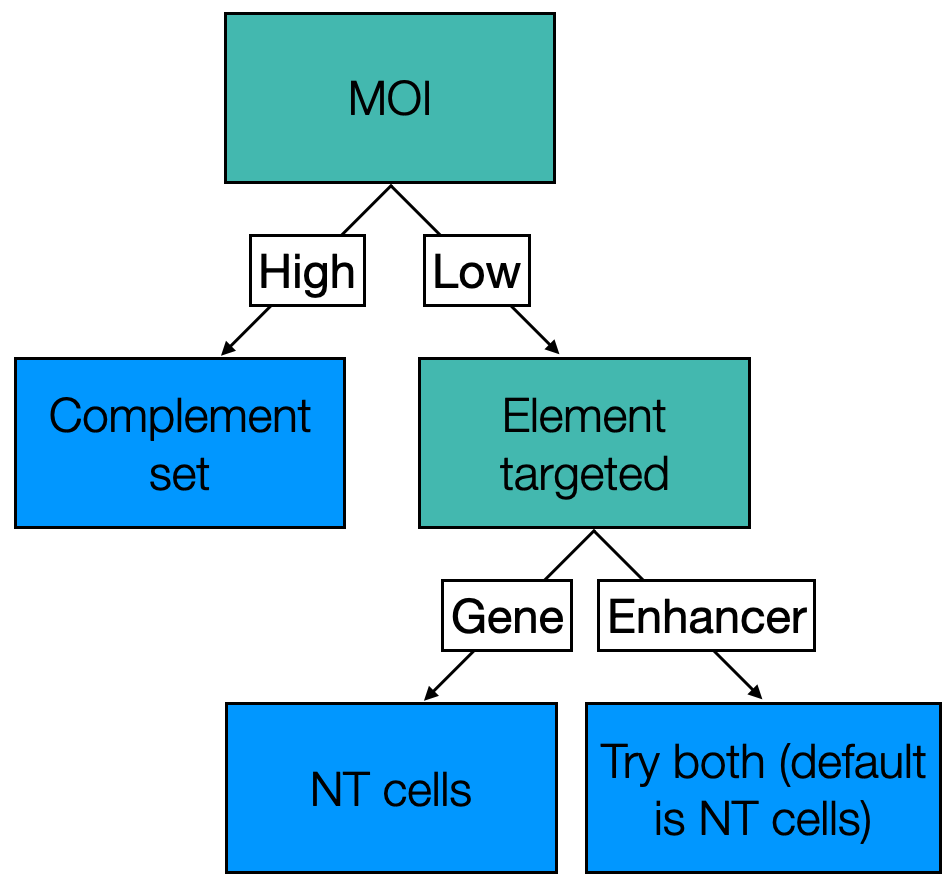
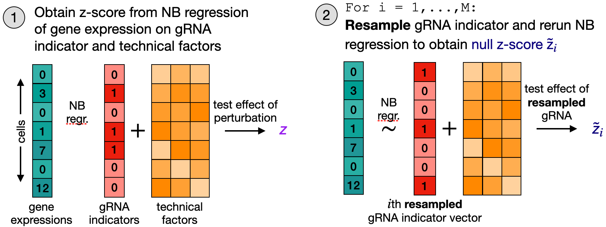
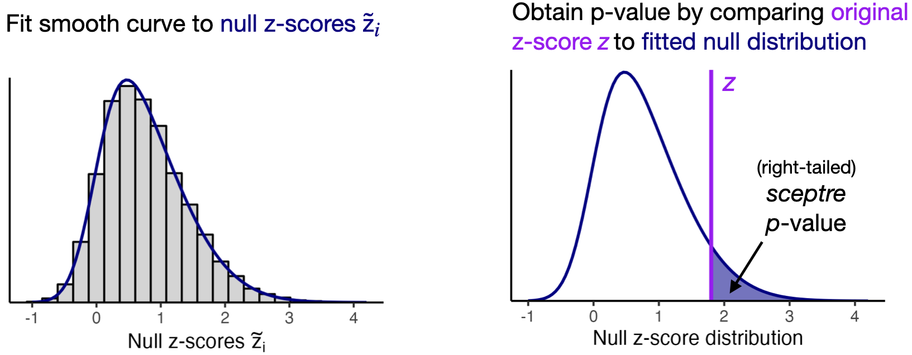

```{r, include = FALSE}
knitr::opts_chunk$set(
  collapse = TRUE,
  comment = "#>"
)
```

This vignette explicates the "set analysis parameters" step of the `sceptre` pipeline. The purpose of this step is to select the parameters that govern how the statistical analysis is to be carried out.

```{r, out.width = "650px", fig.align="center", echo = FALSE}

```

We begin by loading the `sceptre` package.

```{r,results='hide'}
library(sceptre)
```

Throughout, we examine two example datasets. First, we examine the example high-MOI CRISPRi screen of candidate enhancers in K562 cells. This is the example dataset that we used in the Get Started (`vignette("sceptre")`) and Import Data (`vignette("import-data")`) vignettes. We initialize a `sceptre_object` called `sceptre_object_highmoi` to represent these data.

```{r}
data(highmoi_example_data)
data(grna_target_data_frame_highmoi)
sceptre_object_highmoi <- import_data(response_matrix = highmoi_example_data$response_matrix,
                                      grna_matrix = highmoi_example_data$grna_matrix,
                                      grna_target_data_frame = grna_target_data_frame_highmoi,
                                      moi = "high",
                                      extra_covariates = highmoi_example_data$extra_covariates,
                                      response_names = highmoi_example_data$gene_names)
```

We additionally examine an example low-MOI CRISPRko screen of gene transcription start sites in immune cells. We initialize a `sceptre_object` called `sceptre_object_lowmoi` to store this latter dataset.

```{r}
sceptre_object_lowmoi <- import_data(response_matrix = lowmoi_example_data$response_matrix,
                                     grna_matrix = lowmoi_example_data$grna_matrix,
                                     extra_covariates = lowmoi_example_data$extra_covariates,
                                     grna_target_data_frame = lowmoi_example_data$grna_target_data_frame,
                                     moi = "low")
```

We print the details of the CRISPRko dataset below.

```{r}
sceptre_object_lowmoi
```

The CRISPR perturbations target gene transcription start sites. Each gene is targeted by three or four gRNAs, and nine gRNAs in the dataset are non-targeting. The "responses" are genes. We print a few rows of the gRNA target data frame corresponding to this dataset below.

```{r}
lowmoi_example_data$grna_target_data_frame[1:8,]
```

Our goal in analyzing the CRISPRko dataset is to dissect gene regulatory networks by linking perturbations of genes to changes in the expression of other genes.

We set the analysis parameters by calling the function `set_analysis_parameters()` on the `sceptre_object`. `set_analysis_parameters()` takes several arguments: `positive_control_pairs`, `discovery_pairs`, `side`, `grna_grouping_strategy`, `control_group`, `resampling_mechanism`, `formula_object`, `multiple_testing_method`, `multiple_testing_alpha`, and `fit_parametric_curve`. The only required argument among these is `discovery_pairs`. We describe these arguments below.

## Positive control pairs

Positive control pairs are target-response pairs for which we know (or have strong reason to believe) that there is a regulatory relationship between the target and the response. We can use positive control pairs to verify that `sceptre` (or any association testing method for that matter) is sensitive (i.e., capable of detecting true associations) on the dataset under analysis. We use the function `construct_positive_control_pairs()` to construct the positive control pairs. `construct_positive_control_pairs()` takes as an argument a `sceptre_object` and returns a data frame with columns `grna_target` and `response_id`, where gRNA targets and response IDs with matching names are paired. We call `construct_positive_control_pairs()` on the high-MOI CRISPRi dataset and the low-MOI CRISPRko dataset. In both cases the positive control set consists of transcription start sites paired to the gene regulated by those transcription start sites.

```{r}
positive_control_pairs_highmoi <- construct_positive_control_pairs(sceptre_object_highmoi)
head(positive_control_pairs_highmoi) # high MOI CRISPRi dataset
```

```{r}
positive_control_pairs_lowmoi <- construct_positive_control_pairs(sceptre_object_lowmoi)
head(positive_control_pairs_lowmoi) # low MOI CRISPRko dataset
```

Positive control pairs need not consist exclusively of gene transcription start sites paired to target genes. For example, enhancer-gene links that have been validated previously (through, e.g., arrayed CRISPR screens) also can serve as positive control pairs. Users manually can append additional positive control pairs to the positive control pair data frame via a call to `rbind()`. For example, suppose we know on the high-MOI CRISPRi data that `candidate_enh_1` regulates gene `ENSG00000069482` and that `candidate_enh_10` regulates gene `ENSG00000135821`. We can add these enhancer-gene links to the positive control pair data frame as follows.

```{r}
# construct data frame of additional positive control pairs
additional_positive_control_pairs <-
  data.frame(grna_target = c("candidate_enh_1", "candidate_enh_10"),
             response_id = c("ENSG00000069482", "ENSG00000135821"))

# append additional pairs to positive control data frame
positive_control_pairs_highmoi_updated <- rbind(positive_control_pairs_highmoi,
                                                additional_positive_control_pairs)
positive_control_pairs_highmoi_updated
```

We then could supply `positive_control_pairs_highmoi_updated` instead of `positive_control_pairs_highmoi` to `set_analysis_parameters()`.

## Discovery pairs

Discovery pairs are target-response pairs whose association status we do not know but seek to learn. Unlike positive control and negative control pairs, which serve a mainly technical purpose, discovery pairs are of primary scientific interest. Discovery pairs must be supplied to `set_analysis_parameters()`; all other arguments (aside from `sceptre_object`) are optional. `sceptre` provides two helper functions for constructing discovery pairs: `construct_cis_pairs()` and `construct_trans_pairs()`.

#### Construct *cis* pairs

`construct_cis_pairs()` returns the set of target-response pairs for which the target and response are located on the same chromosome and in close physical proximity to one another. `construct_cis_pairs()` assumes that the columns `chr`, `start`, and `stop` are present within the `grna_target_data_frame`. `construct_cis_pairs()` also assumes that the responses are genes as opposed to, say, proteins. `construct_cis_pairs()` is a useful pair constructor function for screens that aim to map noncoding regulatory elements (e.g., enhancers, silencers, or noncoding GWAS variants) to target genes in *cis*. `construct_cis_pairs()` takes several arguments: `sceptre_object` (required) `distance_threshold` (optional), `positive_control_pairs` (optional), and `ref_genome` (optional). Each target is paired to the set of genes within `distance_threshold` bases of that target. (The default value of `distance_threshold` is 500,000 bases, or half a megabase.) The `positive_control_pairs` data frame optionally can be passed to `construct_cis_pairs()`, in which case the positive control targets (i.e., the entries within the `grna_target` column of `positive_control_pairs`) are excluded from the *cis* pairs. Finally, `ref_genome` is a string indicating the reference genome that `chr`, `start`, and `stop` are defined with respect to. (The only reference genome currently available is "10X_GRCh38_2020," which is the GRCh38 reference genome that has shipped with CellRanger since 2020.)

We use `construct_cis_pairs()` to construct the discovery pairs for the high-MOI CRISPRi dataset. We set `distance_threshold` to `5e6` (i.e., 5 megabases) so as to increase the number of pairs in the discovery set for illustration purposes.

```{r}
discovery_pairs_highmoi <- construct_cis_pairs(sceptre_object = sceptre_object_highmoi,
                                               positive_control_pairs = positive_control_pairs_highmoi,
                                               distance_threshold = 5e6)
```

`discovery_pairs_highmoi` is a data frame with columns `grna_target` and `response_id`; each candidate enhancer is mapped to the set of genes in close proximity to that candidate enhancer.

```{r}
discovery_pairs_highmoi[c(1, 10, 20, 30, 40, 50),]
```

#### Construct *trans* pairs

`construct_trans_pairs()` returns the entire set of possible target-response pairs. `construct_trans_pairs()` is a useful pair constructor function for analyses in which we seek to conduct a *trans* analysis, testing each target against each response. `construct_trans_pairs()` takes as arguments `sceptre_object` (required), `positive_control_pairs` (optional), `exclude_positive_control_pairs` (optional), and `exclude_positive_control_targets` (optional). By default `construct_trans_pairs()` returns a data frame with columns `grna_target` and `response_id`, where each gRNA target is mapped to each response ID. If the `positive_control_pairs` data frame is passed and `exclude_positive_control_pairs` is set to `TRUE`, then the positive control target-response pairs are excluded from the *trans* pairs. Next, if `positive_control_pairs` is passed and `exclude_positive_control_targets` is set to `TRUE`, then *all* pairs containing a positive control gRNA target are excluded from the *trans* pairs. (In this sense setting `exclude_positive_control_targets` to `TRUE` is stronger than setting `exclude_positive_control_pairs` to `TRUE`.)

We use `construct_trans_pairs()` to construct the discovery set for the low-MOI CRISPRko dataset, excluding the positive control pairs. The discovery set consists of the set of genes targeted by one or more gRNAs paired to the set of *all other* genes.

```{r}
discovery_pairs_lowmoi <- construct_trans_pairs(sceptre_object = sceptre_object_lowmoi,
                                                positive_control_pairs = positive_control_pairs_lowmoi,
                                                exclude_positive_control_pairs = TRUE)
head(discovery_pairs_lowmoi)
```

We also can use `construct_trans_pairs()` to construct a *trans* discovery set for the high-MOI, enhancer-targeting CRISPRi dataset. To this end we call `construct_trans_pairs()`, setting `exclude_positive_control_targets` to `TRUE` so as to exclude all positive control gRNA targets from the *trans* pairs.

```{r}
discovery_pairs_highmoi_trans <- construct_trans_pairs(sceptre_object = sceptre_object_highmoi,
                                                       positive_control_pairs = positive_control_pairs_highmoi,
                                                       exclude_positive_control_targets = TRUE)
```

The resulting data frame, `discovery_pairs_highmoi_trans`, maps each candidate enhancer to the entire set of genes.

```{r}
head(discovery_pairs_highmoi_trans)
```

Some users may wish to run both *cis* and *trans* analyses on their data. We recommend that such users carry out the `sceptre` pipeline twice: once using a *cis* discovery set and once using a *trans* discovery set.

### Reducing the multiplicity burden 

`sceptre` computes a p-value for each target-response pair in the discovery set. These p-values are subjected to a multiple testing correction procedure (by default, the Benjamini-Hochberg method) to produce a discovery set that controls some notion of aggregate type-I error (by default, the false discovery rate). In general it is good to restrict one's attention to pairs that are promising or scientifically interesting. Including a large number of uninteresting or "null" pairs (i.e., pairs for which there is no relationship between the target and response) in the discovery set causes the power of the multiple testing correction procedure to decrease, resulting in fewer discoveries.

## Side

`sceptre` can run left-tailed, right-tailed, and two-tailed tests of association. Left-tailed tests assess a *decrease* in expression, right-tailed tests assess an *increase* in expression, and two-tailed tests assess an increase *or* decrease in expression. The parameter `side` controls the sidedness of the test and can take values `"left"`, `"right"`, or `"both"`. (`"both"` indicates a two-tailed test.) Two-tailed tests typically are the best choice for *trans* analyses, as the direction of *trans* relationships generally is uncertain. For *cis* analyses, on the other hand, the sidedness of the test should be chosen on the basis of the type of genomic element targeted and the CRISPR perturbation modality. The following table summarizes whether a left- or right-tailed test is appropriate for a *cis* analysis as a function of these variables.

+----------------+---------------------+------------------------+---------------+
| Target element | CRISPR modality     | Testing for            | Sidedness     |
+================+=====================+========================+===============+
| Enhancer       | CRISPRi or CRISPRko | Decrease in expression | Left          |
+----------------+---------------------+------------------------+---------------+
| Enhancer       | CRISPRa             | Increase in expression | Right         |
+----------------+---------------------+------------------------+---------------+
| Silencer       | CRISPRi or CRISPRko | Increase in expression | Right         |
+----------------+---------------------+------------------------+---------------+
| Silencer       | CRISPRa             | Decrease in expression | Left          |
+----------------+---------------------+------------------------+---------------+

: Recommended sidedness of the test as a function of target element and CRISPR modality for *cis* analyses.

## gRNA grouping strategy

Multiple gRNAs typically are designed to target a given genomic element. The parameter `grna_grouping_strategy` controls if and how gRNAs that target the same genomic element are combined. The default gRNA grouping strategy is `"union"`. `"union"` constructs a "grouped gRNA" by combining all gRNAs that target a given genomic element via a union operation; this "grouped gRNA" is then tested for association against the responses to which the element is paired. We illustrate this grouping strategy using an example. Suppose that "gRNA 1" and "gRNA 2" target the same genomic element. Suppose that "gRNA 1" is present in the cells indexed 3, 6, 9 and that "gRNA 2" is present in the cells indexed 1, 4, 6, 10. The "grouped gRNA" formed combining "gRNA 1" and "gRNA 2" via the union operation is defined to be present in the cells indexed 1, 3, 4, 6, 9, 10. (See schematic below.) This "grouped gRNA" is then tested against responses as if it were a single gRNA.

```{r, out.width = "450px", fig.align="center", echo = FALSE, fig.cap="Schematic of the `\"union\"` gRNA grouping strategy. Blue (resp., white) squares indicate cells in which the gRNA is present (resp., absent)."}

```

The other available gRNA grouping strategy is `"singleton"`. The `"singleton"` strategy involves individually testing each gRNA targeting a given element against the responses to which that element is paired. `"singleton"` may be more appropriate than `"union"` for experiments in which gRNA effectiveness is expected to vary considerably across gRNAs. However, `"union"` is the default rather than `"singleton"` because `"union"` tends to yield more powerful results.

## Control group

The primary goal of `sceptre` is to test for association between a given gRNA target and response. `control_group` is a parameter that controls the set of cells used to carry out the test of association. Suppose for simplicity that we are carrying out a singleton analysis, i.e. suppose that we are testing for association between an individual targeting gRNA and a response. We define the "treatment group" as the set of cells that contain the given targeting gRNA, and we define the "control group" as the set of cells against which the treatment group is compared to conduct the association test. There are two choices for the control group: the "complement set" and the "non-targeting (NT) cells." The complement set consists of the cells that *do not* contain the given targeting gRNA; the NT cells, by contrast, consist of the cells that contain a non-targeting gRNA. (See schematic below.) `sceptre` tests for association between the given targeting gRNA and the response by testing for differential expression of the response across the treatment group and the control group. Users can select the control group to use by passing either `"complement"` or `"nt_cells"` to `control_group`.

```{r, out.width = "760px", fig.align = "center", echo = FALSE, fig.cap = "A schematic illustrating the difference between the \"complement set\" and \"NT cells\" control groups. The single-cell CRISPR screen experiment produces a pool of cells containing both targeting and non-targeting gRNAs (top). Suppose that we seek to test for association between a given targeting gRNA (e.g., gRNA $T_2$) and a given response. We first divide the cells into two groups: the treatment group (i.e., the cells containing gRNA $T_2$) and the control group. The control group either can consist of the cells not containing gRNA $T_2$ (the \"complement set\") or the cells containing a non-targeting gRNA (the \"NT cells\"). `sceptre` tests for differential expression of the given response across the treatment and control groups, yielding a p-value for the test of association between the given targeting gRNA and the given response."}

```

The choice of the control group should be made on the basis of the MOI of the dataset and the type of genomic element being targeted. In high-MOI screens each cell contains multiple gRNAs. Very few (if any) cells contain exclusively NT gRNAs, and so the complement set is the only choice for the control group. In low-MOI screens there is more flexibility. The default choice for the control group is the NT cells, as we seek to compare the effect of the targeting gRNA to that of a "null" gRNA rather than to the average of the effects of all other gRNAs introduced in the pooled screen. However, the complement set is a reasonable choice for low-MOI enhancer-targeting screens, as gRNAs in enhancer-targeting screens tend to exert small and local effects, rendering the average effect over gRNAs in the complement set similar to that of a "null" gRNA. Thus, we recommend trying both the complement set and the NT cells for the control group in low-MOI enhancer-targeting screens and selecting between these options on the basis of their performance on the negative control and positive control data. The decision tree below summarizes the control group that we recommend selecting as a function of MOI and genomic element targeted.

```{r, out.width = "350px", fig.align="center", echo = FALSE, fig.cap="A decision tree summarizing the control group to select as a function of the MOI of the data and the genomic element targeted. The only option in high-MOI is the complement set. In low-MOI the NT cells are the default option; however, we recommend trying both the complement set and the NT cells for low-MOI enhancer-targeting screens."}

```

## Formula

The parameter `formula_object` specifies how `sceptre` is to adjust for the cell-specific covariates. `formula_object` is optional; if not provided, `set_analysis_parameters()` constructs a default `formula_object`. The default `formula_object` is formed by summing over all covariates and log-transforming the count-based covariates. For example, the high-MOI CRISPRi data contain the cell-specific covariates `response_n_nonzero`, `response_n_umis`, `grna_n_nonzero`, `grna_n_umis`, `response_p_mito`, and `batch`. The first four of these covariates are count-based. Thus, the default formula object for this dataset is as follows:

```{r, results='hide'}
formula(~ log(response_n_nonzero) + log(response_n_umis) +
          log(grna_n_nonzero) + log(grna_n_umis) + response_p_mito + batch)
```

Similarly, the low-MOI CRISPRko data contain the covariates `response_n_nonzero`, `response_n_umis`, `grna_n_nonzero`, `grna_n_umis`, `response_p_mito`, and `bio_rep`. The default formula object for the CRISPRko dataset is as follows:

```{r, results='hide'}
formula(~ log(response_n_nonzero) + log(response_n_umis) +
          response_p_mito + batch)
```

(The covariates `grna_n_nonzero` and `grna_n_umis` by default are not included in the formula object, as `grna_n_nonzero` and `grna_n_umis` typically do not contain substantial information in low MOI after quality control.)

Users can specify a custom formula by passing a formula object to the argument `formula_object` in `set_analysis_parameters()`. User-specified formulas should be defined in terms of the cell-specific covariates, which can be viewed by evaluating the `sceptre_object` in the console.

## Resampling mechanism

The parameter `resampling_mechanism` controls the inferential procedure that `sceptre` uses to compute a p-value for a target-response pair. Suppose for simplicity that we are carrying out a singleton gRNA analysis. There are three pieces of information relevant to testing for association between a given gRNA and response: (1) the vector of UMI counts of the response; (2) the "gRNA indicator vector," where a given entry of the vector is set to "1" if the corresponding cell is part of the treatment group (i.e., it contains the gRNA) and "0" if it is part of the control group; and (3) the matrix of cell-specific covariates. First, `sceptre` regresses the response vector onto the gRNA indicator vector and covariate matrix via a negative binomial (NB) GLM. `sceptre` computes the z-score $z_\textrm{obs}$ corresponding to a test of the null hypothesis that the coefficient corresponding to the gRNA indicator vector in the fitted GLM is zero. Next, `sceptre` *resamples* the gRNA indicator vector *B* times, where *B* is some large integer (e.g., *B* = 5000). (We discuss exactly how the gRNA indicator vector is resampled below.) Finally, for each of the resampled gRNA indicator vectors, `sceptre` recomputes the z-score, producing *B* "null" z-scores $\tilde{z_1}, \dots, \tilde{z_B}$. The observed z-score $z_\textrm{obs}$ is compared to the null z-scores $\tilde{z_1}, \dots, \tilde{z_B}$ to compute a p-value.

```{r, out.width = "650px", fig.align="center", echo = FALSE}

```

`sceptre` provides two procedures for resampling the gRNA indicator vector: permutations and conditional resampling (also known as the conditional randomization test). The permutation procedure involves randomly permuting the gRNA indicator vector *B* times. The conditional resampling procedure is slightly more complex. Briefly, the gRNA indicator vector is regressed onto the covariate matrix via logistic regression, yielding an estimate for the probability that each cell contains the gRNA as a function of the covariates. *B* synthetic gRNA indicator vectors are then sampled according to these estimated probabilities. The resampling mechanism can be specified by passing either `permutations` or `crt` (for conditional resampling) to the argument `resampling_mechanism` in `set_analysis_parameters()`.

Permutations and conditional resampling offer distinct advantages and disadvantages, although the differences can be subtle. The permutation approach is faster and slightly better at handling sparsity, while the conditional resampling approach is slightly better at handling confounding due to cell-specific covariates (see table below). In practice the two approaches often produce similar results; we recommend that users try both, provided that they have the bandwidth and compute to do so. The permutation (resp., conditional resampling) procedure is the default option in low-MOI (resp., high-MOI). (Note that both options are available in both MOI settings.)

+------------------------+------------------------------------+-----------------------------------+
| Resampling procedure   | Advantages                         | Disadvantages                     |
+========================+====================================+===================================+
| Permutations           | -   Faster                         | -   Worse at handling confounding |
|                        |                                    |                                   |
|                        | -   Better at handling sparsity    |                                   |
+------------------------+------------------------------------+-----------------------------------+
| Conditional resampling | -   Better at handling confounding | -   Slower                        |
|                        |                                    |                                   |
|                        |                                    | -   Worse at handling sparsity    |
+------------------------+------------------------------------+-----------------------------------+

Resampling forms the foundation of statistical inference within the `sceptre` framework. In fact, "sceptre" is a loose acronym for "**s**ingle **c**ell **p**er**t**urbation analysis via **re**sampling." The resampling machinery of `sceptre` is reasonably fast due to several algorithmic advances, including the technique of resampling score statistics and a novel sparsity-exploiting algorithm for computing GLM score tests.

## Fit parametric curve

As described above, for a given gRNA-response pair, `sceptre` computes an "observed" z-score $z_\textrm{obs}$ and a set of "null" z-scores $\tilde{z_1}, \dots, \tilde{z_B}$ (regardless of whether `resampling_mechanism` is set to `permutations` or `crt`). By default, `sceptre` fits a parametric density (specifically, a skew-normal density) to the distribution of null z-scores and then computes a p-value by evaluating the tail probability of the fitted density at the observed z-score $z_\textrm{obs}$ (see figure below). The parametric density functionality can be deactivated by setting `fit_parametric_curve` to `FALSE` in `set_analysis_parameters()`, in which case a p-value is computed by directly comparing the observed z-score to the null z-scores.

```{r, out.width = "650px", fig.align="center", echo = FALSE}

```

When `fit_parametric_curve` is set to `FALSE`, `sceptre` must compute a greater number of "null" test statistics to maintain p-value precision. Thus, setting `fit_parametric_curve` to `FALSE` increases compute (in some cases substantially). We recommend setting `fit_parametric_curve` to `FALSE` only when the negative control p-values exhibit miscalibration.

## Multiple testing method and multiple testing $\alpha$

After `sceptre` is deployed to analyze the discovery pairs and negative control pairs, the resulting p-values are subjected to a multiplicity adjustment. The adjusted p-values are thresholded to call each pair as "significant" or "not significant." The parameter `multiple_testing_method` controls the multiple testing method that is used to adjust the p-values. The default option is Benjamini-Hochberg (`"BH"`); other available methods can be viewed via a call to `p.adjust.methods`.

The parameter `multiple_testing_alpha` (default value `0.1`) controls the level of the multiple testing procedure. If `multiple_testing_method` is set to a method that controls that false discovery rate (e.g., `"BH"` or `"BY"`), then `multiple_testing_alpha` is the nominal false discovery rate. If, on the other hand, `multiple_testing_method` is set to a method that controls the family-wise error rate (e.g., `"bonferroni"` or `"holm"`), then `multiple_testing_alpha` is the nominal family-wise error rate.

## Setting the analysis parameters

We set the analysis parameters by calling `set_analysis_parameters()` on the `sceptre_object`s, passing `discovery_pairs` and `positive_control_pairs` (and, on the high-MOI CRISPRi data, `side`). We allow all other arguments to take default values.

```{r}
# high-MOI CRISPRi data
sceptre_object_highmoi <- set_analysis_parameters(sceptre_object = sceptre_object_highmoi, 
                                                  discovery_pairs = discovery_pairs_highmoi, 
                                                  positive_control_pairs = positive_control_pairs_highmoi,
                                                  side = "left")

# low-MOI CRISPRko data
sceptre_object_lowmoi <- set_analysis_parameters(sceptre_object = sceptre_object_lowmoi,
                                                 discovery_pairs = discovery_pairs_lowmoi,
                                                 positive_control_pairs = positive_control_pairs_lowmoi)
```

We can call `print()` on the resulting `sceptre_object`, which prints to the console a summary tracking the status of the analysis. Notice that the "Analysis parameters" field of the output contains information about the analysis parameters that we have selected (or that have been set by default).

```{r}
print(sceptre_object_highmoi)
```
